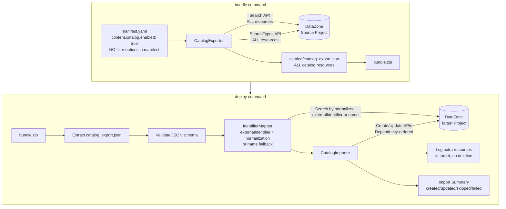
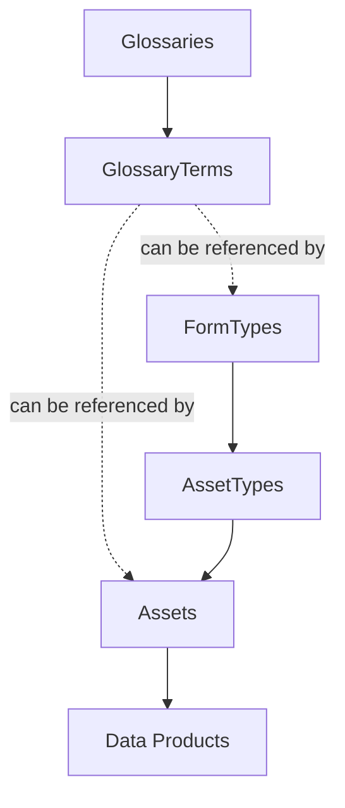

# Design Document

## Overview

This design adds catalog resource export/import capabilities to the SMUS CI/CD `bundle` and `deploy` commands. During bundling, a new `CatalogExporter` component queries the DataZone Search and SearchTypes APIs to retrieve Glossaries, GlossaryTerms, FormTypes, AssetTypes, Assets, and Data Products that are owned by the source project, serializing them into `catalog/catalog_export.json` within the bundle ZIP. The Search API supports `owningProjectIdentifier` as a request parameter for server-side ownership filtering, while the SearchTypes API requires client-side filtering by `owningProjectId` on response items (it does not support the `owningProjectIdentifier` parameter). For assets, an additional `get_asset` API call per item enriches search results with full details including `formsOutput`, since the Search API only returns summary data. The export captures each asset's and data product's `listingStatus` to preserve the source publish state. The manifest configuration is intentionally simple: only `enabled` (boolean), `skipPublish` (boolean), and `assets.access` (array) — no filter options of any kind exist in the manifest. During deployment, a new `CatalogImporter` component reads the exported JSON, builds an identifier mapping between source and target projects using externalIdentifier (with normalization) or name as fallback, creates or updates resources in dependency order via DataZone create/update APIs, and publishes assets and data products that were published (listingStatus == "ACTIVE") in the source project unless `skipPublish` is set to true. Resources that exist in the target project but are not in the bundle are logged for visibility but never deleted.

The design follows existing patterns in the codebase: helpers live in `src/smus_cicd/helpers/`, manifest configuration extends the existing schema, and the deploy command orchestrates import after storage and QuickSight deployments.

## Architecture



## Components and Interfaces

### 1. Manifest Schema Extension

Extend `content.catalog` in `application-manifest-schema.yaml` with a simple `enabled` boolean, optional `skipPublish` boolean, and preserve the existing `assets.access` array for subscription requests. The manifest contains NO filter options — no `include`, `names`, `assetTypes`, or any other filter fields.

Publishing behavior: By default, assets and data products are published during import only if they were published (`listingStatus == "ACTIVE"`) in the source project. This preserves the source publish state across environments. Set `skipPublish: true` to skip all publishing regardless of source state.

```yaml
content:
  catalog:
    # ONLY these fields are supported — no filter options whatsoever
    enabled: true        # Export ALL project-owned catalog resources when true
    skipPublish: false   # When true, skip all publishing regardless of source state (default: false)
    assets:
      access:            # Existing subscription request functionality (unchanged)
        - selector:
            search:
              assetType: GlueTable
              identifier: covid19_db.countries_aggregated
          permission: READ
          requestReason: Required for analytics pipeline
```

Extend `CatalogConfig` dataclass (no filter-related fields):

```python
@dataclass
class CatalogAssetAccessConfig:
    selector: Dict[str, Any]
    permission: str
    requestReason: str

@dataclass
class CatalogAssetsConfig:
    access: Optional[List[CatalogAssetAccessConfig]] = None

@dataclass
class CatalogConfig:
    enabled: bool = False        # Simple boolean to enable/disable catalog export
    skipPublish: bool = False    # When true, skip all publishing regardless of source state
    connectionName: Optional[str] = None
    assets: Optional[CatalogAssetsConfig] = None  # For asset subscription requests only
    # NOTE: No filter fields (include, names, assetTypes, etc.)
```

### 2. CatalogExporter (`src/smus_cicd/helpers/catalog_export.py`)

```python
def export_catalog(
    domain_id: str,
    project_id: str,
    region: str,
) -> Dict[str, Any]:
    """
    Export ALL catalog resources owned by a DataZone project.

    Args:
        domain_id: DataZone domain identifier
        project_id: DataZone project identifier
        region: AWS region

    Returns a dict matching the catalog_export.json schema.
    Raises on API errors during search.
    
    Exports all resource types owned by the project: Glossaries, GlossaryTerms, 
    FormTypes, AssetTypes, Assets, and Data Products.
    """
```

Internal helpers:

| Function | Purpose |
|---|---|
| `_search_resources(client, domain_id, project_id, search_scope)` | Paginated Search API call for Assets, GlossaryTerms, Glossaries with `owningProjectIdentifier` parameter |
| `_search_type_resources(client, domain_id, project_id, search_scope)` | Paginated SearchTypes API call for FormTypes, AssetTypes with client-side `owningProjectId` filtering. Note: the SearchTypes API does NOT support the `owningProjectIdentifier` parameter — ownership filtering is done client-side on response items. |
| `_enrich_asset_items(client, domain_id, items)` | Call `get_asset` for each asset item to retrieve full details including `formsOutput`, `description`, and `listingStatus` — the Search API only returns summary data without form details |
| `_serialize_resource(resource, resource_type)` | Extract user-configurable fields, preserve `name`, `externalIdentifier`, and source identifier. For assets, uses `identifier` (from Search API) or `id` (from GetAsset API) as `sourceId` fallback. |
| `_normalize_external_identifier(external_id)` | Remove AWS account ID and region information from externalIdentifier |

API routing:

| Resource Type | API | searchScope / typeFilter | Ownership Filter |
|---|---|---|---|
| glossaries | `search` | `searchScope="GLOSSARY"` | `owningProjectIdentifier=project_id` (API parameter) |
| glossaryTerms | `search` | `searchScope="GLOSSARY_TERM"` | `owningProjectIdentifier=project_id` (API parameter) |
| formTypes | `searchTypes` | `searchScope="FORM_TYPE"`, `managed=False` | Client-side filter: `owningProjectId == project_id` |
| assetTypes | `searchTypes` | `searchScope="ASSET_TYPE"`, `managed=False` | Client-side filter: `owningProjectId == project_id` |
| assets | `search` | `searchScope="ASSET"` | `owningProjectIdentifier=project_id` (API parameter) |
| dataProducts | `search` | `searchScope="DATA_PRODUCT"` | `owningProjectIdentifier=project_id` (API parameter) |

**Important API differences:**
- The `search` API supports `owningProjectIdentifier` as a request parameter for server-side ownership filtering.
- The `searchTypes` API does NOT support `owningProjectIdentifier` as a request parameter. Ownership filtering for FormTypes and AssetTypes is performed client-side by checking `owningProjectId` on each response item.

**Asset enrichment:**
- The `search` API returns only summary data for assets — it does NOT include `formsOutput` (form data).
- After searching assets, `_enrich_asset_items()` calls `get_asset` for each asset to retrieve the full asset details including `formsOutput`, `description`, and `listingStatus`.
- The `get_asset` API returns `id` instead of `identifier`, so `_serialize_resource` handles both via `asset.get("identifier") or asset.get("id")` for the `sourceId` field.

All queries use:
- Ownership filtering (server-side via `owningProjectIdentifier` for Search API, client-side via `owningProjectId` for SearchTypes API)
- `sort=[{"attribute": "updatedAt", "order": "DESCENDING"}]`
- `nextToken` pagination until exhausted

Export additional fields:
- Assets: Include `inputForms` field in serialization
- GlossaryTerms: Include `termRelations` field in serialization

### 3. CatalogImporter (`src/smus_cicd/helpers/catalog_import.py`)

```python
def import_catalog(
    domain_id: str,
    project_id: str,
    catalog_data: Dict[str, Any],
    region: str,
    skip_publish: bool = False,
) -> Dict[str, int]:
    """
    Import catalog resources into a target DataZone project.

    Resources in the target that are not in the bundle are logged for
    visibility but never deleted.

    Publishing behavior: By default, assets and data products are published only
    if they were published (listingStatus == "ACTIVE") in the source project.
    Set skip_publish=True to skip all publishing regardless of source state.

    Args:
        domain_id: DataZone domain identifier
        project_id: DataZone project identifier
        catalog_data: Exported catalog JSON data
        region: AWS region
        skip_publish: When True, skip all publishing regardless of source state

    Returns {"created": N, "updated": N, "skipped": N, "failed": N, "published": N}.
    Logs errors per resource but continues processing.
    """
```

Internal helpers:

| Function | Purpose |
|---|---|
| `_build_identifier_map(client, domain_id, project_id, catalog_data)` | Query target project using normalized externalIdentifier (when present) or name for each resource type, build source→target ID map |
| `_normalize_external_identifier(external_id)` | Remove AWS account ID and region information from externalIdentifier |
| `_resolve_cross_references(resource, id_map)` | Replace source IDs in cross-reference fields (e.g., glossaryId in GlossaryTerm) with target IDs |
| `_import_resource(client, domain_id, project_id, resource, resource_type, id_map)` | Call create or update API; handle ConflictException for idempotency |
| `_identify_extra_target_resources(client, domain_id, project_id, catalog_data)` | Query target project to find resources not present in bundle (logged, not deleted) |
| `_publish_resource(client, domain_id, resource_id, resource_type, max_wait_seconds, poll_interval)` | Call publish API for assets and data products that were published in the source (listingStatus == "ACTIVE"), then poll to verify listing becomes ACTIVE before counting as published. Returns False if listing status is FAILED or verification times out. |
| `_resolve_target_data_source(client, domain_id, project_id, source_ds_type, database_name)` | Find a data source in the target project that matches the source type and covers the asset's database. Matching priority: (1) exact `databaseName` match in `relationalFilterConfigurations`, (2) wildcard `"*"` database filter, (3) first candidate of same type. Returns `{dataSourceId, dataSourceRunId}` or None. |
| `_normalize_forms_input_for_api(forms_input, resource_type, client, domain_id, project_id)` | Normalize formsInput for Create/Update APIs: rename `typeName` → `typeIdentifier`, remap `typeRevision` to target domain revision, and remap `DataSourceReferenceForm` content to the target domain's data source using `_resolve_target_data_source()`. Extracts `databaseName` from the asset's `GlueTableForm` to match the correct target data source. Strips the form if no matching data source is found. |
| `_validate_catalog_json(catalog_data)` | Validate required top-level keys and metadata fields |

### 4. Bundle Command Integration

In `bundle.py`, after QuickSight export and before ZIP creation:

```python
# Export catalog resources if configured
if manifest.content and manifest.content.catalog and manifest.content.catalog.enabled:
    from ..helpers.catalog_export import export_catalog
    
    # Export ALL project-owned catalog resources when enabled
    catalog_data = export_catalog(
        domain_id, 
        project_id,
        region,
    )
    
    # Write catalog/catalog_export.json to temp_bundle_dir
    catalog_dir = os.path.join(temp_bundle_dir, "catalog")
    os.makedirs(catalog_dir, exist_ok=True)
    with open(os.path.join(catalog_dir, "catalog_export.json"), "w") as f:
        json.dump(catalog_data, f, indent=2, default=str)
    total_files_added += 1
```

### 5. Deploy Command Integration

In `deploy.py`, within `_deploy_bundle_to_target`, after `_process_catalog_assets` (existing access-request logic) and before the return:

```python
# Import catalog resources from bundle if present
catalog_import_success = _import_catalog_from_bundle(
    bundle_path, target_config, config, emitter, metadata
)
```

New function `_import_catalog_from_bundle`:
1. Extract `catalog/catalog_export.json` from bundle ZIP
2. If not present, skip silently (backward compatible)
3. Check `deployment_configuration.catalog.disable` — skip if true
4. Validate JSON structure
5. Get `skipPublish` flag from `manifest.content.catalog.skipPublish` (default: false)
6. Call `import_catalog()` with skip_publish flag
7. Report summary counts (created/updated/skipped/failed/published)
8. If all fail, return False

## Data Models

### catalog_export.json Schema

```json
{
  "metadata": {
    "sourceProjectId": "string",
    "sourceDomainId": "string",
    "exportTimestamp": "ISO 8601 string",
    "resourceTypes": ["glossaries", "glossaryTerms", "formTypes", "assetTypes", "assets", "dataProducts"]
  },
  "glossaries": [
    {
      "sourceId": "string",
      "name": "string",
      "description": "string",
      "status": "string"
    }
  ],
  "glossaryTerms": [
    {
      "sourceId": "string",
      "name": "string",
      "shortDescription": "string",
      "longDescription": "string",
      "glossaryId": "string",
      "status": "string",
      "termRelations": {}
    }
  ],
  "formTypes": [
    {
      "sourceId": "string",
      "name": "string",
      "description": "string",
      "model": {
        "smithy": "string containing complete field definitions, types, and validation rules"
      }
    }
  ],
  "assetTypes": [
    {
      "sourceId": "string",
      "name": "string",
      "description": "string",
      "formsInput": {}
    }
  ],
  "assets": [
    {
      "sourceId": "string",
      "name": "string",
      "description": "string",
      "typeIdentifier": "string",
      "formsInput": [],
      "inputForms": [],
      "externalIdentifier": "string (optional, used for mapping when present)"
    }
  ],
  "dataProducts": [
    {
      "sourceId": "string",
      "name": "string",
      "description": "string",
      "items": []
    }
  ]
}
```

### Dependency Graph



Creation order: `Glossaries` → `GlossaryTerms` → (`FormTypes`, `AssetTypes` can reference terms) → `Assets` → `Data Products`

Note: Resources in the target that are not in the bundle are logged for visibility but never deleted. Assets and FormTypes can reference GlossaryTerms, so GlossaryTerms must be created before Assets and FormTypes. Data Products can reference Assets, so they are created last.

## Correctness Properties

Correctness properties are statements that must hold true for all valid inputs and system states. They serve as the foundation for property-based tests using the `hypothesis` library, ensuring the implementation satisfies its requirements through exhaustive, randomized verification rather than example-based testing alone.

### Property 1: Catalog Export Enabled/Disabled
**Validates: Requirement 1.1, 1.2, 1.3**

For all manifest configurations `M` where `M.content.catalog.enabled` is true, the `CatalogExporter` SHALL produce a `catalog_export.json` containing ALL catalog resource types owned by the source project (Glossaries, GlossaryTerms, FormTypes, AssetTypes, Assets, Data Products). When `M.content.catalog.enabled` is false or omitted, no catalog export SHALL occur.

### Property 2: Export All Project-Owned Resources
**Validates: Requirement 2.1, 2.2, 2.3**

When catalog export is enabled, the `CatalogExporter` SHALL query ALL resource types from the source project. For the Search API (Assets, Glossaries, GlossaryTerms, Data Products), the `owningProjectIdentifier` parameter is used for server-side filtering. For the SearchTypes API (FormTypes, AssetTypes), client-side filtering by `owningProjectId` is used since the SearchTypes API does not support the `owningProjectIdentifier` parameter. The resulting JSON SHALL contain all project-owned resources without any filtering.

### Property 4: API Routing by Resource Type
**Validates: Requirements 2.1, 2.2, 2.6, 2.7**

For all resource types `RT` in `{glossaries, glossaryTerms, assets, dataProducts}`, the `CatalogExporter` SHALL invoke the DataZone `search` API with the corresponding `searchScope` value and `owningProjectIdentifier` parameter. For all resource types `RT` in `{formTypes, assetTypes}`, the `CatalogExporter` SHALL invoke the DataZone `searchTypes` API with the corresponding `searchScope`, `managed=False`, and client-side `owningProjectId` filtering (since `searchTypes` does not support the `owningProjectIdentifier` parameter). For assets, the `CatalogExporter` SHALL additionally call `get_asset` per item to enrich search results with full details including `formsOutput`.

### Property 5: Pagination Completeness
**Validates: Requirement 2.5**

For any DataZone project `P` containing `N` resources of type `RT`, the `CatalogExporter` SHALL return exactly `N` resources of type `RT` in the export JSON, regardless of the page size used by the API.

### Property 6: Export JSON Structure Invariant
**Validates: Requirements 3.1, 3.2**

For all valid export operations, the resulting JSON SHALL contain exactly the keys `{metadata, glossaries, glossaryTerms, formTypes, assetTypes, assets, dataProducts}` at the top level, and the `metadata` object SHALL contain exactly the keys `{sourceProjectId, sourceDomainId, exportTimestamp, resourceTypes}`.

### Property 7: Field Preservation During Serialization
**Validates: Requirement 3.3, 3.4, 3.5, 3.6**

For all resources `R` exported by the `CatalogExporter`, the serialized JSON representation SHALL preserve the `name` field, `externalIdentifier` field (when present), all user-configurable attributes (description, model, formsInput, etc.), and the source identifier stored as `sourceId`. For assets, the `formsOutput` field (retrieved via `get_asset` enrichment, since the Search API does not return it) SHALL be serialized as `formsInput`. The `sourceId` for assets SHALL be resolved using `identifier` (from Search API) or `id` (from GetAsset API) as fallback. For glossary terms, the `termRelations` field SHALL be preserved. For metadata form types, the complete `model` structure SHALL be preserved.

### Property 8: Catalog Export JSON Round-Trip
**Validates: Requirement 3.7**

For all `catalog_export.json` files `J` produced by the `CatalogExporter`, deserializing `J` from JSON and re-serializing it SHALL produce a JSON document that is structurally equivalent to `J` (identical keys, values, and nesting).

### Property 9: ExternalIdentifier-Based Identifier Mapping with Normalization
**Validates: Requirements 4.1, 4.2, 4.3, 4.4, 4.5**

For all resources `R` in the `catalog_export.json`: 
- IF `R` has an `externalIdentifier` field, THEN the `Identifier_Mapper` SHALL normalize it by removing AWS account ID and region information, and use the normalized value to find matching target resources
- IF a resource with the same normalized externalIdentifier exists in the target project, THEN the `Identifier_Mapper` SHALL map `R.sourceId` to the existing target resource's identifier
- IF `R` does not have an `externalIdentifier` field, THEN the `Identifier_Mapper` SHALL use the `name` field for mapping
- IF no matching resource exists in the target project, THEN the `Identifier_Mapper` SHALL mark `R` for creation

### Property 10: Cross-Reference Resolution
**Validates: Requirement 4.6**

For all resources `R` that contain cross-resource references (GlossaryTerm.glossaryId, Asset.typeIdentifier, Asset or FormType referencing GlossaryTerms), the `CatalogImporter` SHALL replace every source identifier in those reference fields with the corresponding target identifier from the `Identifier_Mapper` before calling create/update APIs.

### Property 11: Dependency-Ordered Creation
**Validates: Requirement 5.6**

For all import operations, the `CatalogImporter` SHALL invoke create APIs such that: every Glossary is created before any GlossaryTerm that references it, every GlossaryTerm is created before any Asset or FormType that references it, every FormType is created before any AssetType that references it, and every AssetType is created before any Asset that references it.

### Property 12: Extra Resources Not Deleted
**Validates: Requirement 5.4**

For all import operations where resources exist in the target project but are NOT present in the bundle, the `CatalogImporter` SHALL NOT invoke any delete APIs. Instead, it SHALL log each extra resource's name and type for visibility and count them as skipped.

### Property 13: Import Error Resilience
**Validates: Requirements 5.10, 5.14, 7.3**

For any import operation where `K` out of `N` resources fail during create/update/publish API calls (where `0 < K < N`), the `CatalogImporter` SHALL still attempt to process all `N` resources, log each of the `K` failures with resource name, type, and error message, and report a summary containing the failure count.

### Property 14: Import Summary Counts
**Validates: Requirement 5.12, 6.3**

For all import operations, the `CatalogImporter` SHALL return counts `{created, updated, skipped, failed, published}` where `created + updated + failed` equals the total number of resources in the bundle, `skipped` equals the number of extra resources found in the target but not in the bundle, and `published` equals the number of assets and data products that were published in the source (listingStatus == "ACTIVE") and whose listing was verified as ACTIVE in the target when skipPublish is false.

### Property 15: Source-State-Based Publishing with skipPublish Override
**Validates: Requirement 5.13**

For all import operations where `skipPublish` is false (default), the `CatalogImporter` SHALL publish only those assets `A` and data products `D` that had `listingStatus == "ACTIVE"` in the source project, and SHALL verify the listing status becomes ACTIVE in the target by polling `get_asset` or `get_data_product` after calling `create_listing_change_set`. If the listing status is FAILED or verification times out, the publish SHALL be counted as a failure. When `skipPublish` is true, no publish API calls SHALL be made regardless of source state.

### Property 16: Export Error Propagation
**Validates: Requirement 7.1**

For any DataZone Search or SearchTypes API call that returns an error during export, the `CatalogExporter` SHALL raise an exception containing the API error message, and SHALL NOT produce a partial `catalog_export.json`.

### Property 18: DataSourceReferenceForm Remapping
**Validates: Requirement 5.15**

For all assets `A` in the `catalog_export.json` that contain a `DataSourceReferenceForm` in their `formsInput`, the `CatalogImporter` SHALL remap the form's `dataSourceIdentifier.id`, `filterableDataSourceId`, and `dataSourceRunId` to the corresponding data source in the target project. The target data source SHALL be matched by: (1) same `dataSourceType` + exact `databaseName` match in `relationalFilterConfigurations`, (2) same type + wildcard `"*"` database filter, (3) first candidate of same type. The `databaseName` for matching SHALL be extracted from the asset's `GlueTableForm` content. If no matching data source exists in the target project, the `DataSourceReferenceForm` SHALL be stripped from the asset's forms.

### Property 17: Malformed JSON Validation
**Validates: Requirement 7.4**

For all JSON inputs `J` that are missing any of the required top-level keys `{metadata, glossaries, glossaryTerms, formTypes, assetTypes, assets, dataProducts}` or where `metadata` is missing any of `{sourceProjectId, sourceDomainId, exportTimestamp, resourceTypes}`, the `CatalogImporter` SHALL raise a validation error before attempting any API calls.

## Error Handling

| Scenario | Behavior |
|---|---|
| Search/SearchTypes API error during export | Raise exception, abort export, no partial JSON produced |
| No project-owned resources in source project | Produce valid JSON with empty arrays, log informational message |
| ConflictException on create | Treat as existing resource, attempt update instead |
| Create/update API failure during import | Log error (resource name, type, message), continue with next resource |
| Publish API failure during import | Log error (resource name, type, message), continue with next resource, increment failed count |
| Publish listing verification FAILED | Log error indicating listing failed asynchronously, continue with next resource, increment failed count |
| Publish listing verification timeout | Log error indicating listing did not become ACTIVE within timeout, continue with next resource, increment failed count |
| All imports fail | Return `False` from import, deploy command reports failure |
| Malformed catalog_export.json | Raise validation error before any API calls |
| Missing catalog/catalog_export.json in bundle | Skip silently (backward compatible) |
| `deployment_configuration.catalog.disable: true` | Skip catalog import, log message |
| Resource exists in target but not in bundle | Log resource name and type for visibility, count as skipped (no deletion) |
| ~~Deletion fails due to dependency~~ | _(Removed — resources are never deleted)_ |
| Invalid timestamp format | Raise validation error with helpful message |
| DataSourceReferenceForm with no matching target data source | Strip the form from the asset's formsInput, log warning |
| DataSourceReferenceForm JSON parse failure | Strip the form from the asset's formsInput, log warning |

## Testing Strategy

### Unit Tests

Located in `tests/unit/helpers/`:

- `test_catalog_export.py` — Test `CatalogExporter` with mocked DataZone client (boto3 stubber)
  - Verify API routing per resource type
  - Verify `owningProjectIdentifier` parameter is applied to Search API queries
  - Verify SearchTypes API uses client-side `owningProjectId` filtering (not `owningProjectIdentifier` parameter, which is unsupported)
  - Verify `_enrich_asset_items` calls `get_asset` per asset to retrieve full details including `formsOutput`
  - Verify `_enrich_asset_items` falls back to search data on `get_asset` failure
  - Verify `sourceId` resolution uses `identifier` (Search API) or `id` (GetAsset API) fallback
  - Verify pagination handling
  - Verify JSON structure output with all resource types
  - Verify error propagation on API failure
  - Verify externalIdentifier and inputForms/termRelations are exported

- `test_catalog_import.py` — Test `CatalogImporter` with mocked DataZone client
  - Verify externalIdentifier-based identifier mapping with normalization
  - Verify name-based identifier mapping fallback
  - Verify cross-reference resolution
  - Verify dependency-ordered creation
  - Verify extra resources in target are logged but not deleted
  - Verify source-state-based publishing (only LISTED resources published)
  - Verify skipPublish override skips all publishing
  - Verify error resilience (partial failures including publish failures)
  - Verify ConflictException handling
  - Verify validation of malformed JSON
  - Verify extra resources in target are identified and counted as skipped

### Property-Based Tests

Using `hypothesis` library with minimum 100 iterations per property (`@settings(max_examples=100)`).

Located in `tests/unit/helpers/test_catalog_properties.py`:

- Generate random resource collections with `@st.composite` strategies
- Test catalog export enabled/disabled (Property 1)
- Test export all project-owned resources (Property 2)
- Test round-trip serialization (Property 8)
- Test externalIdentifier-based identifier mapping with normalization (Property 9)
- Test dependency ordering invariant for creation (Property 11)
- Test extra resources are logged not deleted (Property 12)
- Test summary count arithmetic including skipped and publishes (Property 14)
- Test source-state-based publishing and skipPublish override (Property 15)
- Test JSON validation rejects all malformed inputs (Property 17)

### Integration Tests

Located in `tests/integration/catalog-import-export/`:

- `test_catalog_export.py` — End-to-end export from a real DataZone project
  - Verify all resource types owned by project are exported when enabled
  - Verify externalIdentifier is exported for assets
  - Verify inputForms and termRelations are exported
  
- `test_catalog_import.py` — End-to-end import into a target project
  - Verify resources are created/updated using externalIdentifier mapping
  - Verify extra resources in target are logged but not deleted
  - Verify source-state-based publishing (only LISTED resources published)
  - Verify skipPublish override skips all publishing
  - Verify published assets and data products are accessible
  
- `test_catalog_round_trip.py` — Export from source, import to target, verify resources exist
  - Verify externalIdentifier-based mapping works end-to-end
  - Verify cross-references are correctly remapped
  - Verify published resources are available in target project
