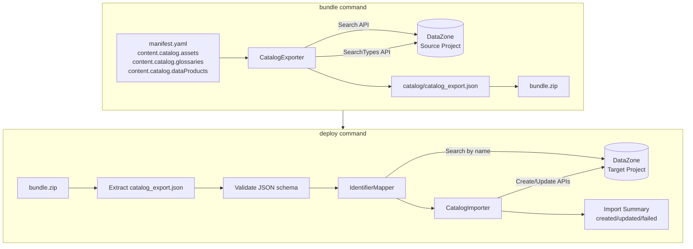
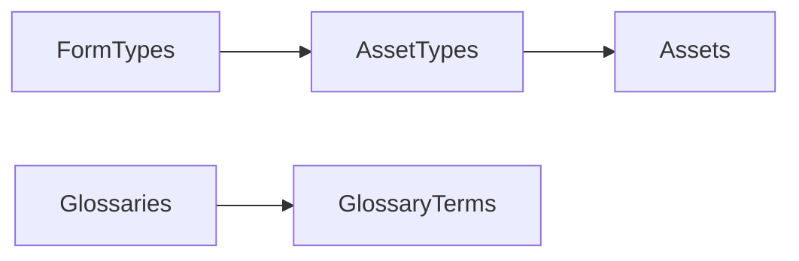

# Design Document

## Overview

This design adds catalog resource export/import capabilities to the SMUS CI/CD `bundle` and `deploy` commands. During bundling, a new `CatalogExporter` component queries the DataZone Search and SearchTypes APIs to retrieve Glossaries, GlossaryTerms, FormTypes, AssetTypes, Assets, and Data Products from the source project, serializing them into `catalog/catalog_export.json` within the bundle ZIP. During deployment, a new `CatalogImporter` component reads the exported JSON, builds a name-based identifier mapping between source and target projects, and creates or updates resources in dependency order via DataZone create/update APIs.

The design follows existing patterns in the codebase: helpers live in `src/smus_cicd/helpers/`, manifest configuration extends the existing schema, and the deploy command orchestrates import after storage and QuickSight deployments.

## Architecture



## Components and Interfaces

### 1. Manifest Schema Extension

Extend `content.catalog` in `application-manifest-schema.yaml` with `assets`, `glossaries`, `dataProducts`, and `metadataForms` subsections:

```yaml
content:
  catalog:
    assets:
      include:              # optional, defaults to all three
        - formTypes
        - assetTypes
        - assets
      updatedAfter: "2025-01-01T00:00:00Z"  # optional ISO 8601 filter
    glossaries:
      include:              # optional, defaults to both
        - glossaries
        - glossaryTerms
      updatedAfter: "2025-01-01T00:00:00Z"  # optional ISO 8601 filter
    dataProducts:
      names:                # optional, defaults to all data products
        - "Sales Analytics Product"
        - "Customer Insights Product"
      updatedAfter: "2025-01-01T00:00:00Z"  # optional ISO 8601 filter
    metadataForms:
      include:              # optional, defaults to all form types
        - formTypes
      updatedAfter: "2025-01-01T00:00:00Z"  # optional ISO 8601 filter
```

Extend `CatalogConfig` dataclass:

```python
@dataclass
class CatalogAssetsConfig:
    include: List[str] = field(default_factory=lambda: [
        "formTypes", "assetTypes", "assets"
    ])
    updatedAfter: Optional[str] = None

@dataclass
class CatalogGlossariesConfig:
    include: List[str] = field(default_factory=lambda: [
        "glossaries", "glossaryTerms"
    ])
    updatedAfter: Optional[str] = None

@dataclass
class CatalogDataProductsConfig:
    names: Optional[List[str]] = None  # None means export all
    updatedAfter: Optional[str] = None

@dataclass
class CatalogMetadataFormsConfig:
    include: List[str] = field(default_factory=lambda: ["formTypes"])
    updatedAfter: Optional[str] = None

@dataclass
class CatalogConfig:
    connectionName: Optional[str] = None
    assets: Optional[CatalogAssetsConfig] = None
    glossaries: Optional[CatalogGlossariesConfig] = None
    dataProducts: Optional[CatalogDataProductsConfig] = None
    metadataForms: Optional[CatalogMetadataFormsConfig] = None  # NEW
```

### 2. CatalogExporter (`src/smus_cicd/helpers/catalog_export.py`)

```python
def export_catalog(
    domain_id: str,
    project_id: str,
    resource_types: List[str],
    region: str,
    updated_after: Optional[str] = None,
    data_product_names: Optional[List[str]] = None,
) -> Dict[str, Any]:
    """
    Export catalog resources from a DataZone project.

    Returns a dict matching the catalog_export.json schema.
    Raises on API errors during search.
    
    Args:
        data_product_names: Optional list of data product names to filter export.
                           If None, exports all data products.
    """
```

Internal helpers:

| Function | Purpose |
|---|---|
| `_search_resources(client, domain_id, project_id, search_scope, updated_after)` | Paginated Search API call for Assets, GlossaryTerms, Glossaries |
| `_search_type_resources(client, domain_id, project_id, type_filter, updated_after)` | Paginated SearchTypes API call for FormTypes, AssetTypes |
| `_serialize_resource(resource, resource_type)` | Extract user-configurable fields, preserve `name` and source identifier |

API routing:

| Resource Type | API | searchScope / typeFilter |
|---|---|---|
| glossaries | `search` | `searchScope="GLOSSARY"` |
| glossaryTerms | `search` | `searchScope="GLOSSARY_TERM"` |
| formTypes | `searchTypes` | `searchScope="FORM_TYPE"`, `managed=False` |
| assetTypes | `searchTypes` | `searchScope="ASSET_TYPE"`, `managed=False` |
| assets | `search` | `searchScope="ASSET"` |
| dataProducts | `search` | `searchScope="DATA_PRODUCT"` |
| metadataForms | `searchTypes` | `searchScope="FORM_TYPE"`, `managed=False` (includes complete model with field definitions) |

All queries use:
- `owningProjectIdentifier=project_id`
- `sort=[{"attribute": "updatedAt", "order": "DESCENDING"}]`
- `nextToken` pagination until exhausted
- Optional `filters` for `updatedAfter` timestamp
- For data products: optional name-based filtering when `names` list is specified

### 3. CatalogImporter (`src/smus_cicd/helpers/catalog_import.py`)

```python
def import_catalog(
    domain_id: str,
    project_id: str,
    catalog_data: Dict[str, Any],
    region: str,
) -> Dict[str, int]:
    """
    Import catalog resources into a target DataZone project.

    Returns {"created": N, "updated": N, "failed": N}.
    Logs errors per resource but continues processing.
    """
```

Internal helpers:

| Function | Purpose |
|---|---|
| `_build_identifier_map(client, domain_id, project_id, catalog_data)` | Query target project by name for each resource type, build source→target ID map |
| `_resolve_cross_references(resource, id_map)` | Replace source IDs in cross-reference fields (e.g., glossaryId in GlossaryTerm) with target IDs |
| `_import_resource(client, domain_id, project_id, resource, resource_type, id_map)` | Call create or update API; handle ConflictException for idempotency |
| `_validate_catalog_json(catalog_data)` | Validate required top-level keys and metadata fields |

### 4. Bundle Command Integration

In `bundle.py`, after QuickSight export and before ZIP creation:

```python
# Export catalog resources if configured
if manifest.content and manifest.content.catalog:
    from ..helpers.catalog_export import export_catalog
    
    # Collect resource types from assets, glossaries, and dataProducts sections
    resource_types = []
    updated_after = None
    data_product_names = None
    
    if manifest.content.catalog.assets:
        resource_types.extend(manifest.content.catalog.assets.include)
        updated_after = manifest.content.catalog.assets.updatedAfter
    
    if manifest.content.catalog.glossaries:
        resource_types.extend(manifest.content.catalog.glossaries.include)
        # Use the most restrictive updatedAfter if both are specified
        if manifest.content.catalog.glossaries.updatedAfter:
            if updated_after:
                updated_after = max(updated_after, manifest.content.catalog.glossaries.updatedAfter)
            else:
                updated_after = manifest.content.catalog.glossaries.updatedAfter
    
    if manifest.content.catalog.dataProducts:
        resource_types.append("dataProducts")
        data_product_names = manifest.content.catalog.dataProducts.names
        # Merge updatedAfter filter
        if manifest.content.catalog.dataProducts.updatedAfter:
            if updated_after:
                updated_after = max(updated_after, manifest.content.catalog.dataProducts.updatedAfter)
            else:
                updated_after = manifest.content.catalog.dataProducts.updatedAfter
    
    if manifest.content.catalog.metadataForms:
        resource_types.extend(manifest.content.catalog.metadataForms.include)
        # Merge updatedAfter filter
        if manifest.content.catalog.metadataForms.updatedAfter:
            if updated_after:
                updated_after = max(updated_after, manifest.content.catalog.metadataForms.updatedAfter)
            else:
                updated_after = manifest.content.catalog.metadataForms.updatedAfter
    
    if resource_types:
        catalog_data = export_catalog(
            domain_id, project_id,
            resource_types,
            region,
            updated_after,
            data_product_names,
        )
        # Write catalog/catalog_export.json to temp_bundle_dir
        catalog_dir = os.path.join(temp_bundle_dir, "catalog")
        os.makedirs(catalog_dir, exist_ok=True)
        with open(os.path.join(catalog_dir, "catalog_export.json"), "w") as f:
            json.dump(catalog_data, f, indent=2, default=str)
        total_files_added += 1
```

### 5. Deploy Command Integration

In `deploy.py`, within `_deploy_bundle_to_target`, after `_process_catalog_assets` (existing access-request logic) and before the return:

```python
# Import catalog resources from bundle if present
catalog_import_success = _import_catalog_from_bundle(
    bundle_path, target_config, config, emitter, metadata
)
```

New function `_import_catalog_from_bundle`:
1. Extract `catalog/catalog_export.json` from bundle ZIP
2. If not present, skip silently (backward compatible)
3. Check `deployment_configuration.catalog.disable` — skip if true
4. Validate JSON structure
5. Call `import_catalog()`
6. Report summary counts (created/updated/failed)
7. If all fail, return False

## Data Models

### catalog_export.json Schema

```json
{
  "metadata": {
    "sourceProjectId": "string",
    "sourceDomainId": "string",
    "exportTimestamp": "ISO 8601 string",
    "resourceTypes": ["glossaries", "glossaryTerms", "dataProducts", "metadataForms", ...]
  },
  "glossaries": [
    {
      "sourceId": "string",
      "name": "string",
      "description": "string",
      "status": "string"
    }
  ],
  "glossaryTerms": [
    {
      "sourceId": "string",
      "name": "string",
      "shortDescription": "string",
      "longDescription": "string",
      "glossaryId": "string",
      "status": "string",
      "termRelations": {}
    }
  ],
  "formTypes": [
    {
      "sourceId": "string",
      "name": "string",
      "description": "string",
      "model": {
        "smithy": "string containing complete field definitions, types, and validation rules"
      }
    }
  ],
  "assetTypes": [
    {
      "sourceId": "string",
      "name": "string",
      "description": "string",
      "formsInput": {}
    }
  ],
  "assets": [
    {
      "sourceId": "string",
      "name": "string",
      "description": "string",
      "typeIdentifier": "string",
      "formsInput": [],
      "externalIdentifier": "string"
    }
  ],
  "dataProducts": [
    {
      "sourceId": "string",
      "name": "string",
      "description": "string",
      "items": []
    }
  ],
  "metadataForms": [
    {
      "sourceId": "string",
      "name": "string",
      "description": "string",
      "model": {
        "smithy": "string containing complete metadata form structure with all field definitions"
      },
      "revision": "string",
      "status": "string"
    }
  ]
}
```

### Dependency Graph



Creation order: `FormTypes` → `AssetTypes` → `Assets`, `Glossaries` → `GlossaryTerms`. The two chains are independent and can be processed sequentially in either order.

## Correctness Properties

Correctness properties are statements that must hold true for all valid inputs and system states. They serve as the foundation for property-based tests using the `hypothesis` library, ensuring the implementation satisfies its requirements through exhaustive, randomized verification rather than example-based testing alone.

### Property 1: Resource Type Filtering
**Validates: Requirement 1.2, 1.2a, 1.3, 1.8, 1.11, 1.12**

For all manifest configurations `M` where `M.content.catalog.assets.include` is a non-empty subset of `{formTypes, assetTypes, assets}`, `M.content.catalog.glossaries.include` is a non-empty subset of `{glossaries, glossaryTerms}`, `M.content.catalog.dataProducts.names` is a non-empty list of data product names, or `M.content.catalog.metadataForms.include` is a non-empty subset of `{formTypes}`, the `CatalogExporter` SHALL produce a `catalog_export.json` where only the keys corresponding to the specified resource types contain non-empty arrays, and all other resource type keys contain empty arrays.

### Property 2: Updated-After Filter Correctness
**Validates: Requirement 1.4, 1.5, 1.9, 1.11**

For all ISO 8601 timestamps `T` specified in `content.catalog.assets.updatedAfter`, `content.catalog.glossaries.updatedAfter`, `content.catalog.dataProducts.updatedAfter`, or `content.catalog.metadataForms.updatedAfter`, and for all resources `R` in the resulting `catalog_export.json`, the `updatedAt` attribute of `R` in the source system SHALL be greater than or equal to `T`.

### Property 3: API Routing by Resource Type
**Validates: Requirements 2.1, 2.2, 2.2a, 2.3, 2.8, 2.9**

For all resource types `RT` in `{glossaries, glossaryTerms, assets, dataProducts}`, the `CatalogExporter` SHALL invoke the DataZone `search` API with the corresponding `searchScope` value. For all resource types `RT` in `{formTypes, assetTypes, metadataForms}`, the `CatalogExporter` SHALL invoke the DataZone `searchTypes` API with the corresponding `searchScope` and `managed=False`. For metadata forms, the complete model structure including all field definitions SHALL be exported.

### Property 4: Pagination Completeness
**Validates: Requirement 2.5**

For any DataZone project `P` containing `N` resources of type `RT`, the `CatalogExporter` SHALL return exactly `N` resources of type `RT` in the export JSON, regardless of the page size used by the API.

### Property 5: Export JSON Structure Invariant
**Validates: Requirements 3.1, 3.2**

For all valid export operations, the resulting JSON SHALL contain exactly the keys `{metadata, glossaries, glossaryTerms, formTypes, assetTypes, assets, dataProducts, metadataForms}` at the top level, and the `metadata` object SHALL contain exactly the keys `{sourceProjectId, sourceDomainId, exportTimestamp, resourceTypes}`.

### Property 6: Field Preservation During Serialization
**Validates: Requirement 3.3, 3.3a**

For all resources `R` exported by the `CatalogExporter`, the serialized JSON representation SHALL preserve the `name` field, all user-configurable attributes (description, model, formsInput, etc.), and the source identifier stored as `sourceId`. For metadata form types, the complete `model` structure including all field definitions, data types, constraints, and validation rules SHALL be preserved.

### Property 7: Catalog Export JSON Round-Trip
**Validates: Requirement 3.4**

For all `catalog_export.json` files `J` produced by the `CatalogExporter`, deserializing `J` from JSON and re-serializing it SHALL produce a JSON document that is structurally equivalent to `J` (identical keys, values, and nesting).

### Property 8: Name-Based Identifier Mapping
**Validates: Requirements 4.1, 4.3, 4.4**

For all resources `R` in the `catalog_export.json` with name `N`: if a resource with name `N` and the same type exists in the target project, the `IdentifierMapper` SHALL map `R.sourceId` to the existing target resource's identifier; if no such resource exists, the `IdentifierMapper` SHALL mark `R` for creation.

### Property 9: Cross-Reference Resolution
**Validates: Requirement 4.5**

For all resources `R` that contain cross-resource references (GlossaryTerm.glossaryId, Asset.typeIdentifier), the `CatalogImporter` SHALL replace every source identifier in those reference fields with the corresponding target identifier from the `IdentifierMapper` before calling create/update APIs.

### Property 10: Dependency-Ordered Creation
**Validates: Requirement 5.3, 5.3a**

For all import operations, the `CatalogImporter` SHALL invoke create APIs such that: every metadata form type is created before any asset type or asset that references it, every FormType is created before any AssetType that references it, every AssetType is created before any Asset that references it, and every Glossary is created before any GlossaryTerm that references it.

### Property 11: Import Error Resilience
**Validates: Requirements 5.4, 7.3**

For any import operation where `K` out of `N` resources fail during create/update API calls (where `0 < K < N`), the `CatalogImporter` SHALL still attempt to process all `N` resources, log each of the `K` failures with resource name, type, and error message, and report a summary containing the failure count.

### Property 12: Import Summary Counts
**Validates: Requirement 6.3**

For all import operations, the `CatalogImporter` SHALL return counts `{created, updated, failed}` where `created + updated + failed` equals the total number of resources in the `catalog_export.json`.

### Property 13: Export Error Propagation
**Validates: Requirement 7.1**

For any DataZone Search or SearchTypes API call that returns an error during export, the `CatalogExporter` SHALL raise an exception containing the API error message, and SHALL NOT produce a partial `catalog_export.json`.

### Property 14: Malformed JSON Validation
**Validates: Requirement 7.4**

For all JSON inputs `J` that are missing any of the required top-level keys `{metadata, glossaries, glossaryTerms, formTypes, assetTypes, assets, dataProducts, metadataForms}` or where `metadata` is missing any of `{sourceProjectId, sourceDomainId, exportTimestamp, resourceTypes}`, the `CatalogImporter` SHALL raise a validation error before attempting any API calls.

## Error Handling

| Scenario | Behavior |
|---|---|
| Search/SearchTypes API error during export | Raise exception, abort export, no partial JSON produced |
| No resources match filter | Produce valid JSON with empty arrays, log informational message |
| ConflictException on create | Treat as existing resource, attempt update instead |
| Create/update API failure during import | Log error (resource name, type, message), continue with next resource |
| All imports fail | Return `False` from import, deploy command reports failure |
| Malformed catalog_export.json | Raise validation error before any API calls |
| Missing catalog/catalog_export.json in bundle | Skip silently (backward compatible) |
| `deployment_configuration.catalog.disable: true` | Skip catalog import, log message |

## Testing Strategy

### Unit Tests

Located in `tests/unit/helpers/`:

- `test_catalog_export.py` — Test `CatalogExporter` with mocked DataZone client (boto3 stubber)
  - Verify API routing per resource type
  - Verify pagination handling
  - Verify updatedAfter filter construction
  - Verify JSON structure output
  - Verify error propagation on API failure

- `test_catalog_import.py` — Test `CatalogImporter` with mocked DataZone client
  - Verify name-based identifier mapping
  - Verify cross-reference resolution
  - Verify dependency-ordered creation
  - Verify error resilience (partial failures)
  - Verify ConflictException handling
  - Verify validation of malformed JSON

### Property-Based Tests

Using `hypothesis` library with minimum 100 iterations per property (`@settings(max_examples=100)`).

Located in `tests/unit/helpers/test_catalog_properties.py`:

- Generate random resource collections with `@st.composite` strategies
- Test round-trip serialization (Property 7)
- Test identifier mapping correctness (Property 8)
- Test dependency ordering invariant (Property 10)
- Test summary count arithmetic (Property 12)
- Test JSON validation rejects all malformed inputs (Property 14)

### Integration Tests

Located in `tests/integration/catalog-import-export/`:

- `test_catalog_export.py` — End-to-end export from a real DataZone project
- `test_catalog_import.py` — End-to-end import into a target project
- `test_catalog_round_trip.py` — Export from source, import to target, verify resources exist
