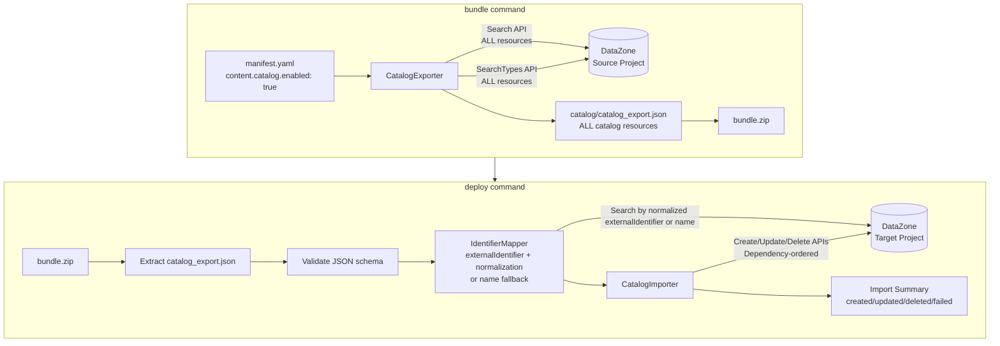
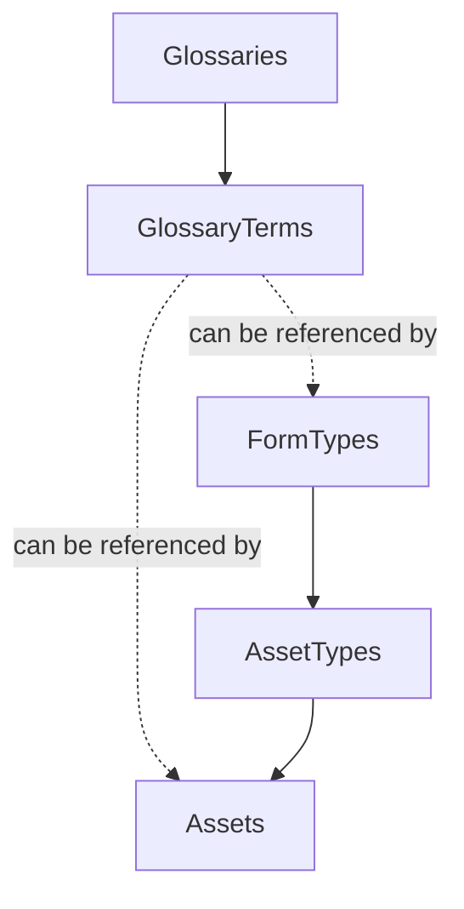

# Design Document

## Overview

This design adds catalog resource export/import capabilities to the SMUS CI/CD `bundle` and `deploy` commands. During bundling, a new `CatalogExporter` component queries the DataZone Search and SearchTypes APIs to retrieve Glossaries, GlossaryTerms, FormTypes, AssetTypes, Assets, and Data Products that are owned by the source project, serializing them into `catalog/catalog_export.json` within the bundle ZIP. An optional `--updated-after` CLI flag allows filtering resources by modification timestamp. During deployment, a new `CatalogImporter` component reads the exported JSON, builds an identifier mapping between source and target projects using externalIdentifier (with normalization) or name as fallback, creates or updates resources in dependency order via DataZone create/update APIs, and optionally publishes assets and data products when configured.

The design follows existing patterns in the codebase: helpers live in `src/smus_cicd/helpers/`, manifest configuration extends the existing schema, and the deploy command orchestrates import after storage and QuickSight deployments.

## Architecture



## Components and Interfaces

### 1. Manifest Schema Extension

Extend `content.catalog` in `application-manifest-schema.yaml` with a simple `enabled` boolean, optional `publish` boolean, and preserve the existing `assets.access` array for subscription requests:

```yaml
content:
  catalog:
    enabled: true   # Export ALL project-owned catalog resources when true
    publish: false  # Automatically publish assets and data products during deploy (default: false)
    assets:
      access:       # Existing subscription request functionality (unchanged)
        - selector:
            search:
              assetType: GlueTable
              identifier: covid19_db.countries_aggregated
          permission: READ
          requestReason: Required for analytics pipeline
```

Extend `CatalogConfig` dataclass:

```python
@dataclass
class CatalogAssetAccessConfig:
    selector: Dict[str, Any]
    permission: str
    requestReason: str

@dataclass
class CatalogAssetsConfig:
    access: Optional[List[CatalogAssetAccessConfig]] = None

@dataclass
class CatalogConfig:
    enabled: bool = False   # Simple boolean to enable/disable catalog export
    publish: bool = False   # Automatically publish assets and data products during deploy
    connectionName: Optional[str] = None
    assets: Optional[CatalogAssetsConfig] = None  # For asset subscription requests only
```

### 2. CatalogExporter (`src/smus_cicd/helpers/catalog_export.py`)

```python
def export_catalog(
    domain_id: str,
    project_id: str,
    region: str,
    updated_after: Optional[str] = None,
) -> Dict[str, Any]:
    """
    Export ALL catalog resources owned by a DataZone project.

    Args:
        domain_id: DataZone domain identifier
        project_id: DataZone project identifier
        region: AWS region
        updated_after: Optional ISO 8601 timestamp to filter resources by updatedAt

    Returns a dict matching the catalog_export.json schema.
    Raises on API errors during search.
    
    Exports all resource types owned by the project: Glossaries, GlossaryTerms, 
    FormTypes, AssetTypes, Assets, and Data Products.
    """
```

Internal helpers:

| Function | Purpose |
|---|---|
| `_search_resources(client, domain_id, project_id, search_scope, updated_after)` | Paginated Search API call for Assets, GlossaryTerms, Glossaries with owningProjectIdentifier filter and optional updatedAfter filter |
| `_search_type_resources(client, domain_id, project_id, type_filter, updated_after)` | Paginated SearchTypes API call for FormTypes, AssetTypes with owningProjectIdentifier filter and optional updatedAfter filter |
| `_serialize_resource(resource, resource_type)` | Extract user-configurable fields, preserve `name`, `externalIdentifier`, and source identifier |
| `_normalize_external_identifier(external_id)` | Remove AWS account ID and region information from externalIdentifier |

API routing:

| Resource Type | API | searchScope / typeFilter | Ownership Filter |
|---|---|---|---|
| glossaries | `search` | `searchScope="GLOSSARY"` | `owningProjectIdentifier=project_id` |
| glossaryTerms | `search` | `searchScope="GLOSSARY_TERM"` | `owningProjectIdentifier=project_id` |
| formTypes | `searchTypes` | `searchScope="FORM_TYPE"`, `managed=False` | `owningProjectIdentifier=project_id` |
| assetTypes | `searchTypes` | `searchScope="ASSET_TYPE"`, `managed=False` | `owningProjectIdentifier=project_id` |
| assets | `search` | `searchScope="ASSET"` | `owningProjectIdentifier=project_id` |
| dataProducts | `search` | `searchScope="DATA_PRODUCT"` | `owningProjectIdentifier=project_id` |

All queries use:
- `owningProjectIdentifier=project_id` (CRITICAL: only export project-owned resources)
- `sort=[{"attribute": "updatedAt", "order": "DESCENDING"}]`
- `nextToken` pagination until exhausted
- Optional `filters.updatedAt >= updated_after` when `updated_after` is provided

Export additional fields:
- Assets: Include `inputForms` field in serialization
- GlossaryTerms: Include `termRelations` field in serialization

### 3. CatalogImporter (`src/smus_cicd/helpers/catalog_import.py`)

```python
def import_catalog(
    domain_id: str,
    project_id: str,
    catalog_data: Dict[str, Any],
    region: str,
    publish: bool = False,
) -> Dict[str, int]:
    """
    Import catalog resources into a target DataZone project.

    Args:
        domain_id: DataZone domain identifier
        project_id: DataZone project identifier
        catalog_data: Exported catalog JSON data
        region: AWS region
        publish: Whether to automatically publish assets and data products after import

    Returns {"created": N, "updated": N, "deleted": N, "failed": N, "published": N}.
    Logs errors per resource but continues processing.
    """
```

Internal helpers:

| Function | Purpose |
|---|---|
| `_build_identifier_map(client, domain_id, project_id, catalog_data)` | Query target project using normalized externalIdentifier (when present) or name for each resource type, build source→target ID map |
| `_normalize_external_identifier(external_id)` | Remove AWS account ID and region information from externalIdentifier |
| `_resolve_cross_references(resource, id_map)` | Replace source IDs in cross-reference fields (e.g., glossaryId in GlossaryTerm) with target IDs |
| `_import_resource(client, domain_id, project_id, resource, resource_type, id_map)` | Call create or update API; handle ConflictException for idempotency |
| `_delete_resource(client, domain_id, project_id, resource_id, resource_type)` | Call delete API for resources missing from bundle |
| `_identify_resources_to_delete(client, domain_id, project_id, catalog_data)` | Query target project to find resources not present in bundle |
| `_publish_resource(client, domain_id, resource_id, resource_type)` | Call publish API for assets and data products when publish flag is enabled |
| `_validate_catalog_json(catalog_data)` | Validate required top-level keys and metadata fields |

### 4. Bundle Command Integration

In `bundle.py`, after QuickSight export and before ZIP creation:

```python
# Export catalog resources if configured
if manifest.content and manifest.content.catalog and manifest.content.catalog.enabled:
    from ..helpers.catalog_export import export_catalog
    
    # Get optional --updated-after CLI flag
    updated_after = args.updated_after if hasattr(args, 'updated_after') else None
    
    # Export ALL project-owned catalog resources when enabled
    catalog_data = export_catalog(
        domain_id, 
        project_id,
        region,
        updated_after=updated_after,
    )
    
    # Write catalog/catalog_export.json to temp_bundle_dir
    catalog_dir = os.path.join(temp_bundle_dir, "catalog")
    os.makedirs(catalog_dir, exist_ok=True)
    with open(os.path.join(catalog_dir, "catalog_export.json"), "w") as f:
        json.dump(catalog_data, f, indent=2, default=str)
    total_files_added += 1
```

CLI argument addition:

```python
# In bundle command argument parser
parser.add_argument(
    '--updated-after',
    type=str,
    help='ISO 8601 timestamp to filter catalog resources by updatedAt (e.g., 2024-01-01T00:00:00Z)',
    required=False
)
```

### 5. Deploy Command Integration

In `deploy.py`, within `_deploy_bundle_to_target`, after `_process_catalog_assets` (existing access-request logic) and before the return:

```python
# Import catalog resources from bundle if present
catalog_import_success = _import_catalog_from_bundle(
    bundle_path, target_config, config, emitter, metadata
)
```

New function `_import_catalog_from_bundle`:
1. Extract `catalog/catalog_export.json` from bundle ZIP
2. If not present, skip silently (backward compatible)
3. Check `deployment_configuration.catalog.disable` — skip if true
4. Validate JSON structure
5. Get `publish` flag from `manifest.content.catalog.publish` (default: false)
6. Call `import_catalog()` with publish flag
7. Report summary counts (created/updated/deleted/failed/published)
8. If all fail, return False

## Data Models

### catalog_export.json Schema

```json
{
  "metadata": {
    "sourceProjectId": "string",
    "sourceDomainId": "string",
    "exportTimestamp": "ISO 8601 string",
    "resourceTypes": ["glossaries", "glossaryTerms", "formTypes", "assetTypes", "assets", "dataProducts"]
  },
  "glossaries": [
    {
      "sourceId": "string",
      "name": "string",
      "description": "string",
      "status": "string"
    }
  ],
  "glossaryTerms": [
    {
      "sourceId": "string",
      "name": "string",
      "shortDescription": "string",
      "longDescription": "string",
      "glossaryId": "string",
      "status": "string",
      "termRelations": {}
    }
  ],
  "formTypes": [
    {
      "sourceId": "string",
      "name": "string",
      "description": "string",
      "model": {
        "smithy": "string containing complete field definitions, types, and validation rules"
      }
    }
  ],
  "assetTypes": [
    {
      "sourceId": "string",
      "name": "string",
      "description": "string",
      "formsInput": {}
    }
  ],
  "assets": [
    {
      "sourceId": "string",
      "name": "string",
      "description": "string",
      "typeIdentifier": "string",
      "formsInput": [],
      "inputForms": [],
      "externalIdentifier": "string (optional, used for mapping when present)"
    }
  ],
  "dataProducts": [
    {
      "sourceId": "string",
      "name": "string",
      "description": "string",
      "items": []
    }
  ]
}
```

### Dependency Graph



Creation order: `Glossaries` → `GlossaryTerms` → (`FormTypes`, `AssetTypes` can reference terms) → `Assets`

Deletion order (reverse): `Assets` → `AssetTypes` → `FormTypes`, `GlossaryTerms` → `Glossaries`

Note: Assets and FormTypes can reference GlossaryTerms, so GlossaryTerms must be created before Assets and FormTypes, and deleted after them.

## Correctness Properties

Correctness properties are statements that must hold true for all valid inputs and system states. They serve as the foundation for property-based tests using the `hypothesis` library, ensuring the implementation satisfies its requirements through exhaustive, randomized verification rather than example-based testing alone.

### Property 1: Catalog Export Enabled/Disabled
**Validates: Requirement 1.1, 1.2, 1.3**

For all manifest configurations `M` where `M.content.catalog.enabled` is true, the `CatalogExporter` SHALL produce a `catalog_export.json` containing ALL catalog resource types owned by the source project (Glossaries, GlossaryTerms, FormTypes, AssetTypes, Assets, Data Products). When `M.content.catalog.enabled` is false or omitted, no catalog export SHALL occur.

### Property 2: Export All Project-Owned Resources
**Validates: Requirement 2.1, 2.2, 2.3**

When catalog export is enabled, the `CatalogExporter` SHALL query ALL resource types from the source project using `owningProjectIdentifier=project_id` filter, ensuring ONLY resources owned by the source project are exported. The resulting JSON SHALL contain all project-owned resources without filtering by resource type or name.

### Property 3: Updated-After Filter Correctness
**Validates: Requirement 2.12**

For all ISO 8601 timestamps `T` provided via the `--updated-after` CLI flag, and for all resources `R` in the resulting `catalog_export.json`, the `updatedAt` attribute of `R` in the source system SHALL be greater than or equal to `T`. When `--updated-after` is not provided, all project-owned resources SHALL be exported regardless of their `updatedAt` timestamp.

### Property 3: Updated-After Filter Correctness
**Validates: Requirement 2.12**

For all ISO 8601 timestamps `T` provided via the `--updated-after` CLI flag, and for all resources `R` in the resulting `catalog_export.json`, the `updatedAt` attribute of `R` in the source system SHALL be greater than or equal to `T`. When `--updated-after` is not provided, all project-owned resources SHALL be exported regardless of their `updatedAt` timestamp.

### Property 4: API Routing by Resource Type
**Validates: Requirements 2.1, 2.2, 2.6, 2.7**

For all resource types `RT` in `{glossaries, glossaryTerms, assets, dataProducts}`, the `CatalogExporter` SHALL invoke the DataZone `search` API with the corresponding `searchScope` value. For all resource types `RT` in `{formTypes, assetTypes}`, the `CatalogExporter` SHALL invoke the DataZone `searchTypes` API with the corresponding `searchScope` and `managed=False`.

### Property 5: Pagination Completeness
**Validates: Requirement 2.5**

For any DataZone project `P` containing `N` resources of type `RT`, the `CatalogExporter` SHALL return exactly `N` resources of type `RT` in the export JSON, regardless of the page size used by the API.

### Property 6: Export JSON Structure Invariant
**Validates: Requirements 3.1, 3.2**

For all valid export operations, the resulting JSON SHALL contain exactly the keys `{metadata, glossaries, glossaryTerms, formTypes, assetTypes, assets, dataProducts}` at the top level, and the `metadata` object SHALL contain exactly the keys `{sourceProjectId, sourceDomainId, exportTimestamp, resourceTypes}`.

### Property 7: Field Preservation During Serialization
**Validates: Requirement 3.3, 3.4, 3.5, 3.6**

For all resources `R` exported by the `CatalogExporter`, the serialized JSON representation SHALL preserve the `name` field, `externalIdentifier` field (when present), all user-configurable attributes (description, model, formsInput, etc.), and the source identifier stored as `sourceId`. For assets, the `inputForms` field SHALL be preserved. For glossary terms, the `termRelations` field SHALL be preserved. For metadata form types, the complete `model` structure SHALL be preserved.

### Property 8: Catalog Export JSON Round-Trip
**Validates: Requirement 3.7**

For all `catalog_export.json` files `J` produced by the `CatalogExporter`, deserializing `J` from JSON and re-serializing it SHALL produce a JSON document that is structurally equivalent to `J` (identical keys, values, and nesting).

### Property 9: ExternalIdentifier-Based Identifier Mapping with Normalization
**Validates: Requirements 4.1, 4.2, 4.3, 4.4, 4.5**

For all resources `R` in the `catalog_export.json`: 
- IF `R` has an `externalIdentifier` field, THEN the `Identifier_Mapper` SHALL normalize it by removing AWS account ID and region information, and use the normalized value to find matching target resources
- IF a resource with the same normalized externalIdentifier exists in the target project, THEN the `Identifier_Mapper` SHALL map `R.sourceId` to the existing target resource's identifier
- IF `R` does not have an `externalIdentifier` field, THEN the `Identifier_Mapper` SHALL use the `name` field for mapping
- IF no matching resource exists in the target project, THEN the `Identifier_Mapper` SHALL mark `R` for creation

### Property 10: Cross-Reference Resolution
**Validates: Requirement 4.6**

For all resources `R` that contain cross-resource references (GlossaryTerm.glossaryId, Asset.typeIdentifier, Asset or FormType referencing GlossaryTerms), the `CatalogImporter` SHALL replace every source identifier in those reference fields with the corresponding target identifier from the `Identifier_Mapper` before calling create/update APIs.

### Property 11: Dependency-Ordered Creation
**Validates: Requirement 5.6**

For all import operations, the `CatalogImporter` SHALL invoke create APIs such that: every Glossary is created before any GlossaryTerm that references it, every GlossaryTerm is created before any Asset or FormType that references it, every FormType is created before any AssetType that references it, and every AssetType is created before any Asset that references it.

### Property 12: Dependency-Ordered Deletion
**Validates: Requirement 5.4, 5.5**

For all import operations where resources exist in the target project but are NOT present in the bundle, the `CatalogImporter` SHALL invoke delete APIs in reverse dependency order: Assets before AssetTypes, AssetTypes before FormTypes, GlossaryTerms before Glossaries (to avoid breaking references).

### Property 13: Import Error Resilience
**Validates: Requirements 5.10, 5.14, 7.3**

For any import operation where `K` out of `N` resources fail during create/update/delete/publish API calls (where `0 < K < N`), the `CatalogImporter` SHALL still attempt to process all `N` resources, log each of the `K` failures with resource name, type, and error message, and report a summary containing the failure count.

### Property 14: Import Summary Counts
**Validates: Requirement 5.12, 6.3**

For all import operations, the `CatalogImporter` SHALL return counts `{created, updated, deleted, failed, published}` where `created + updated + deleted + failed` equals the total number of resources processed (resources in bundle + resources in target not in bundle), and `published` equals the number of assets and data products successfully published when the publish flag is enabled.

### Property 15: Automatic Publishing When Enabled
**Validates: Requirement 5.13**

For all import operations where `manifest.content.catalog.publish` is true, and for all assets `A` and data products `D` that are successfully created or updated, the `CatalogImporter` SHALL invoke the corresponding publish API for each resource.

### Property 16: Export Error Propagation
**Validates: Requirement 7.1**

For any DataZone Search or SearchTypes API call that returns an error during export, the `CatalogExporter` SHALL raise an exception containing the API error message, and SHALL NOT produce a partial `catalog_export.json`.

### Property 17: Malformed JSON Validation
**Validates: Requirement 7.4**

For all JSON inputs `J` that are missing any of the required top-level keys `{metadata, glossaries, glossaryTerms, formTypes, assetTypes, assets, dataProducts}` or where `metadata` is missing any of `{sourceProjectId, sourceDomainId, exportTimestamp, resourceTypes}`, the `CatalogImporter` SHALL raise a validation error before attempting any API calls.

## Error Handling

| Scenario | Behavior |
|---|---|
| Search/SearchTypes API error during export | Raise exception, abort export, no partial JSON produced |
| No project-owned resources in source project | Produce valid JSON with empty arrays, log informational message |
| ConflictException on create | Treat as existing resource, attempt update instead |
| Create/update/delete API failure during import | Log error (resource name, type, message), continue with next resource |
| Publish API failure during import | Log error (resource name, type, message), continue with next resource, increment failed count |
| All imports fail | Return `False` from import, deploy command reports failure |
| Malformed catalog_export.json | Raise validation error before any API calls |
| Missing catalog/catalog_export.json in bundle | Skip silently (backward compatible) |
| `deployment_configuration.catalog.disable: true` | Skip catalog import, log message |
| Resource exists in target but not in bundle | Delete resource in reverse dependency order |
| Deletion fails due to dependency | Log error, continue with next resource, report in summary |
| Invalid --updated-after timestamp format | Raise validation error with helpful message |

## Testing Strategy

### Unit Tests

Located in `tests/unit/helpers/`:

- `test_catalog_export.py` — Test `CatalogExporter` with mocked DataZone client (boto3 stubber)
  - Verify API routing per resource type
  - Verify owningProjectIdentifier filter is applied to all queries
  - Verify pagination handling
  - Verify --updated-after filter construction and application
  - Verify JSON structure output with all resource types
  - Verify error propagation on API failure
  - Verify externalIdentifier and inputForms/termRelations are exported

- `test_catalog_import.py` — Test `CatalogImporter` with mocked DataZone client
  - Verify externalIdentifier-based identifier mapping with normalization
  - Verify name-based identifier mapping fallback
  - Verify cross-reference resolution
  - Verify dependency-ordered creation
  - Verify dependency-ordered deletion (reverse order)
  - Verify automatic publishing when publish flag is enabled
  - Verify error resilience (partial failures including publish failures)
  - Verify ConflictException handling
  - Verify validation of malformed JSON
  - Verify deletion of resources not in bundle

### Property-Based Tests

Using `hypothesis` library with minimum 100 iterations per property (`@settings(max_examples=100)`).

Located in `tests/unit/helpers/test_catalog_properties.py`:

- Generate random resource collections with `@st.composite` strategies
- Test catalog export enabled/disabled (Property 1)
- Test export all project-owned resources (Property 2)
- Test updated-after filter correctness (Property 3)
- Test round-trip serialization (Property 8)
- Test externalIdentifier-based identifier mapping with normalization (Property 9)
- Test dependency ordering invariant for creation (Property 11)
- Test dependency ordering invariant for deletion (Property 12)
- Test summary count arithmetic including deletions and publishes (Property 14)
- Test automatic publishing when enabled (Property 15)
- Test JSON validation rejects all malformed inputs (Property 17)

### Integration Tests

Located in `tests/integration/catalog-import-export/`:

- `test_catalog_export.py` — End-to-end export from a real DataZone project
  - Verify all resource types owned by project are exported when enabled
  - Verify --updated-after CLI flag filters resources correctly
  - Verify externalIdentifier is exported for assets
  - Verify inputForms and termRelations are exported
  
- `test_catalog_import.py` — End-to-end import into a target project
  - Verify resources are created/updated using externalIdentifier mapping
  - Verify resources are deleted when missing from bundle
  - Verify deletion happens in reverse dependency order
  - Verify automatic publishing when publish flag is enabled
  - Verify published assets and data products are accessible
  
- `test_catalog_round_trip.py` — Export from source, import to target, verify resources exist
  - Verify externalIdentifier-based mapping works end-to-end
  - Verify cross-references are correctly remapped
  - Verify published resources are available in target project
