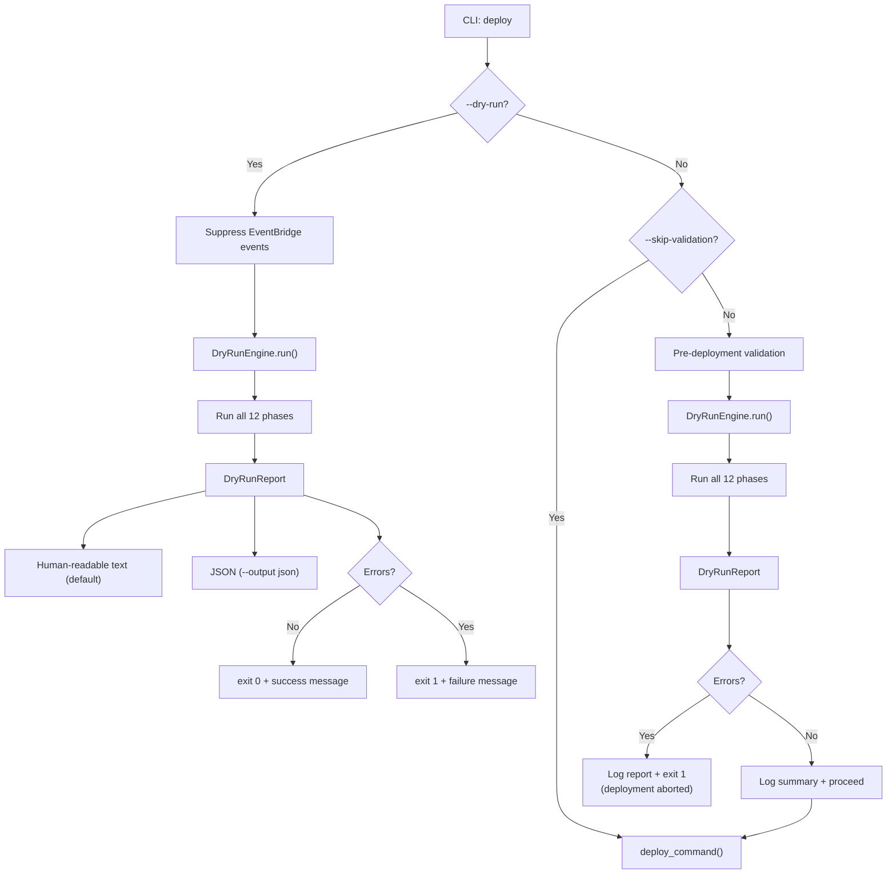
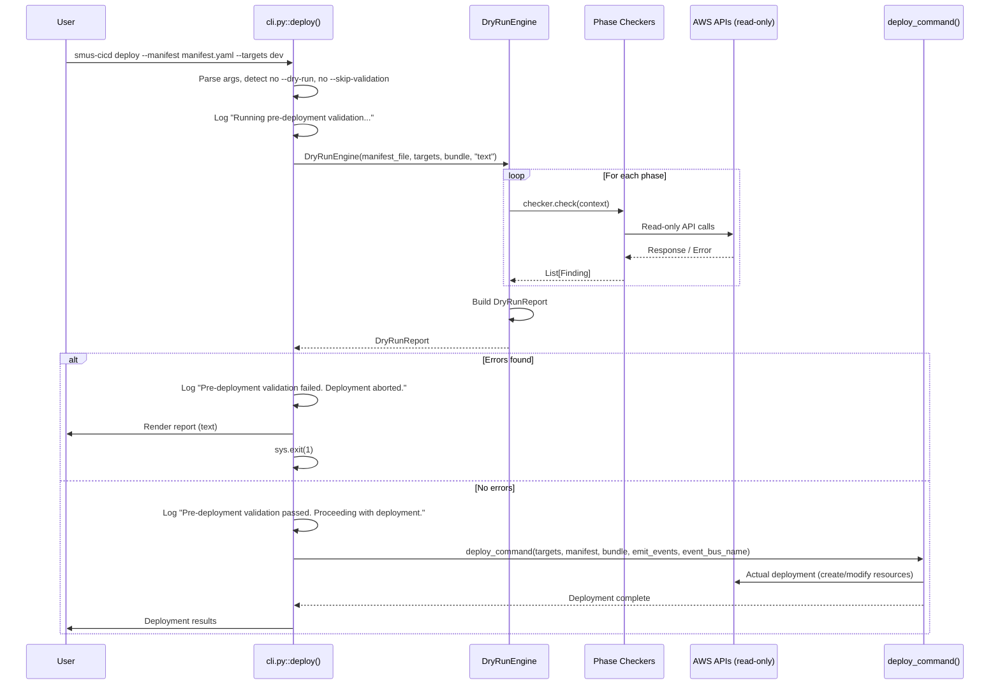
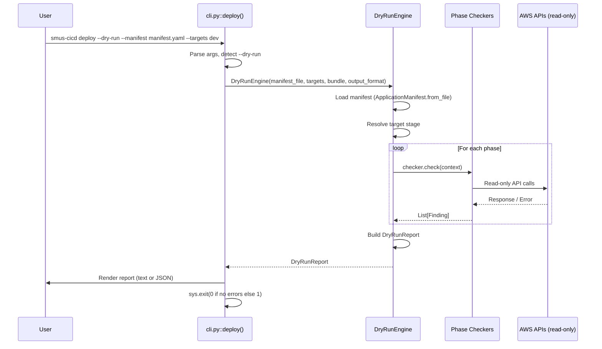

# Design Document: Deploy Dry Run

## Overview

The deploy dry-run feature adds a `--dry-run` flag to the existing `smus-cicd deploy` command. When active, the CLI executes every deployment phase in read-only mode: it loads and validates the manifest, explores the bundle archive, verifies IAM permissions, checks AWS resource reachability, simulates each deployment phase (project init, storage, git, catalog import, QuickSight, workflows, bootstrap actions), validates pre-existing resource dependencies (Glue Data Catalog resources including tables, views, and databases; data sources; form types; asset types), and produces a structured report — all without creating, modifying, or deleting any resources.

**Important: Best-Effort Validation.** The dry run is a best-effort validation mechanism. A successful dry run significantly reduces the risk of deployment failure but does not guarantee that the actual deployment will succeed. Conditions such as transient AWS service errors, IAM policy changes between validation and deployment, concurrent resource modifications by other actors, eventual consistency delays, and service quotas or throttling limits may cause a deployment to fail even after a clean dry-run report.

Additionally, the deploy command automatically runs the dry-run engine as a pre-deployment validation step before beginning the actual deployment. If the validation detects any ERROR-level findings, the deployment is aborted before any resources are created or modified. This prevents partial deployments that leave resources in an inconsistent state. The pre-deployment validation can be skipped with the `--skip-validation` flag.

The implementation introduces a `DryRunEngine` that orchestrates phase-specific checkers, a `PermissionChecker` that uses `iam:SimulatePrincipalPolicy` for permission verification, a `DependencyChecker` that validates pre-existing AWS resources and DataZone types referenced by catalog export data, and a `DryRunReport` model that collects findings classified as OK/WARNING/ERROR. The engine is invoked from the existing `deploy()` CLI function both when `--dry-run` is passed (standalone mode, short-circuiting the real deployment path) and as an automatic pre-deployment validation step during normal deploys.

### Design Goals

- Integrate naturally with the existing Typer CLI and deploy command flow
- Reuse existing helpers for read-only checks
- Maintain the same phase ordering as the real deploy command
- Produce both human-readable and JSON report output
- Suppress all side effects (resource creation, EventBridge events)
- Proactively detect missing pre-existing resources (Glue Data Catalog resources including tables, views, and databases; data sources; form types; asset types) that would cause silent failures during catalog import

### Key Source References

The design builds on top of the existing codebase. These files define the current architecture:

- #[[file:CICD-for-SageMakerUnifiedStudio-public/src/smus_cicd/cli.py]] — CLI entry point with `deploy()` function (add `--dry-run` and `--output` options here)
- #[[file:CICD-for-SageMakerUnifiedStudio-public/src/smus_cicd/commands/deploy.py]] — Current deploy command implementation (unchanged; dry-run short-circuits before this)
- #[[file:CICD-for-SageMakerUnifiedStudio-public/src/smus_cicd/helpers/datazone.py]] — DataZone helper (reuse for read-only domain/project checks)
- #[[file:CICD-for-SageMakerUnifiedStudio-public/src/smus_cicd/helpers/s3.py]] — S3 helper (reuse for bucket accessibility checks)
- #[[file:CICD-for-SageMakerUnifiedStudio-public/src/smus_cicd/helpers/iam.py]] — IAM helper (reuse for permission simulation)
- #[[file:CICD-for-SageMakerUnifiedStudio-public/src/smus_cicd/helpers/quicksight.py]] — QuickSight helper (reuse for dashboard checks)
- #[[file:CICD-for-SageMakerUnifiedStudio-public/src/smus_cicd/helpers/airflow_serverless.py]] — Airflow helper (reuse for workflow reachability)
- #[[file:CICD-for-SageMakerUnifiedStudio-public/src/smus_cicd/helpers/catalog_import.py]] — Catalog import helper (reuse for catalog validation)
- #[[file:CICD-for-SageMakerUnifiedStudio-public/src/smus_cicd/bootstrap/executor.py]] — Bootstrap executor (reference for action execution order)
- #[[file:CICD-for-SageMakerUnifiedStudio-public/src/smus_cicd/bootstrap/models.py]] — Bootstrap models (reuse BootstrapAction model)
- #[[file:CICD-for-SageMakerUnifiedStudio-public/src/smus_cicd/bootstrap/handlers/workflow_handler.py]] — Workflow bootstrap handler (reference for workflow permissions)
- #[[file:CICD-for-SageMakerUnifiedStudio-public/src/smus_cicd/bootstrap/handlers/workflow_create_handler.py]] — Workflow create handler (reference for create permissions)
- #[[file:CICD-for-SageMakerUnifiedStudio-public/src/smus_cicd/bootstrap/handlers/quicksight_handler.py]] — QuickSight bootstrap handler (reference for refresh permissions)
- #[[file:CICD-for-SageMakerUnifiedStudio-public/src/smus_cicd/bootstrap/handlers/datazone_handler.py]] — DataZone bootstrap handler (reference for environment/connection permissions)
- #[[file:CICD-for-SageMakerUnifiedStudio-public/src/smus_cicd/bootstrap/handlers/custom_handler.py]] — Custom/EventBridge handler (reference for put_events permissions)
- #[[file:CICD-for-SageMakerUnifiedStudio-public/docs/architecture.md]] — System architecture documentation
- #[[file:CICD-for-SageMakerUnifiedStudio-public/docs/bootstrap-actions.md]] — Bootstrap action types and their properties
- #[[file:CICD-for-SageMakerUnifiedStudio-public/docs/manifest-schema.md]] — Manifest YAML schema
- #[[file:CICD-for-SageMakerUnifiedStudio-public/docs/cli-commands.md]] — CLI command reference
- #[[file:CICD-for-SageMakerUnifiedStudio-public/developer/developer-guide.md]] — Developer guide with testing and contribution patterns

## Architecture

### High-Level Flow



### Integration with Existing Deploy Command

The `--dry-run` flag is added to the existing `deploy()` function in `cli.py`. When set, the function delegates to `DryRunEngine` instead of calling `deploy_command()`. When not set (and `--skip-validation` is not provided), the function runs `DryRunEngine` as a pre-deployment validation step before calling `deploy_command()`. This keeps the existing deploy logic completely untouched.



For standalone dry-run mode:



### Module Layout

New files to create:

```
src/smus_cicd/
├── commands/
│   └── dry_run/
│       ├── __init__.py
│       ├── engine.py               # DryRunEngine orchestrator
│       ├── models.py               # Finding, DryRunReport, Severity, Phase, DryRunContext
│       ├── report.py               # Text and JSON report formatters (ReportFormatter)
│       └── checkers/
│           ├── __init__.py
│           ├── manifest_checker.py  # Phase 1: Manifest & target validation
│           ├── bundle_checker.py    # Phase 2: Bundle artifact exploration
│           ├── permission_checker.py# Phase 3: IAM permission verification
│           ├── connectivity_checker.py # Phase 4: Reachability checks
│           ├── project_checker.py   # Phase 5: Project init simulation
│           ├── quicksight_checker.py# Phase 6: QuickSight simulation
│           ├── storage_checker.py   # Phase 7: Storage deployment simulation
│           ├── git_checker.py       # Phase 8: Git deployment simulation
│           ├── catalog_checker.py   # Phase 9: Catalog import simulation
│           ├── dependency_checker.py# Phase 9b: Pre-existing resource dependency validation
│           ├── workflow_checker.py  # Phase 10: Workflow validation
│           └── bootstrap_checker.py # Phase 11: Bootstrap action simulation
```

Test files to create:

```
tests/unit/commands/dry_run/
├── __init__.py
├── test_engine.py              # Engine orchestration, phase ordering
├── test_models.py              # Finding, DryRunReport, Severity, Phase
├── test_report.py              # Text and JSON formatters
├── test_manifest_checker.py    # Manifest & target validation
├── test_bundle_checker.py      # Bundle artifact exploration
├── test_permission_checker.py  # IAM permission verification
├── test_connectivity_checker.py# Reachability checks
├── test_project_checker.py     # Project init simulation
├── test_quicksight_checker.py  # QuickSight simulation
├── test_storage_checker.py     # Storage deployment simulation
├── test_git_checker.py         # Git deployment simulation
├── test_catalog_checker.py     # Catalog import simulation
├── test_dependency_checker.py  # Pre-existing resource dependency validation
├── test_workflow_checker.py    # Workflow validation
├── test_bootstrap_checker.py   # Bootstrap action simulation
└── test_properties.py          # All property-based tests (Hypothesis)
```

## Components and Interfaces

### 1. CLI Layer Changes

Modify #[[file:CICD-for-SageMakerUnifiedStudio-public/src/smus_cicd/cli.py]] to add three new options to the existing `deploy()` function:

- `--dry-run` (bool, default False): When True, delegate to `DryRunEngine` instead of `deploy_command()`
- `--output` (str, default "text"): Output format for the dry-run report ("text" or "json")
- `--skip-validation` (bool, default False): When True, skip the automatic pre-deployment dry-run validation step

The deploy function has three execution paths:

1. **Standalone dry-run** (`--dry-run`): Runs `DryRunEngine`, renders the report, exits with code 0 or 1. No deployment occurs. `emit_events` and `event_bus_name` are ignored.

2. **Normal deploy with pre-deployment validation** (default): Runs `DryRunEngine` first as a validation step. If the report contains any ERROR findings, the deployment is aborted — the report is displayed and the CLI exits with code 1. If validation passes (zero errors), a summary is logged and `deploy_command()` is called to proceed with the actual deployment. EventBridge events are suppressed during the validation phase and only emitted during the actual deployment if `--emit-events` is enabled.

3. **Normal deploy without validation** (`--skip-validation`): Calls `deploy_command()` directly, matching the current behavior before the dry-run feature was added.

```python
def deploy(
    manifest_file: str = ...,
    targets: str = ...,
    bundle: str = ...,
    emit_events: bool = ...,
    event_bus_name: str = ...,
    dry_run: bool = typer.Option(False, "--dry-run", help="..."),
    output_format: str = typer.Option("text", "--output", help="..."),
    skip_validation: bool = typer.Option(False, "--skip-validation", help="..."),
    target_positional: str = ...,
):
    configure_logging("TEXT", LOG_LEVEL)
    final_targets = target_positional if target_positional else targets

    if dry_run:
        # Path 1: Standalone dry-run
        report = DryRunEngine(manifest_file, final_targets, bundle, output_format).run()
        print(report.render(output_format))
        sys.exit(0 if report.error_count == 0 else 1)

    if not skip_validation:
        # Path 2: Pre-deployment validation
        logger.info("Running pre-deployment validation...")
        report = DryRunEngine(manifest_file, final_targets, bundle, "text").run()
        if report.error_count > 0:
            logger.error("Pre-deployment validation failed. Deployment aborted.")
            print(report.render("text"))
            sys.exit(1)
        logger.info(
            f"Pre-deployment validation passed. "
            f"{report.warning_count} warning(s). Proceeding with deployment."
        )

    # Path 2 (continued) or Path 3: Actual deployment
    deploy_command(final_targets, manifest_file, bundle, emit_events, event_bus_name)
```

### 2. DryRunEngine (`commands/dry_run/engine.py`)

The engine orchestrates all 12 checkers in deployment-phase order. Each checker receives a shared `DryRunContext` and returns a list of `Finding` objects.

Key behaviors:
- Instantiates each checker in phase order and calls `checker.check(context)`
- Adds findings to the `DryRunReport` under the corresponding `Phase`
- Fail-fast on manifest errors: if Phase 1 produces ERROR findings, the engine returns immediately (subsequent phases depend on a valid manifest)
- Continues through all other phases even when errors are found, to give a complete picture

### 3. Checker Interface

All checkers implement a common protocol:

```python
class Checker(Protocol):
    def check(self, context: DryRunContext) -> List[Finding]: ...
```

#### ManifestChecker (`checkers/manifest_checker.py`)

- Loads the manifest via `ApplicationManifest.from_file()` (same class used in #[[file:CICD-for-SageMakerUnifiedStudio-public/src/smus_cicd/commands/deploy.py]])
- Resolves the target stage using the same logic as `_get_target_name()` / `_get_target_config()` from deploy.py
- Validates environment variable references (`${VAR_NAME}` and `$VAR_NAME`) by scanning manifest content with regex and checking against `target_config.environment_variables` and `os.environ`
- Returns ERROR for missing/unparseable manifest, missing target stage; WARNING for unresolved env vars

#### BundleChecker (`checkers/bundle_checker.py`)

- Opens the bundle ZIP and enumerates all files (populates `context.bundle_files`)
- If no bundle path provided, uses the same resolution logic as deploy.py (`./artifacts` directory)
- Cross-references storage items and git items from `deployment_configuration` against bundle contents
- Validates `catalog/catalog_export.json` structure if present (populates `context.catalog_data`)
- Returns ERROR for missing artifacts, invalid ZIP, invalid catalog JSON; OK for successful checks

#### PermissionChecker (`checkers/permission_checker.py`)

- Uses `iam:SimulatePrincipalPolicy` to verify the caller has required permissions
- Builds a permissions map: `Dict[resource_arn, List[iam_action]]` from the deployment config
- Includes a `BOOTSTRAP_PERMISSION_MAP` dictionary mapping each bootstrap action type to its required IAM actions (see Permission Map table below)
- When catalog assets contain Glue Data Catalog resource references (tables, views, databases), adds `glue:GetTable`, `glue:GetDatabase`, and `glue:GetPartitions` to the permissions map for the dependency validation phase
- Falls back to WARNING (not ERROR) if `SimulatePrincipalPolicy` itself is denied

#### ConnectivityChecker (`checkers/connectivity_checker.py`)

- Calls `datazone:GetDomain` to verify domain reachability (reuses #[[file:CICD-for-SageMakerUnifiedStudio-public/src/smus_cicd/helpers/datazone.py]])
- Checks project existence via `get_project_by_name()` from datazone helper
- Calls `s3:HeadBucket` for each unique S3 bucket (reuses #[[file:CICD-for-SageMakerUnifiedStudio-public/src/smus_cicd/helpers/s3.py]])
- Checks Airflow environment reachability if workflow bootstrap actions are configured (reuses #[[file:CICD-for-SageMakerUnifiedStudio-public/src/smus_cicd/helpers/airflow_serverless.py]])

#### ProjectChecker (`checkers/project_checker.py`)

- Simulates project initialization: reports whether the target project exists or would be created
- Uses `get_project_by_name()` from datazone helper
- Returns OK if project exists, OK if not found but `create=True`, ERROR if not found and `create=False`

#### QuickSightChecker (`checkers/quicksight_checker.py`)

- Simulates QuickSight deployment if configured in manifest
- Reports which dashboards would be exported/imported
- Reuses #[[file:CICD-for-SageMakerUnifiedStudio-public/src/smus_cicd/helpers/quicksight.py]] for read-only checks

#### StorageChecker (`checkers/storage_checker.py`)

- Simulates storage deployment for each storage item in `deployment_configuration`
- Reports target S3 bucket, prefix, and file count per item

#### GitChecker (`checkers/git_checker.py`)

- Simulates git deployment for each git item in `deployment_configuration`
- Reports target connection, repository, and file count per item

#### CatalogChecker (`checkers/catalog_checker.py`)

- Validates catalog export data from `context.catalog_data` (populated by BundleChecker)
- Checks required fields (`type`, `name`, `identifier`) on each resource entry
- Verifies cross-references between catalog resources are resolvable
- Reports count of each resource type (glossaries, glossary terms, custom asset types, form types, data products)
- Reuses validation patterns from #[[file:CICD-for-SageMakerUnifiedStudio-public/src/smus_cicd/helpers/catalog_import.py]]

#### DependencyChecker (`checkers/dependency_checker.py`)

Validates that pre-existing AWS resources and DataZone types referenced by catalog export data exist in the target environment. This checker runs after CatalogChecker and uses `context.catalog_data` populated by BundleChecker.

Key behaviors:

- **Glue Data Catalog Resource Validation**: Parses each asset's `formsInput` to find forms with `GlueTableFormType` in the `typeIdentifier`. Extracts `databaseName` and `tableName` from the form's JSON `content` field. Note that `GlueTableFormType` covers both Glue tables and Glue views (distinguished by the `tableType` field in the content — views have `tableType` set to `VIRTUAL_VIEW` or similar). Calls `glue:GetDatabase` to verify database existence and `glue:GetTable` to verify table/view existence. For tables (non-view `tableType`), additionally calls `glue:GetPartitions` to validate partition accessibility. Caches results to avoid duplicate API calls for the same database/table/view. Reports ERROR for each missing Glue database, table, or view.

- **Data Source Validation**: Parses each asset's `formsInput` to find forms with `DataSourceReferenceFormType` in the `typeIdentifier`. Extracts `dataSourceType` (defaults to `GLUE`) from the form's JSON `content`. Calls `datazone:ListDataSources` on the target project and matches by type and database name using the same matching strategy as `_resolve_target_data_source()` in #[[file:CICD-for-SageMakerUnifiedStudio-public/src/smus_cicd/helpers/catalog_import.py]]. Reports WARNING (not ERROR) for missing data sources since the import strips the form rather than failing.

- **Custom Form Type Validation**: For each asset type in the catalog export, iterates over `formsInput` entries and extracts the `typeIdentifier` (or `typeName`). Skips managed form types (those with `amazon.datazone.` prefix) using the same `_is_managed_resource()` check from catalog_import.py. Calls `datazone:GetFormType` on the target domain for each custom form type. Reports ERROR for missing custom form types.

- **Custom Asset Type Validation**: For each asset in the catalog export, extracts the `typeIdentifier`. Skips managed asset types (those with `amazon.datazone.` prefix). Calls `datazone:SearchTypes` on the target domain to verify the asset type exists. Reports ERROR for missing custom asset types.

- **Form Type Revision Validation**: For each asset's `formsInput`, extracts custom form type identifiers and their `typeRevision`. Calls `datazone:GetFormType` to check if the revision is resolvable in the target domain. Reports WARNING for unresolvable revisions since the import falls back to the original revision.

API calls used (all read-only):
- `glue:GetTable(DatabaseName, Name)` — verify Glue table or view existence (views are tables with a different `tableType`)
- `glue:GetDatabase(Name)` — verify Glue database existence
- `glue:GetPartitions(DatabaseName, TableName)` — verify partition accessibility for Glue tables
- `datazone:ListDataSources(domainIdentifier, projectIdentifier)` — list data sources in target project
- `datazone:GetFormType(domainIdentifier, formTypeIdentifier)` — verify form type existence and revision
- `datazone:SearchTypes(domainIdentifier, searchScope=ASSET_TYPE)` — verify asset type existence

Caching strategy:
- Glue database existence results are cached by database name
- Glue table/view existence results are cached by `(databaseName, tableName)` tuple (covers both tables and views)
- Glue partition check results are cached by `(databaseName, tableName)` tuple
- Data source lookup results are cached by `(dataSourceType, databaseName)` tuple
- Form type existence/revision results are cached by form type name
- Asset type existence results are cached by type identifier

#### WorkflowChecker (`checkers/workflow_checker.py`)

- Validates workflow YAML files from bundle or local filesystem
- Checks for valid YAML syntax and required top-level Airflow DAG keys
- Verifies environment variable references against `target_config.environment_variables`

#### BootstrapChecker (`checkers/bootstrap_checker.py`)

- Lists each bootstrap action that would execute, including type and parameters
- References bootstrap action types from #[[file:CICD-for-SageMakerUnifiedStudio-public/docs/bootstrap-actions.md]]
- Uses action registry from #[[file:CICD-for-SageMakerUnifiedStudio-public/src/smus_cicd/bootstrap/action_registry.py]]

### 4. Report Formatter (`commands/dry_run/report.py`)

- `ReportFormatter.to_text(report)`: Renders human-readable text with severity icons (✅/⚠️/❌), grouped by phase, with summary counts
- `ReportFormatter.to_json(report)`: Renders machine-readable JSON with `summary` (ok/warnings/errors counts) and `phases` (findings per phase)

## Data Models (`commands/dry_run/models.py`)

### Severity (Enum)
- `OK` — Check passed
- `WARNING` — Non-blocking issue
- `ERROR` — Blocking issue that would cause deployment failure

### Phase (Enum)
Deployment phases in execution order:
`MANIFEST_VALIDATION` → `BUNDLE_EXPLORATION` → `PERMISSION_VERIFICATION` → `CONNECTIVITY` → `PROJECT_INIT` → `QUICKSIGHT` → `STORAGE_DEPLOYMENT` → `GIT_DEPLOYMENT` → `CATALOG_IMPORT` → `DEPENDENCY_VALIDATION` → `WORKFLOW_VALIDATION` → `BOOTSTRAP_ACTIONS`

### Finding (dataclass)
- `severity: Severity`
- `message: str`
- `phase: Optional[Phase]` (set by DryRunReport.add_findings)
- `resource: Optional[str]` (AWS resource ARN or identifier)
- `service: Optional[str]` (AWS service name)
- `details: Optional[Dict[str, Any]]`

### DryRunContext (dataclass)
Shared state passed between checkers:
- `manifest` — Parsed ApplicationManifest
- `stage_name` — Resolved target stage name
- `target_config` — Resolved StageConfig
- `config` — Domain config dict (region, domain_id, etc.)
- `bundle_path` — Path to bundle ZIP
- `bundle_files` — Set of file names inside bundle
- `catalog_data` — Parsed catalog_export.json
- `manifest_file` — Path to manifest YAML file

### DryRunReport (dataclass)
- `findings_by_phase: Dict[Phase, List[Finding]]`
- `add_findings(phase, findings)` — Adds findings and sets their phase
- `ok_count`, `warning_count`, `error_count` — Computed properties
- `has_blocking_errors(phase)` — True if any ERROR findings in given phase
- `render(output_format)` — Delegates to ReportFormatter

### Permission Map

The `BOOTSTRAP_PERMISSION_MAP` in PermissionChecker maps each bootstrap action type to required IAM actions:

| Bootstrap Action Type | Required IAM Actions |
|---|---|
| `workflow.create` | `airflow-serverless:CreateWorkflow`, `airflow-serverless:GetWorkflow` |
| `workflow.run` | `airflow-serverless:CreateWorkflowRun` |
| `workflow.logs` | `logs:GetLogEvents`, `logs:FilterLogEvents` |
| `workflow.monitor` | `airflow-serverless:GetWorkflow`, `logs:GetLogEvents`, `logs:FilterLogEvents` |
| `quicksight.refresh_dataset` | `quicksight:CreateIngestion`, `quicksight:DescribeIngestion`, `quicksight:ListDataSets` |
| `eventbridge.put_events` | `events:PutEvents` |
| `project.create_environment` | `datazone:CreateEnvironment` |
| `project.create_connection` | `datazone:CreateConnection` |
| `catalog.dependency_check` | `glue:GetTable`, `glue:GetDatabase`, `glue:GetPartitions` |

### JSON Report Schema

```json
{
  "summary": { "ok": 15, "warnings": 2, "errors": 0 },
  "phases": {
    "Manifest Validation": [
      {"severity": "OK", "message": "Manifest loaded successfully"},
      {"severity": "OK", "message": "Target stage 'dev' resolved"}
    ],
    "Permission Verification": [
      {"severity": "WARNING", "message": "Could not verify permissions for arn:aws:s3:::my-bucket/*: AccessDenied"}
    ]
  }
}
```

## Correctness Properties

*A property is a characteristic or behavior that should hold true across all valid executions of a system — essentially, a formal statement about what the system should do.*

### Property 1: No-mutation invariant

*For any* valid manifest, target configuration, and bundle archive, executing the dry-run engine shall invoke zero mutating AWS API calls (no `create*`, `put*`, `delete*`, `update*`, `upload*` operations on any boto3 client). Only read-only calls (`get*`, `describe*`, `head*`, `list*`, `simulate*`, `search*`) are permitted.

**Validates: Requirements 1.1**

### Property 2: CLI option compatibility

*For any* combination of existing deploy options (`--manifest`, `--targets`, `--bundle-archive-path`, `--emit-events/--no-events`, `--event-bus-name`), the CLI parser shall accept the `--dry-run` flag without raising a parsing error.

**Validates: Requirements 1.3**

### Property 3: Event suppression under dry-run

*For any* value of `--emit-events` (True, False, or None), when `--dry-run` is active, the system shall not instantiate an EventEmitter or emit any EventBridge events.

**Validates: Requirements 1.4**

### Property 4: Environment variable detection

*For any* manifest content string containing `${VAR_NAME}` or `$VAR_NAME` references and any environment variable dictionary, the ManifestChecker shall report a WARNING finding for every variable reference whose name is absent from both the dictionary and `os.environ`.

**Validates: Requirements 2.5**

### Property 5: Manifest validation error reporting

*For any* input string, if the string is not valid YAML or does not conform to the manifest schema, the ManifestChecker shall return at least one ERROR finding. Conversely, if the string is valid YAML conforming to the schema, no ERROR findings shall be produced for the manifest parsing step.

**Validates: Requirements 2.1, 2.2**

### Property 6: Bundle file enumeration

*For any* valid ZIP archive, the BundleChecker shall report an OK finding whose message contains the exact count of files in the archive, and `context.bundle_files` shall equal the set of file names returned by `ZipFile.namelist()`.

**Validates: Requirements 3.1**

### Property 7: Missing artifact detection

*For any* deployment configuration listing storage and git items, and any bundle archive, every item name that has no corresponding files in the bundle (and no local filesystem fallback) shall produce an ERROR finding containing the item name. Items that do have corresponding files shall not produce ERROR findings.

**Validates: Requirements 3.3, 3.4, 3.5**

### Property 8: Catalog export schema validation

*For any* JSON object, if it is missing any of the required top-level keys (`metadata`, `resources`) or required metadata keys, the CatalogChecker shall produce an ERROR finding. If all required keys are present, no schema-related ERROR findings shall be produced.

**Validates: Requirements 3.6**

### Property 9: Permission set correctness

*For any* deployment configuration (with arbitrary combinations of storage items, catalog assets, IAM role config, QuickSight dashboards, and bootstrap actions of any type), the set of IAM actions passed to `simulate_principal_policy` by the PermissionChecker shall exactly equal the union of actions derived from the `BOOTSTRAP_PERMISSION_MAP` for each bootstrap action type, plus the base actions required by each enabled deployment feature (S3, DataZone, catalog, IAM, QuickSight), plus `glue:GetTable`, `glue:GetDatabase`, and `glue:GetPartitions` when catalog assets contain Glue Data Catalog resource references. When `simulate_principal_policy` returns "denied" for an action, the corresponding finding shall contain the action name and resource ARN.

**Validates: Requirements 4.1–4.13**

### Property 10: Project existence simulation

*For any* project configuration with `create` set to True or False, and any mock DataZone response (project exists or not found), the dry-run engine shall produce an OK finding when the project exists, an OK finding when the project does not exist but `create=True`, and an ERROR finding when the project does not exist and `create=False`.

**Validates: Requirements 5.1, 6.2**

### Property 11: Storage simulation reporting

*For any* storage deployment configuration item and corresponding bundle contents, the StorageChecker shall produce a finding whose message contains the target S3 bucket name, the S3 prefix, and the file count matching the number of files in the bundle for that item.

**Validates: Requirements 5.2**

### Property 12: Catalog resource type counting

*For any* catalog export JSON containing resources of types glossary, glossary_term, custom_asset_type, form_type, and data_product, the CatalogChecker shall produce a finding whose message contains the correct count for each resource type present.

**Validates: Requirements 5.4, 8.4**

### Property 13: Phase ordering invariant

*For any* dry-run execution, the phases in the report shall appear in the order: Manifest Validation → Bundle Exploration → Permission Verification → Connectivity & Reachability → Project Initialization → QuickSight Deployment → Storage Deployment → Git Deployment → Catalog Import → Dependency Validation → Workflow Validation → Bootstrap Actions.

**Validates: Requirements 5.7**

### Property 14: S3 bucket reachability

*For any* set of S3 bucket names referenced in the deployment configuration, the ConnectivityChecker shall call `s3:HeadBucket` for each unique bucket. When `HeadBucket` succeeds, an OK finding is produced. When it raises an exception, an ERROR finding is produced containing the bucket name and the error message.

**Validates: Requirements 6.3, 6.5**

### Property 15: Report structure correctness

*For any* list of findings with arbitrary severities and phases, the DryRunReport shall satisfy: `ok_count` equals the number of findings with severity OK, `warning_count` equals the number with severity WARNING, `error_count` equals the number with severity ERROR, and `findings_by_phase[p]` contains exactly the findings assigned to phase `p`.

**Validates: Requirements 7.1, 7.2, 7.3**

### Property 16: Exit code correctness

*For any* DryRunReport, the CLI exit code shall be 0 if and only if `error_count == 0`. If `error_count > 0`, the exit code shall be non-zero.

**Validates: Requirements 7.4, 7.5**

### Property 17: JSON report round-trip

*For any* DryRunReport, serializing it to JSON via `ReportFormatter.to_json()` and then parsing the result with `json.loads()` shall produce a dictionary whose `summary.ok`, `summary.warnings`, and `summary.errors` values equal the report's `ok_count`, `warning_count`, and `error_count` respectively.

**Validates: Requirements 7.7**

### Property 18: Catalog resource field validation

*For any* catalog resource entry, if it is missing any of the required fields (`type`, `name`, `identifier`), the CatalogChecker shall produce an ERROR finding referencing the resource. If all required fields are present, no field-validation ERROR shall be produced for that resource.

**Validates: Requirements 8.1**

### Property 19: Catalog cross-reference resolution

*For any* catalog export containing cross-references (glossary terms referencing glossary identifiers, assets referencing form type identifiers), if a referenced identifier does not exist in the catalog data, the CatalogChecker shall produce an ERROR finding for each unresolvable reference.

**Validates: Requirements 8.2**

### Property 20: Workflow file validation

*For any* file content string, the WorkflowChecker shall produce an ERROR finding if the content is not valid YAML, or if the parsed YAML is missing required top-level DAG keys. Additionally, for any set of `${VAR}` / `$VAR` references in the workflow content and any environment variable dictionary, every unresolved variable shall produce a WARNING finding.

**Validates: Requirements 9.1, 9.2, 9.3**

### Property 21: Dry-run idempotence

*For any* valid manifest, target, and bundle inputs, executing the dry-run engine twice with the same inputs shall produce reports with identical finding counts (ok, warning, error) and identical finding messages.

**Validates: Requirements 11.6**

### Property 22: Bootstrap action listing

*For any* list of bootstrap actions in the manifest, the BootstrapChecker shall produce one OK finding per action whose message contains the action's type string and its parameter keys.

**Validates: Requirements 5.6**

### Property 23: Glue Data Catalog resource dependency detection

*For any* catalog export containing assets with GlueTableFormType forms (covering both Glue tables and Glue views), and any set of Glue table/view/database existence responses, the DependencyChecker shall produce an ERROR finding for each `(databaseName, tableName)` pair where `glue:GetTable` returns a `EntityNotFoundException` — regardless of whether the asset is a table or a view. For Glue tables (non-view `tableType`), the DependencyChecker shall additionally call `glue:GetPartitions` and produce a WARNING finding if partitions are inaccessible. Assets whose GlueTableFormType content contains a `databaseName` and `tableName` that both exist shall not produce ERROR findings for those references.

**Validates: Requirements 13.1, 13.2, 13.3**

### Property 24: Data source dependency detection

*For any* catalog export containing assets with DataSourceReferenceFormType forms, and any set of `datazone:ListDataSources` responses, the DependencyChecker shall produce a WARNING finding for each asset whose data source type and database name combination has no matching data source in the target project. Assets with matching data sources shall not produce WARNING findings for those references.

**Validates: Requirements 13.4, 13.5**

### Property 25: Custom form type dependency detection

*For any* catalog export containing asset types with formsInput referencing custom form types (non-`amazon.datazone.` prefix), and any set of `datazone:GetFormType` responses, the DependencyChecker shall produce an ERROR finding for each custom form type that does not exist in the target domain. Managed form types (with `amazon.datazone.` prefix) shall not be checked and shall not produce findings.

**Validates: Requirements 13.6, 13.7, 13.12**

### Property 26: Custom asset type dependency detection

*For any* catalog export containing assets with typeIdentifier referencing custom asset types (non-`amazon.datazone.` prefix), and any set of `datazone:SearchTypes` responses, the DependencyChecker shall produce an ERROR finding for each custom asset type that does not exist in the target domain. Managed asset types (with `amazon.datazone.` prefix) shall not be checked and shall not produce findings.

**Validates: Requirements 13.8, 13.9, 13.12**

### Property 27: Form type revision resolution

*For any* catalog export containing assets with formsInput referencing custom form types with typeRevision values, and any set of `datazone:GetFormType` responses, the DependencyChecker shall produce a WARNING finding for each custom form type whose revision cannot be resolved in the target domain. Form types whose revision is successfully resolved shall not produce WARNING findings.

**Validates: Requirements 13.10, 13.11**

### Property 28: Dependency check caching

*For any* catalog export containing N assets referencing the same Glue database, the DependencyChecker shall call `glue:GetDatabase` at most once for that database name. Similarly, for M assets referencing the same `(databaseName, tableName)` pair (whether the asset is a table or a view), `glue:GetTable` shall be called at most once for that pair, and `glue:GetPartitions` shall be called at most once for that pair when applicable. The same caching invariant applies to form type lookups, asset type lookups, and data source lookups.

### Property 29: Pre-deployment validation gate

*For any* deploy invocation without `--dry-run` and without `--skip-validation`, the CLI shall execute `DryRunEngine.run()` before calling `deploy_command()`. If the resulting report has `error_count > 0`, `deploy_command()` shall not be called and the CLI shall exit with a non-zero exit code. If `error_count == 0`, `deploy_command()` shall be called exactly once.

**Validates: Requirements 14.1, 14.2, 14.3**

### Property 30: Skip-validation bypass

*For any* deploy invocation with `--skip-validation` (and without `--dry-run`), the CLI shall call `deploy_command()` without executing `DryRunEngine.run()`. The `DryRunEngine` constructor shall not be invoked.

**Validates: Requirements 14.7**

### Property 31: Pre-deployment event suppression

*For any* deploy invocation without `--dry-run` and without `--skip-validation`, during the pre-deployment validation phase the system shall not instantiate an EventEmitter or emit any EventBridge events. EventBridge events shall only be emitted during the subsequent `deploy_command()` call if `--emit-events` is enabled.

**Validates: Requirements 14.9**

### Property 32: Pre-deployment validation uses same engine

*For any* deploy invocation, the pre-deployment validation step shall use the same `DryRunEngine` class, the same set of checkers, and the same `DryRunReport` model as the standalone `--dry-run` mode. Given identical inputs, the pre-deployment validation and standalone dry-run shall produce reports with identical finding counts and messages.

**Validates: Requirements 14.8**

## Error Handling

### Error Classification

| Severity | Meaning | Effect |
|---|---|---|
| `OK` | Check passed | Informational, no action needed |
| `WARNING` | Non-blocking issue | Deployment may succeed but has risks (e.g., unresolved env vars, permission check failures due to IAM policy restrictions) |
| `ERROR` | Blocking issue | Deployment would fail (e.g., missing manifest, missing artifacts, denied permissions, unreachable resources) |

### Error Propagation Strategy

1. **Fail-fast on manifest errors**: If the manifest cannot be loaded or the target stage cannot be resolved, the engine stops immediately and returns the report with only manifest-phase findings.
2. **Continue on non-blocking errors**: For all other phases, the engine continues through all checks even when errors are found, giving the operator a complete picture.
3. **AWS API errors as findings**: Any exception from an AWS API call is caught and converted to a `Finding` with appropriate severity. The engine never crashes due to AWS errors.
4. **Permission simulation fallback**: If `iam:SimulatePrincipalPolicy` itself is denied, the PermissionChecker produces a WARNING (not ERROR) since it cannot verify permissions but this doesn't mean they're missing.

### Exit Codes

| Exit Code | Condition |
|---|---|
| `0` | All checks passed (zero ERROR findings) |
| `1` | One or more ERROR findings detected |

## Testing Strategy

### Dual Testing Approach

- **Unit tests** (`pytest`): Verify specific examples, edge cases, error conditions, and integration points between checkers
- **Property-based tests** (`hypothesis`): Verify universal properties across randomly generated inputs using the 32 correctness properties defined above

### Property-Based Testing Configuration

- **Library**: [Hypothesis](https://hypothesis.readthedocs.io/) — add `hypothesis>=6.0.0` to `[project.optional-dependencies] dev` in #[[file:CICD-for-SageMakerUnifiedStudio-public/pyproject.toml]]
- **Minimum iterations**: 100 per property test (`@settings(max_examples=100)`)
- **Tag format**: Each test is annotated with a comment referencing the design property (e.g., `# Feature: deploy-dry-run, Property 15: Report structure correctness`)
- **Each correctness property maps to a single property-based test function** in `test_properties.py`

### Property-Based Tests for Dependency Validation

The following property-based tests use Hypothesis to generate random catalog export structures with varying combinations of Glue table references, data source references, custom form types, and custom asset types. Mock AWS API responses are generated to simulate both existing and missing resources:

- `test_property_23_glue_data_catalog_dependency`: Generates random assets with GlueTableFormType content containing `databaseName`/`tableName` pairs for both tables and views (varying `tableType` field). Mocks `glue:GetTable`, `glue:GetDatabase`, and `glue:GetPartitions` to return success or `EntityNotFoundException`. Verifies ERROR findings match exactly the set of missing resources regardless of whether the asset is a table or view.
- `test_property_24_data_source_dependency`: Generates random assets with DataSourceReferenceFormType content. Mocks `datazone:ListDataSources` with varying data source lists. Verifies WARNING findings match assets with no matching data source.
- `test_property_25_form_type_dependency`: Generates random asset types with formsInput referencing a mix of managed and custom form types. Mocks `datazone:GetFormType`. Verifies ERROR findings only for missing custom form types, never for managed ones.
- `test_property_26_asset_type_dependency`: Generates random assets with custom and managed typeIdentifiers. Mocks `datazone:SearchTypes`. Verifies ERROR findings only for missing custom asset types.
- `test_property_27_form_type_revision`: Generates random assets with formsInput containing typeRevision values. Mocks `datazone:GetFormType` revision responses. Verifies WARNING findings for unresolvable revisions.
- `test_property_28_dependency_caching`: Generates N assets referencing the same Glue database/table/view. Counts API calls to verify at-most-once invocation per unique resource, including `glue:GetPartitions` calls for tables.

### Property-Based Tests for Pre-Deployment Validation

The following property-based tests verify the pre-deployment validation gate behavior:

- `test_property_29_pre_deployment_gate`: Generates random DryRunReport instances with varying error counts. Mocks `DryRunEngine.run()` to return the generated report and `deploy_command` to track invocations. Verifies that `deploy_command` is called exactly once when `error_count == 0` and never called when `error_count > 0`.
- `test_property_30_skip_validation_bypass`: Generates random deploy arguments with `--skip-validation` set. Mocks `DryRunEngine` constructor and `deploy_command`. Verifies that `DryRunEngine` is never instantiated and `deploy_command` is called exactly once.
- `test_property_31_pre_deployment_event_suppression`: Generates random deploy arguments without `--dry-run` and without `--skip-validation`, with varying `--emit-events` values. Mocks `EventEmitter` and verifies it is not instantiated during the validation phase.
- `test_property_32_validation_engine_consistency`: Generates random manifest/target/bundle inputs. Runs both standalone dry-run and pre-deployment validation with the same inputs. Verifies that both produce reports with identical finding counts and messages.

### Unit Test Coverage Targets

All dry-run modules target 95%+ line coverage. Key scenarios per module:

| Module | Key Scenarios |
|---|---|
| `engine.py` | Phase ordering, early termination on manifest error, full flow |
| `cli.py (deploy)` | Standalone dry-run, pre-deployment validation pass → deploy, pre-deployment validation fail → abort, --skip-validation bypass, --dry-run + --skip-validation interaction |
| `models.py` | Finding creation, report aggregation, severity counting |
| `report.py` | Text formatting, JSON formatting, empty report |
| `manifest_checker.py` | Valid manifest, invalid YAML, missing stage, unresolved vars |
| `bundle_checker.py` | Valid ZIP, missing artifacts, catalog validation, bad ZIP |
| `permission_checker.py` | All permission types, denied permissions, API failures |
| `connectivity_checker.py` | Reachable/unreachable domain, bucket, Airflow |
| `catalog_checker.py` | Valid/invalid catalog JSON, cross-references, resource counts |
| `dependency_checker.py` | Missing Glue tables/views/databases, missing data sources, missing form types, missing asset types, unresolvable revisions, managed resource skipping, caching behavior, partition accessibility |
| `workflow_checker.py` | Valid/invalid YAML, missing DAG keys, unresolved vars |
| `bootstrap_checker.py` | All 8 action types, empty actions list |

### Integration Test Strategy

Integration tests live in `tests/integration/` and run against real AWS resources:

1. **Happy path**: Valid manifest + bundle → report with zero errors
2. **Invalid manifest**: Malformed YAML → report with manifest validation errors
3. **Missing permissions**: Restricted IAM identity → report with permission errors
4. **Unreachable resources**: Nonexistent S3 bucket / DataZone domain → connectivity errors
5. **Invalid bundle**: Incomplete artifacts → bundle validation errors
6. **Idempotence**: Same inputs twice → identical reports
7. **Missing Glue dependencies**: Catalog export referencing nonexistent Glue tables, views, or databases → dependency validation errors
8. **Missing DataZone types**: Catalog export referencing nonexistent custom form types/asset types → dependency validation errors
9. **Pre-deployment validation pass**: Normal deploy with valid manifest + bundle → validation passes, deployment proceeds and completes
10. **Pre-deployment validation fail**: Normal deploy with missing permissions or unreachable resources → validation fails, deployment aborted, no resources created
11. **Skip validation**: Normal deploy with `--skip-validation` → no validation step, deployment proceeds directly
