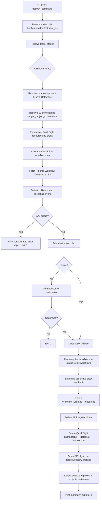

# Design Document: `destroy` Command

## Overview

The `destroy` command is the inverse of `deploy` for the SMUS CI/CD CLI. It reads a manifest file, identifies the targeted stage(s), and deletes all resources that were created by `deploy`: QuickSight dashboards/datasets/data sources, S3 objects at declared target paths, Airflow serverless workflows, workflow-created resources (e.g. Glue jobs), and optionally the DataZone project.

The command is always synchronous and follows a strict two-phase model:

1. **Validation phase** — read-only AWS API calls to discover resources, detect collisions, and collect all issues across all targeted stages before touching anything.
2. **Destruction phase** — sequential deletion in a fixed dependency order, only reached after a clean validation and explicit user confirmation.

This design ensures the operator can review the full impact before any irreversible action begins, and that partial failures leave the system in a predictable state.

---

## Architecture



### Key Design Decisions

- **Collect-all-errors validation**: The validation phase never aborts early. All stages are validated and all issues are collected before any error is reported. This gives the operator a complete picture.
- **Single confirmation gate**: All confirmations (including active-run force-stop) happen in one prompt after the full plan is printed, not scattered through execution.
- **Operator registry pattern**: Workflow-created resources are discovered by parsing YAML files and matching operator class names against a plain dict registry. Adding support for a new operator type requires only a new dict entry.
- **Prefix-based QuickSight enumeration**: Rather than tracking deployed resource IDs, destroy scans all QuickSight resources and filters by the `Resource_Prefix`. This is resilient to state drift but requires the prefix to be unique.
- **S3 paths resolved from live connections**: S3 bucket/prefix is resolved via `get_project_connections` at destroy time, not inferred from the manifest alone. This matches how deploy resolves paths.
- **Workflow run re-check before stopping**: The validation phase records active workflow runs at discovery time, but the user may take time to review the plan before confirming. At the start of the destruction phase, the live run status is re-queried for each workflow before calling `stop_workflow_run`. Runs that completed naturally in the interim are skipped; any new runs that started after validation are also caught and stopped.

---

## Components and Interfaces

### New Files

#### `src/smus_cicd/commands/destroy.py`

The main command implementation. Exports `destroy_command(manifest, targets, force, output)`.

Internal structure:
- `_validate_stage(stage_name, stage_config, manifest, region) -> ValidationResult` — performs all read-only discovery for one stage
- `_destroy_stage(stage_name, stage_config, manifest, validation_result, region, output) -> List[ResourceResult]` — executes deletion for one stage
- `_get_active_workflow_runs(workflow_arn, region) -> List[str]` — re-queries live run status at destruction time, returns list of currently active run IDs
- `_resolve_resource_prefix(stage_name, qs_config) -> str` — applies `{stage.name}` substitution to the prefix template
- `_parse_workflow_yaml_from_s3(bucket, key, region) -> dict` — fetches and parses a workflow YAML from S3
- `_discover_workflow_created_resources(workflow_yaml, stage_name) -> List[ResourceToDelete]` — walks tasks and matches against operator registry
- `_resolve_s3_targets(stage_config, connections) -> List[S3Target]` — builds deduplicated list of S3 prefixes to delete

#### `src/smus_cicd/helpers/operator_registry.py`

The operator registry. A plain module-level dict with a helper to look up entries.

```python
OPERATOR_REGISTRY = {
    "airflow.providers.amazon.aws.operators.glue.GlueJobOperator": {
        "resource_name_field": "job_name",
        "delete_fn": _delete_glue_job,
    }
}
```

`_delete_glue_job(resource_name, region)` calls `boto3.client('glue').delete_job(JobName=resource_name)`.

### Modified Files

#### `src/smus_cicd/helpers/quicksight.py`

Add two new paginated list helpers following the same pattern as `list_datasets`:

- `list_dashboards(aws_account_id, region) -> List[Dict]` — paginates `client.list_dashboards()`
- `list_data_sources(aws_account_id, region) -> List[Dict]` — paginates `client.list_data_sources()`

#### `src/smus_cicd/cli.py`

Register the `destroy` command following the same pattern as `delete`.

---

## Data Models

```python
@dataclass
class ResourceToDelete:
    resource_type: str   # "quicksight_dashboard" | "quicksight_dataset" |
                         # "quicksight_data_source" | "airflow_workflow" |
                         # "glue_job" | "s3_prefix" | "datazone_project"
    resource_id: str     # ID, ARN, name, or S3 prefix
    stage: str
    metadata: dict       # e.g. {"workflow_name": "...", "operator": "..."}


@dataclass
class S3Target:
    bucket: str
    prefix: str          # full prefix = connection_base + "/" + targetDirectory
    connection_name: str


@dataclass
class ValidationResult:
    errors: List[str]                              # fatal issues (collisions)
    warnings: List[str]                            # non-fatal (already absent)
    resources: List[ResourceToDelete]              # the destruction plan
    active_workflow_runs: Dict[str, List[str]]     # workflow_name -> [run_ids]


@dataclass
class ResourceResult:
    resource_type: str
    resource_id: str
    status: str          # "deleted" | "not_found" | "error" | "skipped"
    message: str
```

### Resource Prefix Resolution

The `Resource_Prefix` is read from:
```
stage.deployment_configuration.quicksight.overrideParameters
  .ResourceIdOverrideConfiguration.PrefixForAllResources
```

The template variable `{stage.name}` is replaced with the stage key (e.g. `dev`). Example:
- Template: `deployed-{stage.name}-covid-`
- Stage key: `dev`
- Resolved: `deployed-dev-covid-`

### Workflow Name Reconstruction

Uses the existing `generate_workflow_name` helper:
```python
workflow_name = generate_workflow_name(
    bundle_name=manifest.application_name,
    project_name=stage.project.name,
    dag_name=workflow_entry["workflowName"],
)
```

Format: `{app_name}_{project_name}_{dag_name}` with `-` → `_`.

### Workflow YAML S3 Path Resolution

The workflow YAML S3 path is resolved as follows:
1. Find the `deployment_configuration.storage` entry whose `name` matches `"workflows"`.
2. Call `get_project_connections` to get the S3 connection for that entry's `connectionName`.
3. Construct the S3 key: `{connection.s3Uri_path}/{targetDirectory}/{workflow_file_name}.yaml`

The workflow file name is derived from the `workflowName` field in `content.workflows`.

---

## Design Decision: Workflow-Created Resource Cleanup Strategy

Two approaches were evaluated for cleaning up resources created by Airflow workflow tasks (e.g. Glue jobs).

### Option A: Operator Registry (chosen)

Parse the workflow YAML files statically, match task operator class names against a registry dict, extract the resource name from a well-known field, and call the appropriate boto3 delete API directly.

**Pros:**
- No runtime dependency on Airflow serverless being healthy — destroy works even if the workflow engine is degraded
- Deterministic: resource names are read directly from the YAML, no execution required
- Simple to implement and test — pure Python dict lookup + boto3 call
- Extensible: adding a new operator type requires only a new dict entry, no changes to parser logic
- Destruction ordering is fully controlled by the destroy command itself
- Works even after the Airflow workflow has already been deleted (YAML still in S3)

**Cons:**
- Only covers operators whose resource name is a static field in the task definition — operators that create resources dynamically at runtime (e.g. names computed inside notebook code) cannot be handled
- Requires maintaining the registry as new operator types are adopted
- Template variables in resource name fields (e.g. `{proj.name}`) cannot be resolved statically and must be skipped with a warning

### Option B: Reverse Destroy Workflow DAG

Programmatically generate a new Airflow DAG that is the inverse of the original — replacing each create/run task with a corresponding delete task — upload it to S3, create it as a new workflow, and run it.

**Pros:**
- Conceptually complete: if the forward workflow created it, the reverse workflow deletes it
- Could handle dynamically-named resources if the delete task logic mirrors the create task logic

**Cons:**
- No delete operators exist in the Airflow Amazon provider for most resource types. `GlueJobOperator` has no `GlueDeleteJobOperator` counterpart; `SageMakerNotebookOperator` has no inverse. A reverse DAG would require custom `PythonOperator` or `BashOperator` tasks with inline boto3 code — the same per-operator logic, just moved into DAG generation code
- The Airflow serverless workflow infrastructure is itself being deleted by destroy. The reverse DAG must run before the workflow is deleted, creating a circular dependency on the ordering
- Error handling is significantly harder: a failed task in the reverse DAG leaves the system in an unknown state with no clear recovery path
- Requires the Airflow serverless service to be healthy and reachable to complete cleanup — destroy would fail if the service is degraded
- Variable resolution at destroy time may differ from deploy time (project connections, environment variables may have changed)
- Adds latency: the reverse DAG must be uploaded, registered, run, and monitored before destroy can proceed
- Testing is much harder — requires a live Airflow environment to validate

### Justification for Option A

The reverse DAG approach does not eliminate the per-operator logic problem — it just relocates it from a Python dict to DAG generation code. Since the Airflow Amazon provider does not provide delete operators for the resource types used in this codebase (`GlueJobOperator`, `SageMakerNotebookOperator`), Option B would require writing custom operator wrappers regardless.

Given that the actual operator set in use is small (effectively one operator type that creates deletable named resources: `GlueJobOperator`), the operator registry approach is strictly simpler, more reliable, and easier to test. Option B's additional complexity is not justified by any capability advantage for the current use cases.

---

*A property is a characteristic or behavior that should hold true across all valid executions of a system — essentially, a formal statement about what the system should do. Properties serve as the bridge between human-readable specifications and machine-verifiable correctness guarantees.*

### Property 1: Invalid stage names abort before destruction

*For any* manifest and any `--targets` value containing a stage name not present in the manifest's `stages` dict, the command must exit with a non-zero code and must not invoke any deletion API call.

**Validates: Requirements 1.5**

---

### Property 2: Validation errors prevent all destructive actions

*For any* set of targeted stages where the validation phase produces at least one error (collision, duplicate workflow ARN, etc.), no deletion API call (QuickSight, S3, Airflow, Glue, DataZone) must be made, and the command must exit with a non-zero code.

**Validates: Requirements 3.1, 3.3, 3.11, 3.12**

---

### Property 3: All validation errors are collected before aborting

*For any* set of targeted stages each containing a validation error, all errors from all stages must appear in the consolidated error report — not just the first one encountered.

**Validates: Requirements 3.2**

---

### Property 4: Destruction ordering invariant

*For any* stage with all resource types present, the sequence of deletion API calls must satisfy: `stop_workflow_run` calls precede `delete_workflow` calls, which precede QuickSight deletion calls, which precede S3 deletion calls, which precede `delete_project` calls. Glue job deletion calls must precede `delete_workflow` calls.

**Validates: Requirements 4.1**

---

### Property 5: Workflow name reconstruction is deterministic

*For any* application name, project name, and DAG name, `generate_workflow_name` must produce the same output regardless of call order, and the output must replace all `-` characters with `_` in each component.

**Validates: Requirements 5.1**

---

### Property 6: Active runs are re-checked and stopped before workflow deletion

*For any* workflow, at the start of the destruction phase the live run status must be re-queried via `list_workflow_runs` before any `stop_workflow_run` call is made. Only runs whose status is still active at re-check time must be stopped. Runs that completed between validation and destruction must not have `stop_workflow_run` called on them. `stop_workflow_run` must be called for every run still active at re-check time before `delete_workflow` is called for that workflow's ARN.

**Validates: Requirements 5.4**

---

### Property 6a: New runs started after validation are also stopped

*For any* workflow where a new run starts after the validation phase completes but before the destruction phase begins, that run must appear in the re-check result and must have `stop_workflow_run` called on it before `delete_workflow` is called.

**Validates: Requirements 5.4**

---

### Property 7: QuickSight prefix filtering is exact

*For any* list of QuickSight resources and any `Resource_Prefix`, only resources whose ID starts with the prefix must be included in the deletion plan — no resources with non-matching IDs must be included.

**Validates: Requirements 6.1**

---

### Property 8: S3 deletion is scoped to declared prefixes

*For any* stage, the set of S3 object keys passed to deletion API calls must be a subset of objects whose keys begin with one of the resolved `targetDirectory` prefixes declared in `deployment_configuration.storage` or `deployment_configuration.git`. No objects outside these prefixes must be deleted.

**Validates: Requirements 7.4**

---

### Property 9: S3 prefix deduplication

*For any* manifest where two or more storage/git entries resolve to overlapping S3 prefixes (one is a prefix of another), the deletion must be performed only once for the covering prefix — no redundant API calls for the same key range.

**Validates: Requirements 7.6**

---

### Property 10: project.create=false prevents project deletion

*For any* stage where `project.create` is `false` or absent, no `delete_project` call must be made for that stage, regardless of `--force` or any other flag.

**Validates: Requirements 8.2**

---

### Property 11: Not-found responses are idempotent

*For any* resource type, when the deletion API returns a "not found" / `ResourceNotFoundException` response, the command must log a warning, record the resource as `not_found`, and continue processing remaining resources without raising an exception or setting a non-zero exit code solely due to that absence.

**Validates: Requirements 9.1**

---

### Property 12: Non-recoverable errors continue processing and set exit code

*For any* stage where one resource deletion fails with a non-recoverable error (not a not-found), the command must continue processing all remaining resources in that stage and all remaining stages, and must exit with a non-zero code after all processing is complete.

**Validates: Requirements 9.3, 9.4**

---

### Property 13: JSON output contains required fields for all resources

*For any* execution with `--output JSON`, the stdout must be a single valid JSON object containing `application_name`, `targets`, and a `stages` map where each stage entry contains a list of resource results each with `resource_type`, `resource_id`, and `status` fields.

**Validates: Requirements 10.2, 1.6**

---

### Property 14: Operator registry drives resource deletion

*For any* workflow YAML containing tasks, tasks whose `operator` field is present in `OPERATOR_REGISTRY` must have their named resource included in the deletion plan, and tasks whose `operator` field is absent from the registry must be recorded as `skipped`.

**Validates: Requirements 11.1, 11.2**

---

### Property 15: Workflow YAML parsing extracts all registry-matching tasks

*For any* workflow YAML with N tasks whose operator is in the registry, exactly N `ResourceToDelete` entries of the corresponding type must be produced by `_discover_workflow_created_resources`.

**Validates: Requirements 12.2**

---

### Property 16: Template variables in resource names cause skip

*For any* task in a workflow YAML where the resource name field (e.g. `job_name`) contains a `{` character, that task must be skipped and recorded as `skipped` with a warning — no deletion call must be made for it.

**Validates: Requirements 12.5**

---

### Property 17: Destruction plan includes all discovered resources

*For any* validation result with N resources in `ValidationResult.resources`, the destruction plan printed to the user must contain all N resources before any confirmation prompt is shown.

**Validates: Requirements 12.7, 3.4**

---

## Error Handling

### Validation Phase Errors (abort before destruction)

| Condition | Behavior |
|-----------|----------|
| Manifest file not found or invalid | Print error, exit 1, no API calls |
| Stage name not in manifest | Print error listing valid stages, exit 1 |
| QuickSight prefix scan returns more resources than declared | Record collision error, continue validating other stages |
| Multiple Airflow workflows match reconstructed name | Record collision error, continue validating other stages |
| DataZone domain/project not resolvable | Record error, continue validating other stages |

### Destruction Phase Errors (continue + record)

| Condition | Behavior |
|-----------|----------|
| Resource not found (any type) | Log warning, record `not_found`, continue |
| Workflow YAML not found in S3 | Log warning, skip workflow-created resource discovery for that workflow |
| Template variable in resource name | Log warning, record `skipped`, continue |
| Operator not in registry | Log info, record `skipped`, continue |
| Non-recoverable API error | Log error, record `error`, continue; set exit 1 at end |
| `stop_workflow_run` fails | Log error, record `error`, skip `delete_workflow` for that workflow — a running workflow cannot be deleted |

### Exit Codes

- `0` — all targeted resources either deleted or already absent
- `1` — validation errors, user cancellation, or one or more non-recoverable deletion failures

---

## Testing Strategy

### Unit Tests

Unit tests cover both specific examples and the correctness properties defined above. All AWS API calls are mocked.

**Pure logic:**
- `_resolve_resource_prefix` with various template strings and stage names, including `{stage.name}` substitution
- `generate_workflow_name` with names containing hyphens — verify output has no hyphens
- `_discover_workflow_created_resources` with a workflow YAML containing mixed operator types — verify registry-matching tasks produce `ResourceToDelete` entries, others produce `skipped`
- Template variable detection: task with `{proj.name}` in `job_name` → skipped with warning, no delete call
- S3 prefix deduplication: storage entries where one `targetDirectory` is a subdirectory of another → only the parent prefix is deleted
- `OPERATOR_REGISTRY` contains the required `GlueJobOperator` entry with correct `resource_name_field` and callable `delete_fn`

**Validation phase:**
- Invalid stage name in `--targets` → error printed, no API calls made
- QuickSight prefix scan returns more resources than declared → validation error recorded, other stages still validated
- Multiple workflows match reconstructed name → validation error recorded, other stages still validated
- Multiple stages each with one error → all errors appear in consolidated report (not just first)
- Clean validation → destruction plan printed containing all discovered resources

**Destruction phase ordering:**
- Full stage with all resource types: verify mock call order satisfies `stop_run` → `delete_glue_job` → `delete_workflow` → QuickSight → S3 → `delete_project`
- `stop_workflow_run` fails → `delete_workflow` not called for that workflow
- Workflow run re-check: run active at validation time but completed before destruction → `stop_workflow_run` not called; new run started after validation → `stop_workflow_run` called

**Scope and conditional logic:**
- `project.create=false` → no `delete_project` call regardless of other flags
- `--force` set with active runs → `stop_workflow_run` called without prompt
- `--force` set with collision error → still aborts, no deletion calls
- QuickSight prefix filter: resource list with mixed IDs → only IDs starting with prefix are deleted
- S3 deletion: only objects under declared `targetDirectory` prefixes are deleted

**Idempotency and error resilience:**
- Resource not found (any type) → warning logged, `not_found` recorded, processing continues, exit code 0
- One resource fails with non-recoverable error → remaining resources in stage processed, exit code 1
- All resources already absent → exit code 0

**Output:**
- `--output JSON` → stdout is valid JSON with `application_name`, `targets`, per-stage resource results each containing `resource_type`, `resource_id`, `status`
- `--output JSON` → no non-JSON content on stdout
- `list_dashboards` and `list_data_sources` paginate correctly using `NextToken`

### Integration Test

Rather than creating a new integration test, the destroy command is validated by extending the existing `tests/integration/examples-analytics-workflows/dashboard-glue-quick/test_dashboard_glue_quick_workflow.py`. This test already deploys the full resource set (S3, Airflow workflow, Glue jobs, QuickSight) making it the ideal place to add a destroy step.

**Addition to `test_dashboard_glue_quick_workflow_deployment`:**

After the existing Step 9 (pipeline tests pass), add:

- **Step 10: Run destroy** — `aws-smus-cicd-cli destroy --targets test --manifest manifest.yaml --force`
- **Step 11: Verify resources are gone** — assert each resource type has been deleted:
  - No QuickSight dashboards/datasets/data sources with `deployed-test-covid-` prefix
  - Glue jobs `setup-covid-db-job`, `summary-glue-job`, `set-permission-check-job` do not exist (verified via `boto3.client('glue').get_job()` returning `EntityNotFoundException`)
  - Airflow workflow with reconstructed name does not exist
  - S3 prefixes `dashboard-glue-quick/bundle/` and `repos/` are empty
  - DataZone project still exists (because `project.create` is `false` in this manifest)
- **Step 12: Idempotency check** — run destroy again with `--force`; assert exit code 0 and output contains only `not_found` statuses, no errors

### GitHub Workflow Updates

Two files need updating to wire the destroy step into automated CI:

**`.github/workflows/analytic-dashboard-glue-quicksight.yml`** — add `src/**` path trigger already covers the new `destroy.py` and `operator_registry.py` files. No path changes needed. However, the workflow currently calls the reusable `smus-bundle-deploy.yml` which does not run the integration test suite. The `path` trigger should also include `.github/workflows/analytic-dashboard-glue-quicksight.yml` changes to `src/smus_cicd/commands/destroy.py` and `src/smus_cicd/helpers/operator_registry.py` — these are already covered by the existing `src/**` glob.

**`examples/analytic-workflow/dashboard-glue-quick/manifest.yaml`** — no changes needed to the manifest itself; the destroy command reads it as-is.

The key change is that the integration test (`test_dashboard_glue_quick_workflow_deployment`) now includes the destroy steps, so any CI run that executes this test will automatically validate the full deploy → destroy lifecycle. The existing `smus-bundle-deploy.yml` reusable workflow runs `aws-smus-cicd-cli test` which invokes the app tests in `examples/analytic-workflow/dashboard-glue-quick/app_tests/` — the destroy integration test lives in `tests/integration/` and is run separately via the integration test suite, not via `aws-smus-cicd-cli test`.
