# SMUS CI/CD CLI - Architecture Documentation

← [Back to Main README](../README.md)


**Version:** 1.1  
**Last Updated:** March 25, 2026

## Table of Contents

1. [Overview](#overview)
2. [Architecture Principles](#architecture-principles)
3. [System Architecture](#system-architecture)
4. [Component Architecture](#component-architecture)
5. [Data Flow](#data-flow)
6. [Deployment Lifecycle](#deployment-lifecycle)
7. [Integration Points](#integration-points)
8. [Security Architecture](#security-architecture)

---

## Overview

The SMUS CI/CD CLI is a command-line tool that automates the deployment of data applications across SageMaker Unified Studio (SMUS) environments. It provides an abstraction layer over AWS services, enabling DevOps teams to deploy analytics, ML, and GenAI applications without deep knowledge of AWS service APIs.

### Key Design Goals

- **Separation of Concerns**: Data teams define WHAT to deploy, DevOps teams define HOW and WHEN
- **AWS Abstraction**: CLI encapsulates all AWS complexity (DataZone, Glue, SageMaker, MWAA, etc.)
- **Generic CI/CD**: Same workflow works for any application type (Glue, SageMaker, Bedrock, etc.)
- **Multi-Environment**: Support dev → test → prod promotion with environment-specific configs. Each stage can target an independent project in an independent domain for maximum flexibility and isolation.
- **Infrastructure as Code**: Version-controlled manifests and reproducible deployments

---

## Architecture Principles

### 1. Declarative Configuration

Applications are defined in YAML manifests (`manifest.yaml`) that describe:
- Application content (code, data, workflows)
- Deployment stages (dev, test, prod) - each stage can target a different project and domain
- Environment-specific configurations
- Bootstrap actions for initialization

### 2. Layered Architecture

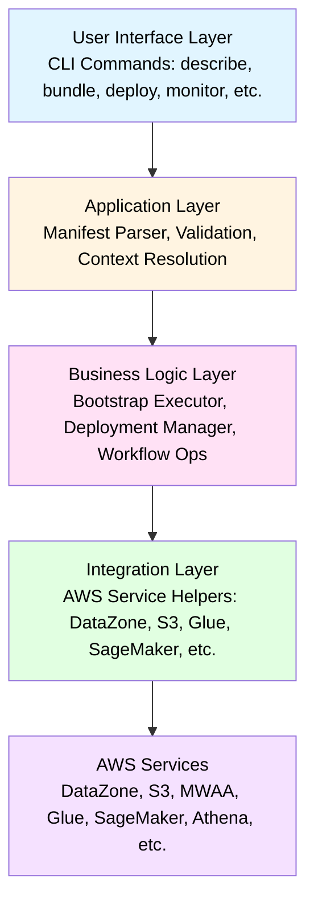

### 3. Plugin Architecture

Bootstrap actions use a registry pattern for extensibility:
- Actions are registered by type (e.g., `workflow.create`, `datazone.create_connection`)
- New actions can be added without modifying core logic
- Each action is self-contained and testable

---

## System Architecture

### High-Level System Diagram

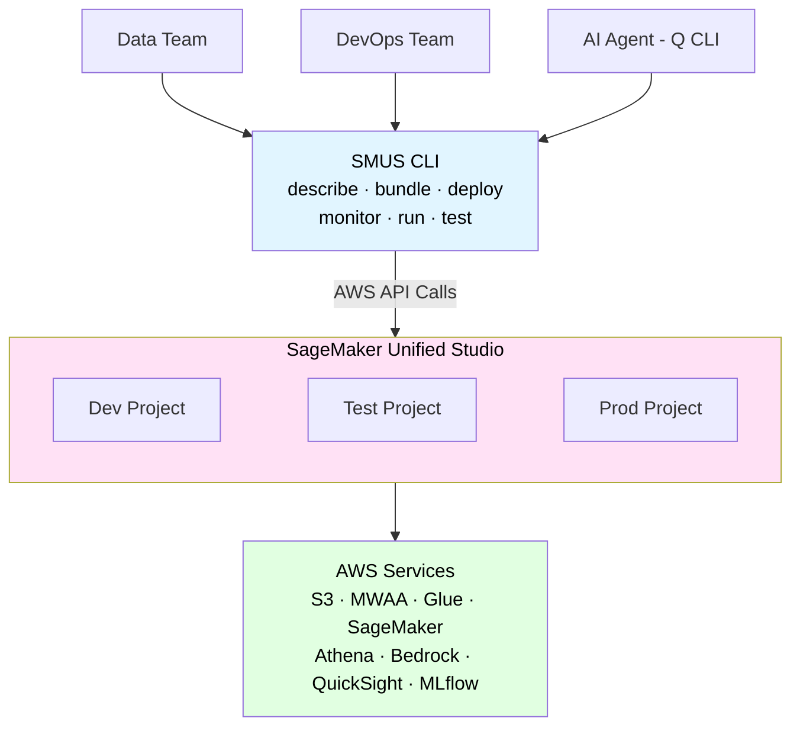

### Multi-Domain and Multi-Project Architecture

The SMUS CI/CD CLI supports flexible deployment topologies where each stage (dev, test, prod) can target:

1. **Independent Projects in the Same Domain**: Multiple projects within a single DataZone domain
2. **Independent Projects in Different Domains**: Each stage can target a completely separate domain

This architecture provides:

- **Isolation**: Complete separation between environments for security and compliance
- **Flexibility**: Different organizational units can own different domains
- **Cross-Account Support**: Stages can span multiple AWS accounts
- **Independent Governance**: Each domain can have its own governance policies and access controls

**Configuration Example:**

```yaml
stages:
  dev:
    stage: DEV
    domain:
      id: dzd_dev123456  # Development domain
      region: us-east-1
    project:
      name: my-app-dev
    
  test:
    stage: TEST
    domain:
      id: dzd_test789012  # Test domain (different from dev)
      region: us-east-1
    project:
      name: my-app-test
    
  prod:
    stage: PROD
    domain:
      id: dzd_prod345678  # Production domain (different from dev and test)
      region: us-west-2
    project:
      name: my-app-prod
```

**Use Cases:**

- **Organizational Boundaries**: Dev in engineering domain, prod in operations domain
- **Compliance Requirements**: Separate domains for regulated vs non-regulated data
- **Multi-Tenant Deployments**: Each customer/tenant gets their own domain
- **Cross-Account Isolation**: Dev/test in one AWS account, prod in another

---

## Component Architecture

### CLI Layer

The CLI layer provides the user interface through Typer-based commands:

```

src/smus_cicd/
├── cli.py                    # Main CLI entry point
└── commands/
    ├── describe.py           # Validate and describe manifest
    ├── bundle.py             # Create deployment bundles
    ├── deploy.py             # Deploy to target environments
    ├── dry_run/              # Deploy dry-run validation engine
    │   ├── engine.py         # DryRunEngine orchestrator
    │   ├── models.py         # Finding, DryRunReport, Severity, Phase
    │   ├── report.py         # Text and JSON report formatters
    │   └── checkers/         # Phase-specific validation checkers
    │       ├── manifest_checker.py
    │       ├── bundle_checker.py
    │       ├── permission_checker.py
    │       ├── connectivity_checker.py
    │       ├── project_checker.py
    │       ├── quicksight_checker.py
    │       ├── storage_checker.py
    │       ├── git_checker.py
    │       ├── catalog_checker.py
    │       ├── dependency_checker.py
    │       ├── workflow_checker.py
    │       └── bootstrap_checker.py
    ├── monitor.py            # Monitor workflow status
    ├── run.py                # Execute workflows
    ├── logs.py               # Fetch workflow logs
    ├── test.py               # Run integration tests
    ├── create.py             # Create new manifests
    ├── delete.py             # Delete deployed resources
    ├── integrate.py          # Integrate with external tools (Q CLI)
    └── dry_run/              # Dry-run validation subsystem
        └── checkers/         # Pre-deployment validation checkers
```

**Key Responsibilities:**
- Parse command-line arguments
- Validate user inputs
- Orchestrate command execution
- Run pre-deployment dry-run validation (automatic, skippable with `--skip-validation`)
- Format and display output (TEXT/JSON)
- Handle errors and provide user feedback

### Application Layer

Manages manifest parsing and validation:

```
src/smus_cicd/application/
├── application_manifest.py          # Manifest data model
├── validation.py                    # Schema validation
└── application-manifest-schema.yaml # JSON Schema definition
```

**Key Components:**

1. **ApplicationManifest**: Central data model representing the entire application configuration
   - Parses YAML into structured Python dataclasses
   - Provides type-safe access to configuration
   - Handles environment variable substitution

2. **Validation**: Ensures manifest correctness
   - YAML syntax validation
   - Schema validation against JSON Schema
   - Environment variable resolution
   - Cross-reference validation (e.g., workflow names exist)

### Business Logic Layer

Core business logic for deployment operations:

```
src/smus_cicd/
├── bootstrap/
│   ├── executor.py                # Execute bootstrap actions
│   ├── action_registry.py         # Register action handlers
│   ├── models.py                  # Bootstrap data models
│   └── handlers/
│       ├── workflow_handler.py         # workflow.run, workflow.logs, workflow.monitor
│       ├── workflow_create_handler.py  # workflow.create (MWAA Serverless workflows)
│       ├── datazone_handler.py         # datazone.create_connection, datazone.create_environment
│       ├── quicksight_handler.py       # quicksight.refresh_dataset
│       ├── mwaaserverless_handler.py   # mwaaserverless.start_workflow_run
│       └── custom_handler.py           # cli.print, cli.wait, cli.notify, cli.validate_deployment
│
└── workflows/
    └── operations.py         # Workflow operations
```

**Bootstrap System:**

The bootstrap system executes initialization actions during deployment:

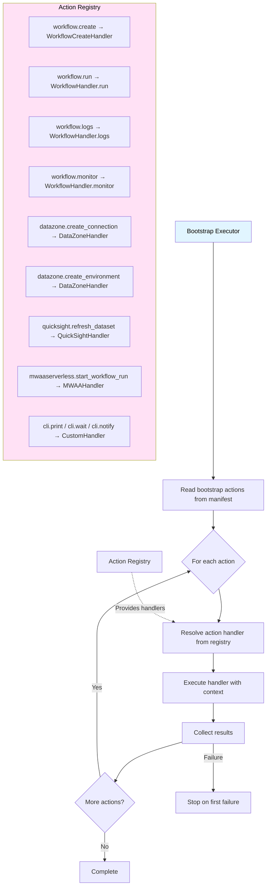

**Workflow Operations:**

Reusable workflow operations for both commands and bootstrap actions:
- `trigger_workflow()`: Start workflow execution
- `fetch_logs()`: Retrieve workflow logs
- `get_workflow_status()`: Check workflow state

### Integration Layer

AWS service integrations:

```

src/smus_cicd/helpers/
├── datazone.py               # DataZone domain/project/connection management
├── s3.py                     # S3 operations
├── mwaa.py                   # MWAA (Managed Airflow) integration
├── airflow_serverless.py     # MWAA Serverless integration
├── airflow_parser.py         # Parse Airflow YAML workflows
├── airflow.py                # Airflow utilities
├── quicksight.py             # QuickSight dashboard management
├── iam.py                    # IAM role management
├── cloudformation.py         # CloudFormation stack operations
├── connections.py            # Connection management
├── connection_creator.py     # Create DataZone connections
├── deployment.py             # Deployment utilities
├── context_resolver.py       # Resolve template variables
├── project_manager.py        # Project lifecycle management
├── catalog_export.py         # Export catalog assets for bundling
├── catalog_import.py         # Import catalog assets during deploy
├── bundle_storage.py         # Bundle storage and retrieval
├── event_emitter.py          # Deployment event emission
├── eventbridge_client.py     # EventBridge client wrapper
├── monitoring.py             # Monitoring utilities
├── metadata_collector.py     # Collect deployment metadata
├── error_handler.py          # Centralized error handling
├── test_config.py            # Test configuration management
├── workflow_utils.py         # Workflow utility functions
├── logger.py                 # Logging configuration
├── boto3_client.py           # Boto3 client factory
└── utils.py                  # General utility functions
```

**Key Helpers:**

1. **DataZone Helper** (`datazone.py`):
   - Resolve domain ID from tags, name, or explicit domain ID configuration
   - Support a different domain per stage
   - Create/update project in the specified domain
   - Manage connections (S3, Athena, Glue, MLflow, etc.)
   - Subscribe to catalog assets
   - Handle pagination for list operations
   - Cross-domain resource management

2. **Airflow Serverless Helper** (`airflow_serverless.py`):
   - Create/update workflows
   - Start workflow runs
   - Monitor execution status
   - Fetch CloudWatch logs
   - Handle workflow naming conventions

3. **S3 Helper** (`s3.py`):
   - Upload/download files
   - List objects with pagination
   - Delete objects
   - Handle compression (gzip, tar.gz)

4. **Context Resolver** (`context_resolver.py`):
   - Resolve template variables in workflows
   - Substitute environment variables
   - Inject connection information
   - Handle nested variable references

5. **Catalog Export/Import** (`catalog_export.py`, `catalog_import.py`):
   - Export catalog assets from source environments for bundling
   - Import catalog assets into target environments during deploy

6. **Event Emitter** (`event_emitter.py`, `eventbridge_client.py`):
   - Emit deployment lifecycle events to EventBridge
   - Configurable event bus targeting

7. **Project Manager** (`project_manager.py`):
   - Project lifecycle management (create, update, delete)
   - Project-level resource coordination

### MCP Integration

Model Context Protocol integration for AI assistants:

```
src/smus_cicd/mcp/
├── server.py                 # MCP server implementation (SMUSMCPServer class)
├── __main__.py               # MCP server entry point
└── __init__.py
```

Provides tools for AI assistants (Amazon Q CLI) to:
- Check project status and configuration (`check_project`)
- Create bundle packages for deployment (`create_bundle_package`)
- Query knowledge base for documentation (`query_kb`)
- Get example manifests and configurations (`get_example`)
- Validate pipeline manifests (`validate_pipeline`)
- List and read available resources (`list_resources`, `read_resource`)

---

## Data Flow

### 1. Describe Command Flow

```
User runs: aws-smus-cicd-cli describe --manifest manifest.yaml --connect

┌─────────────────────────────────────────────────────────────┐
│ 1. CLI Layer (describe.py)                                  │
│    - Parse command arguments                                │
│    - Load manifest file                                     │
└────────────────────┬────────────────────────────────────────┘
                     │
┌────────────────────▼────────────────────────────────────────┐
│ 2. Application Layer (application_manifest.py)              │
│    - Parse YAML                                             │
│    - Validate schema                                        │
│    - Resolve environment variables                          │
│    - Build ApplicationManifest object                       │
└────────────────────┬────────────────────────────────────────┘
                     │
┌────────────────────▼────────────────────────────────────────┐
│ 3. Integration Layer (datazone.py, connections.py)          │
│    - Resolve domain ID from tags                            │
│    - Fetch project information                              │
│    - Retrieve connection details                            │
│    - Validate IAM roles                                     │
└────────────────────┬────────────────────────────────────────┘
                     │
┌────────────────────▼────────────────────────────────────────┐
│ 4. Output                                                    │
│    - Display manifest structure                             │
│    - Show resolved connections                              │
│    - Validate configuration                                 │
│    - Report any issues                                      │
└─────────────────────────────────────────────────────────────┘
```

### 2. Deploy Command Flow

```

User runs: aws-smus-cicd-cli deploy --manifest manifest.yaml --targets test

┌─────────────────────────────────────────────────────────────┐
│ 1. CLI Layer (deploy.py)                                    │
│    - Parse command arguments                                │
│    - Load manifest                                          │
│    - Identify target stages                                 │
└────────────────────┬────────────────────────────────────────┘
                     │
┌────────────────────▼────────────────────────────────────────┐
│ 2. Initialization Phase                                     │
│    - Resolve domain ID                                      │
│    - Create project if needed                               │
│    - Setup IAM roles                                        │
│    - Create default connections                             │
└────────────────────┬────────────────────────────────────────┘
                     │
┌────────────────────▼────────────────────────────────────────┐
│ 3. Content Deployment Phase                                 │
│    For each deployment_configuration:                       │
│    a. Storage:                                              │
│       - Upload files to S3                                  │
│       - Apply compression if specified                      │
│    b. Git:                                                  │
│       - Clone repositories                                  │
│       - Upload to S3                                        │
│    c. QuickSight:                                           │
│       - Export/import dashboards                            │
│       - Configure permissions                               │
└────────────────────┬────────────────────────────────────────┘
                     │
┌────────────────────▼────────────────────────────────────────┐
│ 4. Workflow Deployment Phase                                │
│    For each workflow:                                       │
│    - Parse workflow YAML                                    │
│    - Resolve template variables                             │
│    - Create/update Airflow DAG                              │
│    - Deploy to MWAA Serverless                              │
└────────────────────┬────────────────────────────────────────┘
                     │
┌────────────────────▼────────────────────────────────────────┐
│ 5. Bootstrap Phase                                          │
│    Execute bootstrap actions sequentially:                  │
│    - workflow.create                                        │
│    - datazone.create_connection                             │
│    - workflow.run                                           │
│    - quicksight.refresh_dataset                             │
│    Stop on first failure                                    │
└────────────────────┬────────────────────────────────────────┘
                     │
┌────────────────────▼────────────────────────────────────────┐
│ 6. Event Emission (Optional)                                │
│    - Emit deployment events to EventBridge                  │
│    - Include metadata (stage, status, timestamp)            │
└────────────────────┬────────────────────────────────────────┘
                     │
┌────────────────────▼────────────────────────────────────────┐
│ 7. Output                                                    │
│    - Display deployment summary                             │
│    - Show workflow ARNs                                     │
│    - Report success/failure                                 │
└─────────────────────────────────────────────────────────────┘
```

### 3. Monitor Command Flow

```
User runs: aws-smus-cicd-cli monitor --manifest manifest.yaml --targets test --live

┌─────────────────────────────────────────────────────────────┐
│ 1. CLI Layer (monitor.py)                                   │
│    - Parse command arguments                                │
│    - Load manifest                                          │
│    - Identify workflows to monitor                          │
└────────────────────┬────────────────────────────────────────┘
                     │
┌────────────────────▼────────────────────────────────────────┐
│ 2. Workflow Discovery                                       │
│    For each workflow:                                       │
│    - Generate workflow name                                 │
│    - Find workflow ARN                                      │
│    - List recent runs                                       │
└────────────────────┬────────────────────────────────────────┘
                     │
┌────────────────────▼────────────────────────────────────────┐
│ 3. Status Polling (if --live)                               │
│    Loop until completion:                                   │
│    - Get workflow run status                                │
│    - Fetch latest logs                                      │
│    - Display progress                                       │
│    - Sleep 30 seconds                                       │
└────────────────────┬────────────────────────────────────────┘
                     │
┌────────────────────▼────────────────────────────────────────┐
│ 4. Output                                                    │
│    - Display workflow status                                │
│    - Show run history                                       │
│    - Report completion status                               │
└─────────────────────────────────────────────────────────────┘
```

---

## Deployment Lifecycle

### Complete Deployment Lifecycle Diagram

```

┌─────────────────────────────────────────────────────────────────────────┐
│                        Development Phase                                 │
│                                                                          │
│  Data Team:                          DevOps Team:                       │
│  ┌──────────────────┐               ┌──────────────────┐               │
│  │ Write Code       │               │ Create CI/CD     │               │
│  │ - Notebooks      │               │ Workflows        │               │
│  │ - Scripts        │               │ - GitHub Actions │               │
│  │ - Workflows      │               │ - Test Gates     │               │
│  └────────┬─────────┘               └────────┬─────────┘               │
│           │                                  │                          │
│           ▼                                  ▼                          │
│  ┌──────────────────┐               ┌──────────────────┐               │
│  │ Create Manifest  │               │ Define Stages    │               │
│  │ manifest.yaml    │               │ - dev, test, prod│               │
│  └────────┬─────────┘               └────────┬─────────┘               │
│           │                                  │                          │
│           └──────────────┬───────────────────┘                          │
│                          │                                              │
└──────────────────────────┼──────────────────────────────────────────────┘
                           │
                           ▼
┌─────────────────────────────────────────────────────────────────────────┐
│                        Validation Phase                                  │
│                                                                          │
│  ┌──────────────────────────────────────────────────────────────────┐  │
│  │ aws-smus-cicd-cli describe --manifest manifest.yaml --connect             │  │
│  │                                                                   │  │
│  │ ✓ Validate YAML syntax                                           │  │
│  │ ✓ Validate schema                                                │  │
│  │ ✓ Resolve environment variables                                  │  │
│  │ ✓ Check AWS connectivity                                         │  │
│  │ ✓ Verify domain/project existence                                │  │
│  │ ✓ Validate connections                                           │  │
│  └──────────────────────────────────────────────────────────────────┘  │
└──────────────────────────┬──────────────────────────────────────────────┘
                           │
                           ▼
┌─────────────────────────────────────────────────────────────────────────┐
│                        Bundle Phase (Optional)                           │
│                                                                          │
│  ┌──────────────────────────────────────────────────────────────────┐  │
│  │ aws-smus-cicd-cli bundle --manifest manifest.yaml --targets test           │  │
│  │                                                                   │  │
│  │ 1. Download content from dev environment                         │  │
│  │    - S3 files                                                    │  │
│  │    - Git repositories                                            │  │
│  │    - QuickSight dashboards                                       │  │
│  │                                                                   │  │
│  │ 2. Create compressed archive                                     │  │
│  │    - Bundle-{app}-{target}-{timestamp}.zip                       │  │
│  │                                                                   │  │
│  │ 3. Save to artifacts directory                                   │  │
│  └──────────────────────────────────────────────────────────────────┘  │
└──────────────────────────┬──────────────────────────────────────────────┘
                           │
                           ▼
┌─────────────────────────────────────────────────────────────────────────┐
│                        Deployment Phase                                  │
│                                                                          │
│  ┌──────────────────────────────────────────────────────────────────┐  │
│  │ aws-smus-cicd-cli deploy --manifest manifest.yaml --targets test          │  │
│  │                                                                   │  │
│  │ Phase 1: Infrastructure Initialization                           │  │
│  │ ├─ Resolve domain ID from tags                                   │  │
│  │ ├─ Create project if needed                                      │  │
│  │ ├─ Setup IAM roles                                               │  │
│  │ └─ Create default connections (S3, Athena, Glue)                 │  │
│  │                                                                   │  │
│  │ Phase 2: Content Deployment                                      │  │
│  │ ├─ Upload code to S3                                             │  │
│  │ ├─ Clone and upload git repos                                    │  │
│  │ ├─ Deploy QuickSight dashboards                                  │  │
│  │ └─ Subscribe to catalog assets                                   │  │
│  │                                                                   │  │
│  │ Phase 3: Workflow Deployment                                     │  │
│  │ ├─ Parse workflow YAML                                           │  │
│  │ ├─ Resolve template variables                                    │  │
│  │ ├─ Create Airflow DAG                                            │  │
│  │ └─ Deploy to MWAA Serverless                                     │  │
│  │                                                                   │  │
│  │ Phase 4: Bootstrap Execution                                     │  │
│  │ ├─ Execute initialization actions                                │  │
│  │ ├─ Create additional connections                                 │  │
│  │ ├─ Run workflows                                                 │  │
│  │ └─ Refresh dashboards                                            │  │
│  └──────────────────────────────────────────────────────────────────┘  │
└──────────────────────────┬──────────────────────────────────────────────┘
                           │
                           ▼
┌─────────────────────────────────────────────────────────────────────────┐
│                        Monitoring Phase                                  │
│                                                                          │
│  ┌──────────────────────────────────────────────────────────────────┐  │
│  │ aws-smus-cicd-cli monitor --manifest manifest.yaml --targets test --live  │  │
│  │                                                                   │  │
│  │ ├─ Find workflow ARNs                                            │  │
│  │ ├─ Poll workflow status                                          │  │
│  │ ├─ Stream CloudWatch logs                                        │  │
│  │ └─ Report completion status                                      │  │
│  └──────────────────────────────────────────────────────────────────┘  │
└──────────────────────────┬──────────────────────────────────────────────┘
                           │
                           ▼
┌─────────────────────────────────────────────────────────────────────────┐
│                        Testing Phase                                     │
│                                                                          │
│  ┌──────────────────────────────────────────────────────────────────┐  │
│  │ aws-smus-cicd-cli test --manifest manifest.yaml --targets test            │  │
│  │                                                                   │  │
│  │ ├─ Run integration tests                                         │  │
│  │ ├─ Validate data quality                                         │  │
│  │ ├─ Check workflow outputs                                        │  │
│  │ └─ Report test results                                           │  │
│  └──────────────────────────────────────────────────────────────────┘  │
└──────────────────────────┬──────────────────────────────────────────────┘
                           │
                           ▼
┌─────────────────────────────────────────────────────────────────────────┐
│                        Promotion Phase                                   │
│                                                                          │
│  Repeat deployment for next stage (test → prod)                         │
│                                                                          │
│  ┌──────────────────────────────────────────────────────────────────┐  │
│  │ aws-smus-cicd-cli deploy --manifest manifest.yaml --targets prod          │  │
│  └──────────────────────────────────────────────────────────────────┘  │
└─────────────────────────────────────────────────────────────────────────┘
```

---

## Integration Points

### 1. AWS Service Integration

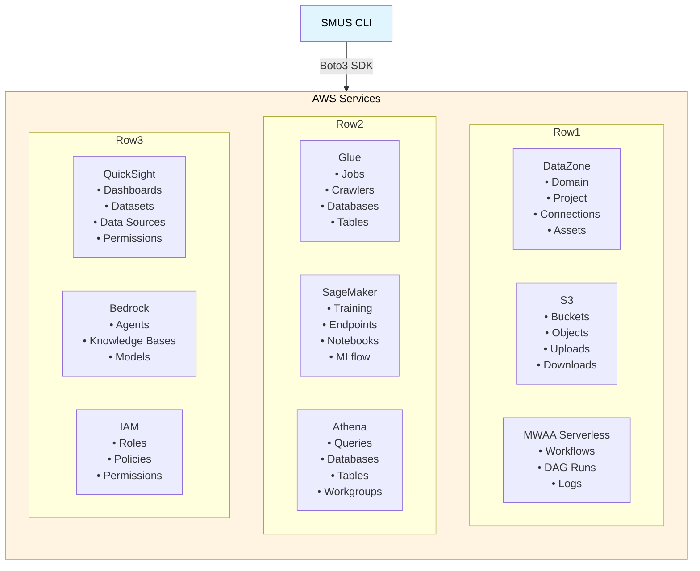

### 2. CI/CD Integration

```
┌─────────────────────────────────────────────────────────────────────────┐
│                          GitHub Actions                                  │
│                                                                          │
│  ┌──────────────────────────────────────────────────────────────────┐  │
│  │ Workflow: .github/workflows/deploy.yml                           │  │
│  │                                                                   │  │
│  │ on:                                                               │  │
│  │   push:                                                           │  │
│  │     branches: [main]                                              │  │
│  │                                                                   │  │
│  │ jobs:                                                             │  │
│  │   deploy-test:                                                    │  │
│  │     - Install SMUS CI/CD CLI                                        │  │
│  │     - Validate manifest                                           │  │
│  │     - Run unit tests                                              │  │
│  │     - Deploy to test                                              │  │
│  │     - Run integration tests                                       │  │
│  │                                                                   │  │
│  │   deploy-prod:                                                    │  │
│  │     needs: deploy-test                                            │  │
│  │     environment: production                                       │  │
│  │     - Deploy to prod                                              │  │
│  │     - Smoke tests                                                 │  │
│  └──────────────────────────────────────────────────────────────────┘  │
└──────────────────────────┬──────────────────────────────────────────────┘
                           │
                           │ Calls
                           │
┌──────────────────────────▼──────────────────────────────────────────────┐
│                        SMUS CI/CD CLI                                    │
│                                                                          │
│  Commands executed:                                                     │
│  1. aws-smus-cicd-cli describe --manifest manifest.yaml --connect           │
│  2. aws-smus-cicd-cli deploy --manifest manifest.yaml --targets test        │
│  3. aws-smus-cicd-cli test --manifest manifest.yaml --targets test          │
│  4. aws-smus-cicd-cli deploy --manifest manifest.yaml --targets prod        │
└─────────────────────────────────────────────────────────────────────────┘
```

### 3. AI Assistant Integration (MCP)

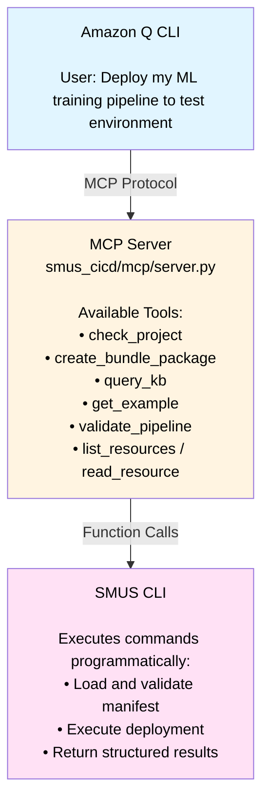

---

## Security Architecture

### 1. Authentication & Authorization

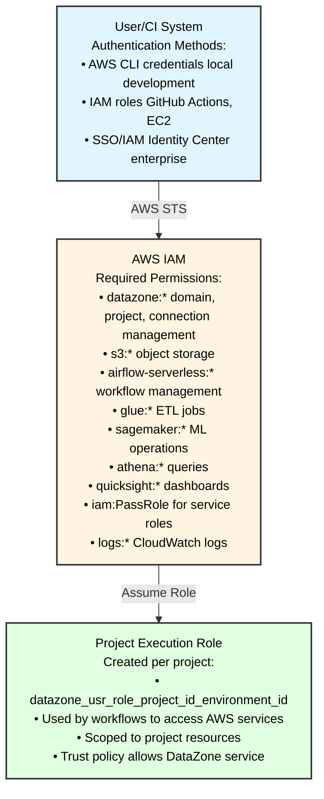

### 2. Data Security

**Encryption:**
- S3: Server-side encryption (SSE-S3 or SSE-KMS)
- Secrets: AWS Secrets Manager for sensitive data
- Transit: TLS 1.2+ for all API calls

**Access Control:**
- Project-level isolation in DataZone
- IAM policies for resource access
- Connection-based access to data sources
- QuickSight row-level security

**Audit:**
- CloudTrail for API calls
- EventBridge for deployment events
- CloudWatch Logs for workflow execution

### 3. Secrets Management

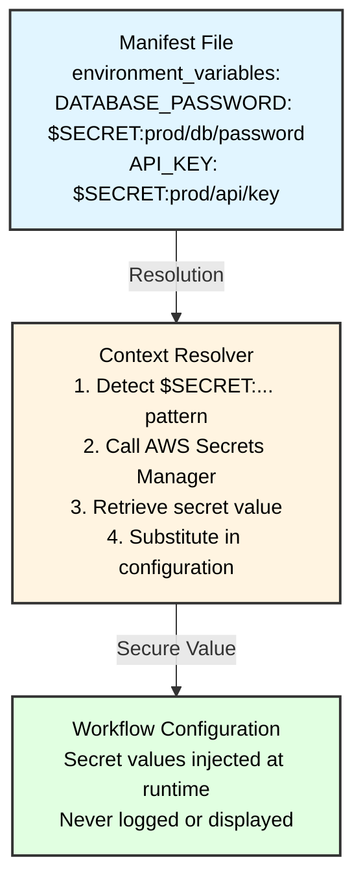

---

## Extension Points

### 1. Custom Bootstrap Actions

Add new bootstrap action types:

```python
# In bootstrap/handlers/custom.py
from ..action_registry import ActionRegistry

@ActionRegistry.register("custom.my_action")
def my_custom_action(context, **parameters):
    """Execute custom initialization logic."""
    # Implementation
    return {"status": "success"}
```

### 2. Custom Helpers

Add new AWS service integrations:

```python
# In helpers/my_service.py
import boto3

def create_resource(name, config):
    """Create resource in custom AWS service."""
    client = boto3.client('my-service')
    response = client.create_resource(
        Name=name,
        Configuration=config
    )
    return response
```

### 3. Custom Commands

Add new CLI commands:

```python
# In commands/my_command.py
import typer

def my_command(
    manifest_file: str = typer.Option("manifest.yaml"),
    targets: str = typer.Option(None)
):
    """Execute custom operation."""
    # Implementation
```

---

## Performance Considerations

### 1. Parallel Operations

- S3 uploads use AWS CLI sync for bulk operations
- Multiple workflows can be deployed concurrently
- Bootstrap actions execute sequentially (by design)

### 2. Caching

- Boto3 clients are cached per service
- Domain/project lookups are cached during execution
- Connection information is cached after first retrieval

### 3. Optimization Strategies

- Use compression for large file uploads
- Batch S3 operations when possible
- Minimize API calls through caching
- Use pagination for large result sets

---

## Error Handling

### 1. Error Categories

**Validation Errors:**
- Manifest syntax errors
- Schema validation failures
- Missing required fields
- Invalid environment variables
- Dry-run pre-deployment validation failures (missing permissions, unreachable resources, missing dependencies)

**AWS Service Errors:**
- Permission denied
- Resource not found
- Service quotas exceeded
- API throttling

**Deployment Errors:**
- S3 upload failures
- Workflow creation failures
- Bootstrap action failures
- Connection creation failures

### 2. Error Recovery

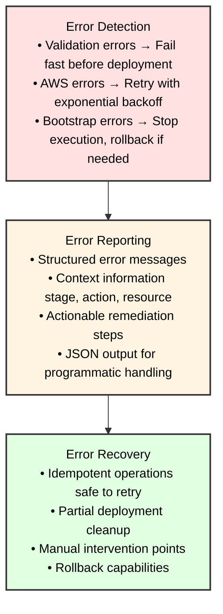

---

## Monitoring & Observability

### 1. Logging Architecture

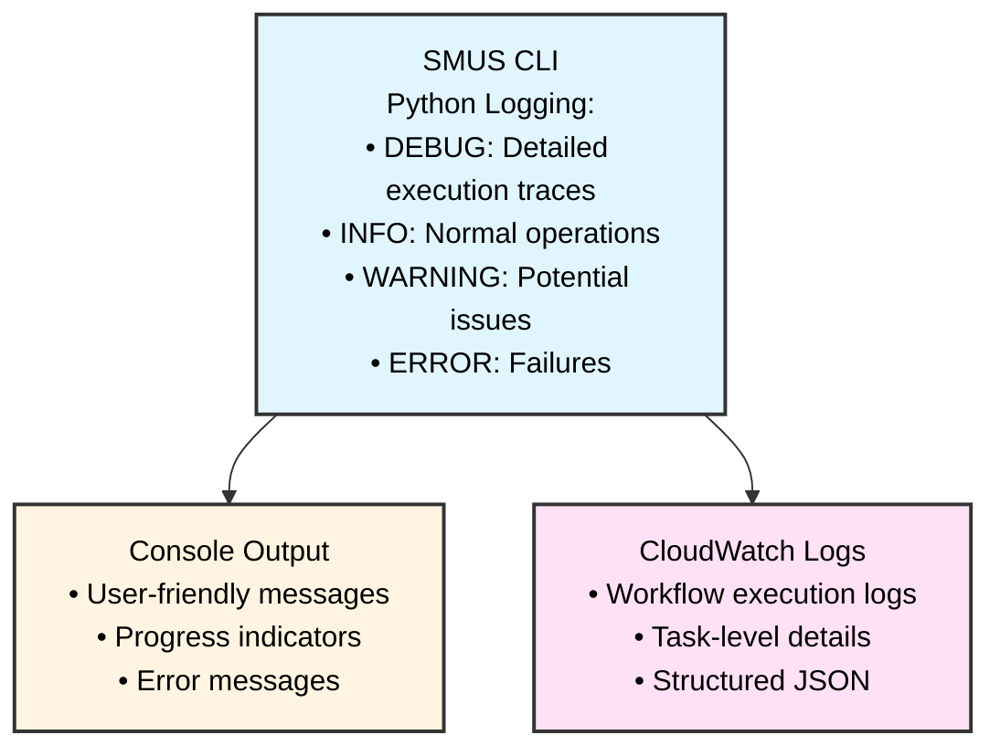

### 2. Event Emission

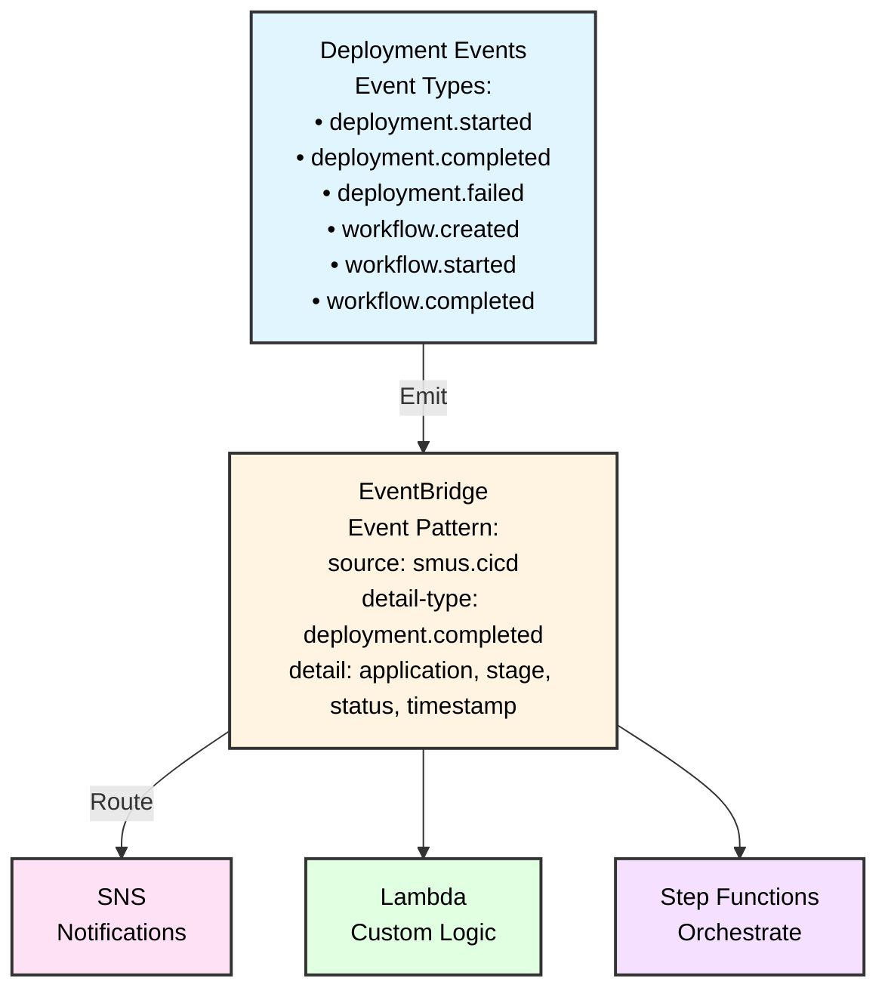

### 3. Metrics

Key metrics tracked:
- Deployment duration
- Success/failure rates
- Workflow execution time
- Resource creation counts
- API call latency

---

## Testing Architecture

### 1. Test Pyramid

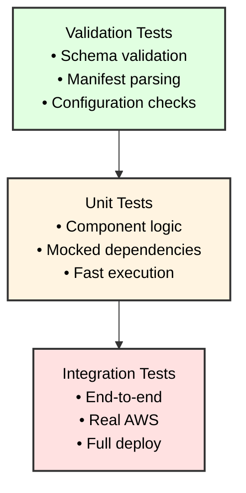

### 2. Test Infrastructure

```
tests/
├── unit/                     # Unit tests
│   ├── bootstrap/            # Bootstrap handler tests
│   ├── commands/             # Command tests
│   ├── helpers/              # Helper module tests
│   ├── test_manifest.py
│   ├── test_validation.py
│   ├── test_context_resolver.py
│   └── ...                   # 35+ unit test files
│
├── integration/              # Integration tests
│   ├── basic_app/
│   ├── bundle_zip_deploy/
│   ├── catalog-import-export/
│   ├── connections_app/
│   ├── create_test_app/
│   ├── delete_test_app/
│   ├── dry_run/
│   ├── examples-analytics-workflows/
│   ├── glue-mwaa-catalog-app/
│   ├── mcp-chat-testing/
│   ├── multi_target_app_airless/
│   ├── multi_target_bundle/
│   └── base.py
│
├── fixtures/                 # Test data
│
└── scripts/                  # Test utilities
```

---

## Deployment Patterns

### 1. Branch-Based Deployment

```
Git Branch → Environment Mapping

main branch        → prod environment
develop branch     → test environment
feature/* branches → dev environment

Workflow:
1. Developer pushes to feature branch
2. CI/CD deploys to dev automatically
3. PR to develop → deploys to test
4. PR to main → deploys to prod (with approval)
```

### 2. Bundle-Based Deployment

```
Artifact Promotion

1. Create bundle from dev:
   aws-smus-cicd-cli bundle --manifest manifest.yaml

2. Store bundle in artifact repository

3. Deploy bundle to test:
   aws-smus-cicd-cli deploy --bundle Bundle-MyApp-test-*.zip --targets test

4. Promote to prod:
   aws-smus-cicd-cli deploy --bundle Bundle-MyApp-test-*.zip --targets prod
```

### 3. Tag-Based Deployment

```
Git Tags → Version Releases

v1.0.0 → prod deployment
v1.0.0-rc1 → test deployment
v1.0.0-beta → dev deployment

Workflow:
1. Tag commit with version
2. CI/CD creates bundle
3. Deploy based on tag pattern
```

---

## Best Practices

### 1. Manifest Organization

```yaml
# Recommended structure
applicationName: MyApplication

# Define content once
content:
  storage: [...]
  git: [...]
  workflows: [...]

# Stage-specific overrides
stages:
  dev:
    # Minimal config for rapid iteration
    bootstrap:
      actions:
        - type: workflow.create
  
  test:
    # Add testing and validation
    bootstrap:
      actions:
        - type: workflow.create
        - type: workflow.run
          trailLogs: true
  
  prod:
    # Production safeguards
    bootstrap:
      actions:
        - type: workflow.create
        # No automatic execution
```

### 2. Environment Variables

```yaml
# Use environment variables for account-specific values
environment_variables:
  AWS_ACCOUNT_ID: ${AWS_ACCOUNT_ID}
  AWS_REGION: ${AWS_DEFAULT_REGION:us-east-1}
  S3_BUCKET: ${S3_BUCKET}
  
# Reference in workflows
workflows:
  - workflowName: my_workflow
    tasks:
      my_task:
        script_args:
          '--bucket': '{env.S3_BUCKET}'
```

### 3. Connection Management

```yaml
# Create connections in bootstrap
bootstrap:
  actions:
    - type: datazone.create_connection
      name: mlflow-server
      connection_type: MLFLOW
      properties:
        trackingServerArn: ${MLFLOW_ARN}
    
    - type: datazone.create_connection
      name: custom-db
      connection_type: ATHENA
      properties:
        workgroup: ${ATHENA_WORKGROUP}
```

### 4. Multi-Domain Configuration

```yaml
# Configure independent domains per stage
stages:
  dev:
    stage: DEV
    domain:
      id: dzd_dev123456  # Development domain
      region: us-east-1
    project:
      name: my-app-dev
    # Rapid iteration, shared resources
    
  test:
    stage: TEST
    domain:
      id: dzd_test789012  # Separate test domain
      region: us-east-1
    project:
      name: my-app-test
    # Isolated testing environment
    
  prod:
    stage: PROD
    domain:
      id: dzd_prod345678  # Production domain in different account
      region: us-west-2
    project:
      name: my-app-prod
    # Strict governance and compliance
```

**Multi-Domain Best Practices:**

- Use separate domains for compliance boundaries (e.g., PCI, HIPAA)
- Configure domain-specific IAM roles and permissions
- Test cross-domain deployments in lower environments first
- Document domain ownership and governance policies
- Use consistent naming conventions across domains
- Consider network connectivity between domains for data sharing

---

## Troubleshooting Guide

### Common Issues

**1. Manifest Validation Errors**
```
Error: Missing required field 'applicationName'
Solution: Add applicationName at top level of manifest
```

**2. Connection Not Found**
```
Error: Connection 'default.s3_shared' not found
Solution: Ensure project has default connections created
```

**3. Workflow Deployment Fails**
```
Error: Workflow 'my_workflow' not found in content.workflows
Solution: Add workflow to content.workflows list
```

**4. Bootstrap Action Fails**
```
Error: workflow.run failed - workflow not found
Solution: Ensure workflow.create runs before workflow.run
```

---

## Appendix

### A. Glossary

- **Application**: Data/analytics workload being deployed
- **Manifest**: YAML file defining application configuration
- **Stage**: Deployment environment (dev, test, prod). Each stage can target an independent project in an independent domain
- **Domain**: DataZone domain that provides governance and isolation. Each stage targets a single domain
- **Project**: DataZone project within a domain. Each stage targets a single project
- **Bootstrap**: Initialization actions during deployment
- **Connection**: DataZone connection to AWS services
- **Workflow**: Airflow DAG for orchestration

### B. References

- [SMUS CI/CD CLI README](../README.md)
- [Manifest Schema](manifest-schema.md)
- [CLI Commands](cli-commands.md)
- [Bootstrap Actions](bootstrap-actions.md)
- [Examples Guide](examples-guide.md)

### C. Version History

| Version | Date | Changes |
|---------|------|---------|
| 1.1 | 2026-03-25 | Updated to reflect actual codebase: corrected bootstrap handlers, helpers, MCP tools, CLI commands, and test structure |
| 1.0 | 2026-01-22 | Initial architecture documentation |

---

**Document End**
