# SMUS CI/CD CLI - Architecture Documentation

← [Back to Main README](../README.md)


**Version:** 1.0  
**Last Updated:** January 22, 2026

## Table of Contents

1. [Overview](#overview)
2. [Architecture Principles](#architecture-principles)
3. [System Architecture](#system-architecture)
4. [Component Architecture](#component-architecture)
5. [Data Flow](#data-flow)
6. [Deployment Lifecycle](#deployment-lifecycle)
7. [Integration Points](#integration-points)
8. [Security Architecture](#security-architecture)

---

## Overview

The SMUS CI/CD CLI is a command-line tool that automates the deployment of data applications across SageMaker Unified Studio (SMUS) environments. It provides an abstraction layer over AWS services, enabling DevOps teams to deploy analytics, ML, and GenAI applications without deep knowledge of AWS service APIs.

### Key Design Goals

- **Separation of Concerns**: Data teams define WHAT to deploy, DevOps teams define HOW and WHEN
- **AWS Abstraction**: CLI encapsulates all AWS complexity (DataZone, Glue, SageMaker, MWAA, etc.)
- **Generic CI/CD**: Same workflow works for any application type (Glue, SageMaker, Bedrock, etc.)
- **Multi-Environment**: Support dev → test → prod promotion with environment-specific configs. Each stage can target an independent project in an independent domain for maximum flexibility and isolation.
- **Infrastructure as Code**: Version-controlled manifests and reproducible deployments

---

## Architecture Principles

### 1. Declarative Configuration

Applications are defined in YAML manifests (`manifest.yaml`) that describe:
- Application content (code, data, workflows)
- Deployment stages (dev, test, prod) - each stage can target a different project and domain
- Environment-specific configurations
- Bootstrap actions for initialization

### 2. Layered Architecture


### 3. Plugin Architecture

Bootstrap actions use a registry pattern for extensibility:
- Actions are registered by type (e.g., `workflow.create`, `datazone.create_connection`)
- New actions can be added without modifying core logic
- Each action is self-contained and testable

---

## System Architecture

### High-Level System Diagram

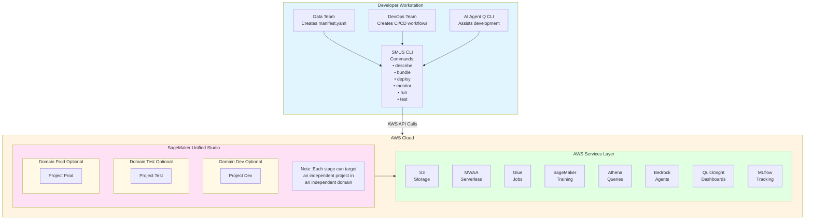

### Multi-Domain and Multi-Project Architecture

The SMUS CI/CD CLI supports flexible deployment topologies where each stage (dev, test, prod) can target:

1. **Independent Projects in the Same Domain**: Multiple projects within a single DataZone domain
2. **Independent Projects in Different Domains**: Each stage can target a completely separate domain

This architecture provides:

- **Isolation**: Complete separation between environments for security and compliance
- **Flexibility**: Different organizational units can own different domains
- **Cross-Account Support**: Stages can span multiple AWS accounts
- **Independent Governance**: Each domain can have its own governance policies and access controls

**Configuration Example:**

```yaml
stages:
  dev:
    domain_id: dzd_dev123456  # Development domain
    project_name: my-app-dev
    
  test:
    domain_id: dzd_test789012  # Test domain (different from dev)
    project_name: my-app-test
    
  prod:
    domain_id: dzd_prod345678  # Production domain (different from dev and test)
    project_name: my-app-prod
```

**Use Cases:**

- **Organizational Boundaries**: Dev in engineering domain, prod in operations domain
- **Compliance Requirements**: Separate domains for regulated vs non-regulated data
- **Multi-Tenant Deployments**: Each customer/tenant gets their own domain
- **Cross-Account Isolation**: Dev/test in one AWS account, prod in another

---

## Component Architecture

### CLI Layer

The CLI layer provides the user interface through Typer-based commands:

```

src/smus_cicd/
├── cli.py                    # Main CLI entry point
└── commands/
    ├── describe.py           # Validate and describe manifest
    ├── bundle.py             # Create deployment bundles
    ├── deploy.py             # Deploy to target environments
    ├── dry_run/              # Deploy dry-run validation engine
    │   ├── engine.py         # DryRunEngine orchestrator
    │   ├── models.py         # Finding, DryRunReport, Severity, Phase
    │   ├── report.py         # Text and JSON report formatters
    │   └── checkers/         # Phase-specific validation checkers
    │       ├── manifest_checker.py
    │       ├── bundle_checker.py
    │       ├── permission_checker.py
    │       ├── connectivity_checker.py
    │       ├── project_checker.py
    │       ├── quicksight_checker.py
    │       ├── storage_checker.py
    │       ├── git_checker.py
    │       ├── catalog_checker.py
    │       ├── dependency_checker.py
    │       ├── workflow_checker.py
    │       └── bootstrap_checker.py
    ├── monitor.py            # Monitor workflow status
    ├── run.py                # Execute workflows
    ├── logs.py               # Fetch workflow logs
    ├── test.py               # Run integration tests
    ├── create.py             # Create new manifests
    ├── delete.py             # Delete deployed resources
    └── integrate.py          # Integrate with external tools
```

**Key Responsibilities:**
- Parse command-line arguments
- Validate user inputs
- Orchestrate command execution
- Run pre-deployment dry-run validation (automatic, skippable with `--skip-validation`)
- Format and display output (TEXT/JSON)
- Handle errors and provide user feedback

### Application Layer

Manages manifest parsing and validation:

```
src/smus_cicd/application/
├── application_manifest.py          # Manifest data model
├── validation.py                    # Schema validation
└── application-manifest-schema.yaml # JSON Schema definition
```

**Key Components:**

1. **ApplicationManifest**: Central data model representing the entire application configuration
   - Parses YAML into structured Python dataclasses
   - Provides type-safe access to configuration
   - Handles environment variable substitution

2. **Validation**: Ensures manifest correctness
   - YAML syntax validation
   - Schema validation against JSON Schema
   - Environment variable resolution
   - Cross-reference validation (e.g., workflow names exist)

### Business Logic Layer

Core business logic for deployment operations:

```
src/smus_cicd/
├── bootstrap/
│   ├── executor.py           # Execute bootstrap actions
│   ├── action_registry.py    # Register action handlers
│   ├── models.py             # Bootstrap data models
│   └── handlers/
│       ├── workflow.py       # Workflow actions
│       ├── datazone.py       # DataZone actions
│       └── quicksight.py     # QuickSight actions
│
└── workflows/
    └── operations.py         # Workflow operations
```

**Bootstrap System:**

The bootstrap system executes initialization actions during deployment:

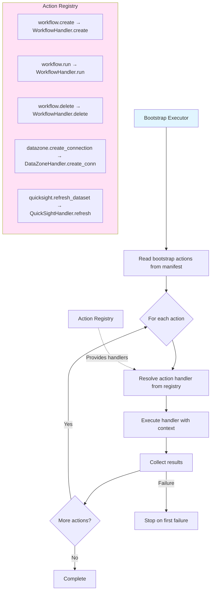

**Workflow Operations:**

Reusable workflow operations for both commands and bootstrap actions:
- `trigger_workflow()`: Start workflow execution
- `fetch_logs()`: Retrieve workflow logs
- `get_workflow_status()`: Check workflow state

### Integration Layer

AWS service integrations:

```

src/smus_cicd/helpers/
├── datazone.py               # DataZone domain/project/connection management
├── s3.py                     # S3 operations
├── mwaa.py                   # MWAA (Managed Airflow) integration
├── airflow_serverless.py     # MWAA Serverless integration
├── airflow_parser.py         # Parse Airflow YAML workflows
├── glue.py                   # AWS Glue operations
├── sagemaker.py              # SageMaker operations
├── quicksight.py             # QuickSight dashboard management
├── iam.py                    # IAM role management
├── cloudformation.py         # CloudFormation stack operations
├── connections.py            # Connection management
├── connection_creator.py     # Create DataZone connections
├── deployment.py             # Deployment utilities
├── context_resolver.py       # Resolve template variables
├── boto3_client.py           # Boto3 client factory
└── utils.py                  # Utility functions
```

**Key Helpers:**

1. **DataZone Helper** (`datazone.py`):
   - Resolve domain IDs from tags or explicit domain_id configuration
   - Support multiple domains across different stages
   - Create/update projects in any specified domain
   - Manage connections (S3, Athena, Glue, MLflow, etc.)
   - Subscribe to catalog assets
   - Handle pagination for list operations
   - Cross-domain resource management

2. **Airflow Serverless Helper** (`airflow_serverless.py`):
   - Create/update workflows
   - Start workflow runs
   - Monitor execution status
   - Fetch CloudWatch logs
   - Handle workflow naming conventions

3. **S3 Helper** (`s3.py`):
   - Upload/download files
   - List objects with pagination
   - Delete objects
   - Handle compression (gzip, tar.gz)

4. **Context Resolver** (`context_resolver.py`):
   - Resolve template variables in workflows
   - Substitute environment variables
   - Inject connection information
   - Handle nested variable references

### MCP Integration

Model Context Protocol integration for AI assistants:

```
src/smus_cicd/mcp/
├── server.py                 # MCP server implementation
├── __main__.py               # MCP server entry point
└── __init__.py
```

Provides tools for AI assistants (Amazon Q CLI) to:
- Describe manifests
- Deploy applications
- Monitor workflows
- Fetch logs
- Run tests

---

## Data Flow

### 1. Describe Command Flow

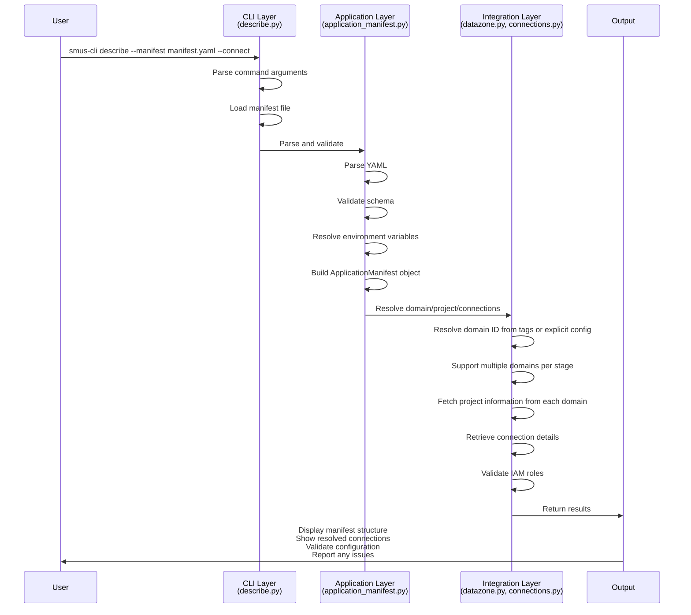

### 2. Deploy Command Flow

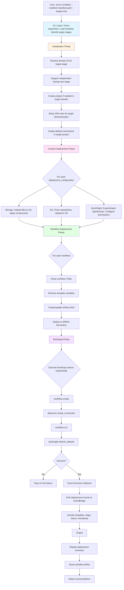

### 3. Monitor Command Flow

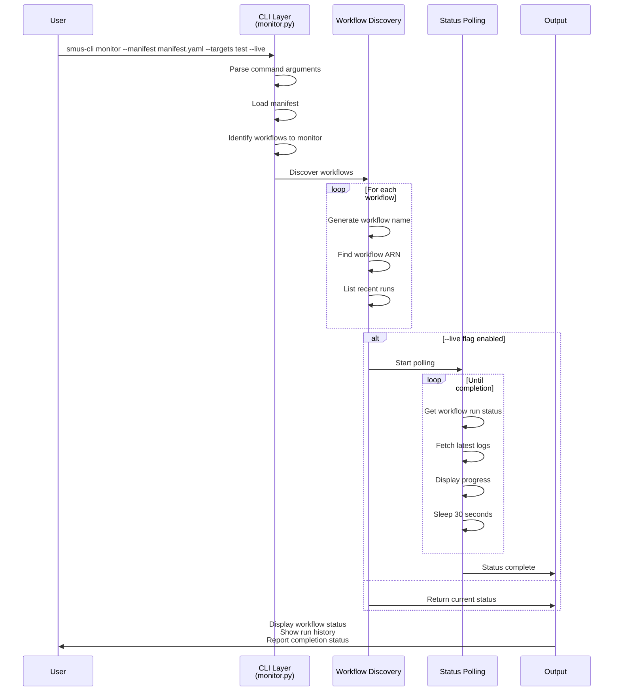

---

## Deployment Lifecycle

### Complete Deployment Lifecycle Diagram

```mermaid
graph TB
    subgraph Development[Development Phase]
        DataTeam[Data Team:<br/>Write Code, Notebooks, Scripts, Workflows]
        DevOpsTeam[DevOps Team:<br/>Create CI/CD Workflows, GitHub Actions, Test Gates]
        DataTeam --> Manifest[Create Manifest<br/>manifest.yaml]
        DevOpsTeam --> Stages[Define Stages<br/>dev, test, prod<br/>Each can target independent domain/project]
    end
    
    Manifest --> Validation
    Stages --> Validation
    
    subgraph Validation[Validation Phase]
        Validate[smus-cli describe --manifest manifest.yaml --connect<br/><br/>✓ Validate YAML syntax<br/>✓ Validate schema<br/>✓ Resolve environment variables<br/>✓ Check AWS connectivity<br/>✓ Verify domain/project existence per stage<br/>✓ Validate connections<br/>✓ Support multi-domain configuration]
    end
    
    Validation --> Bundle
    
    subgraph Bundle[Bundle Phase Optional]
        BundleOp[smus-cli bundle --manifest manifest.yaml --targets test<br/><br/>1. Download content from dev environment<br/>2. Create compressed archive<br/>3. Save to artifacts directory]
    end
    
    Bundle --> DryRun
    
    subgraph DryRun[Pre-Deployment Validation Automatic]
        DryRunOp[smus-cli deploy --dry-run --targets test<br/><br/>1. Validate manifest and target stage<br/>2. Explore bundle artifacts<br/>3. Verify IAM permissions<br/>4. Check resource reachability<br/>5. Simulate deployment phases<br/>6. Validate catalog dependencies<br/>7. Validate workflow definitions<br/>8. Produce structured report]
    end
    
    DryRun --> Deploy
    
    subgraph Deploy[Deployment Phase]
        DeployOp[smus-cli deploy --manifest manifest.yaml --targets test<br/><br/>Phase 1: Infrastructure Initialization target domain/project<br/>Phase 2: Content Deployment<br/>Phase 3: Workflow Deployment<br/>Phase 4: Bootstrap Execution]
    end
    
    Deploy --> Monitor
    
    subgraph Monitor[Monitoring Phase]
        MonitorOp[smus-cli monitor --manifest manifest.yaml --targets test --live<br/><br/>├─ Find workflow ARNs<br/>├─ Poll workflow status<br/>├─ Stream CloudWatch logs<br/>└─ Report completion status]
    end
    
    Monitor --> Test
    
    subgraph Test[Testing Phase]
        TestOp[smus-cli test --manifest manifest.yaml --targets test<br/><br/>├─ Run integration tests<br/>├─ Validate data quality<br/>├─ Check workflow outputs<br/>└─ Report test results]
    end
    
    Test --> Promote
    
    subgraph Promote[Promotion Phase]
        PromoteOp[Repeat deployment for next stage<br/>test → prod<br/><br/>smus-cli deploy --manifest manifest.yaml --targets prod]
    end
    
    style Development fill:#e1f5ff
    style Validation fill:#fff4e1
    style Bundle fill:#ffe1f5
    style Deploy fill:#e1ffe1
    style Monitor fill:#f5e1ff
    style Test fill:#ffe1e1
    style Promote fill:#e1fff5
```

---

## Integration Points

### 1. AWS Service Integration

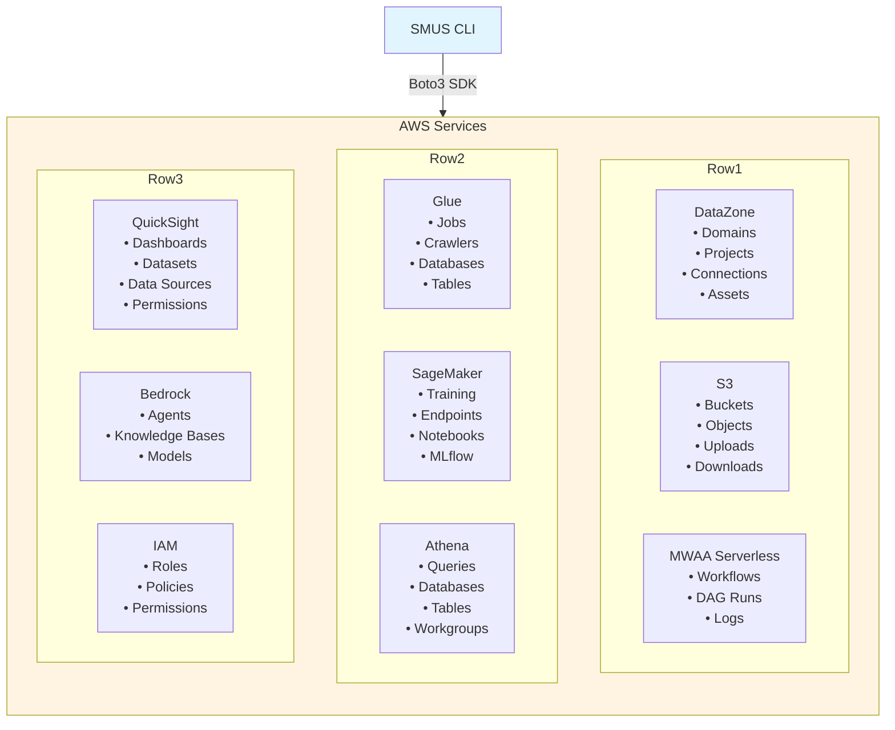

### 2. CI/CD Integration

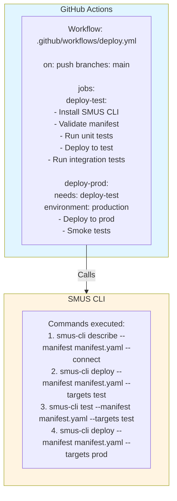

### 3. AI Assistant Integration (MCP)

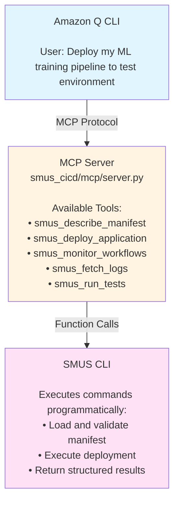

---

## Security Architecture

### 1. Authentication & Authorization

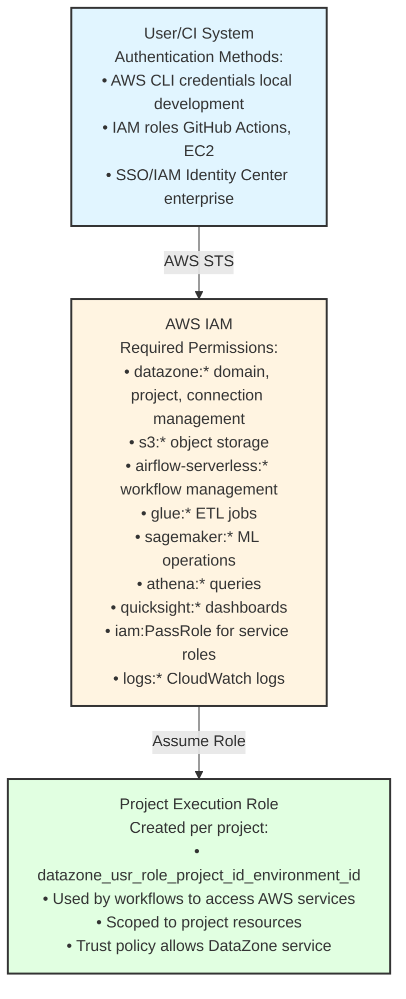

### 2. Data Security

**Encryption:**
- S3: Server-side encryption (SSE-S3 or SSE-KMS)
- Secrets: AWS Secrets Manager for sensitive data
- Transit: TLS 1.2+ for all API calls

**Access Control:**
- Project-level isolation in DataZone
- IAM policies for resource access
- Connection-based access to data sources
- QuickSight row-level security

**Audit:**
- CloudTrail for API calls
- EventBridge for deployment events
- CloudWatch Logs for workflow execution

### 3. Secrets Management

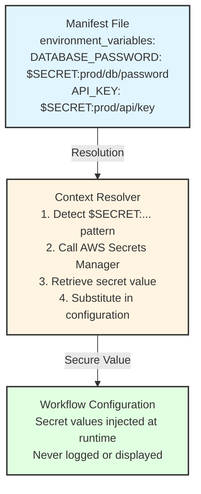

---

## Extension Points

### 1. Custom Bootstrap Actions

Add new bootstrap action types:

```python
# In bootstrap/handlers/custom.py
from ..action_registry import ActionRegistry

@ActionRegistry.register("custom.my_action")
def my_custom_action(context, **parameters):
    """Execute custom initialization logic."""
    # Implementation
    return {"status": "success"}
```

### 2. Custom Helpers

Add new AWS service integrations:

```python
# In helpers/my_service.py
import boto3

def create_resource(name, config):
    """Create resource in custom AWS service."""
    client = boto3.client('my-service')
    response = client.create_resource(
        Name=name,
        Configuration=config
    )
    return response
```

### 3. Custom Commands

Add new CLI commands:

```python
# In commands/my_command.py
import typer

def my_command(
    manifest_file: str = typer.Option("manifest.yaml"),
    targets: str = typer.Option(None)
):
    """Execute custom operation."""
    # Implementation
```

---

## Performance Considerations

### 1. Parallel Operations

- S3 uploads use AWS CLI sync for bulk operations
- Multiple workflows can be deployed concurrently
- Bootstrap actions execute sequentially (by design)

### 2. Caching

- Boto3 clients are cached per service
- Domain/project lookups are cached during execution
- Connection information is cached after first retrieval

### 3. Optimization Strategies

- Use compression for large file uploads
- Batch S3 operations when possible
- Minimize API calls through caching
- Use pagination for large result sets

---

## Error Handling

### 1. Error Categories

**Validation Errors:**
- Manifest syntax errors
- Schema validation failures
- Missing required fields
- Invalid environment variables
- Dry-run pre-deployment validation failures (missing permissions, unreachable resources, missing dependencies)

**AWS Service Errors:**
- Permission denied
- Resource not found
- Service quotas exceeded
- API throttling

**Deployment Errors:**
- S3 upload failures
- Workflow creation failures
- Bootstrap action failures
- Connection creation failures

### 2. Error Recovery

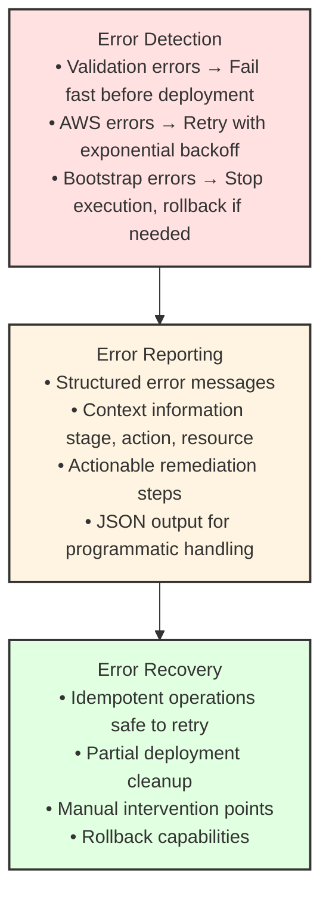

---

## Monitoring & Observability

### 1. Logging Architecture

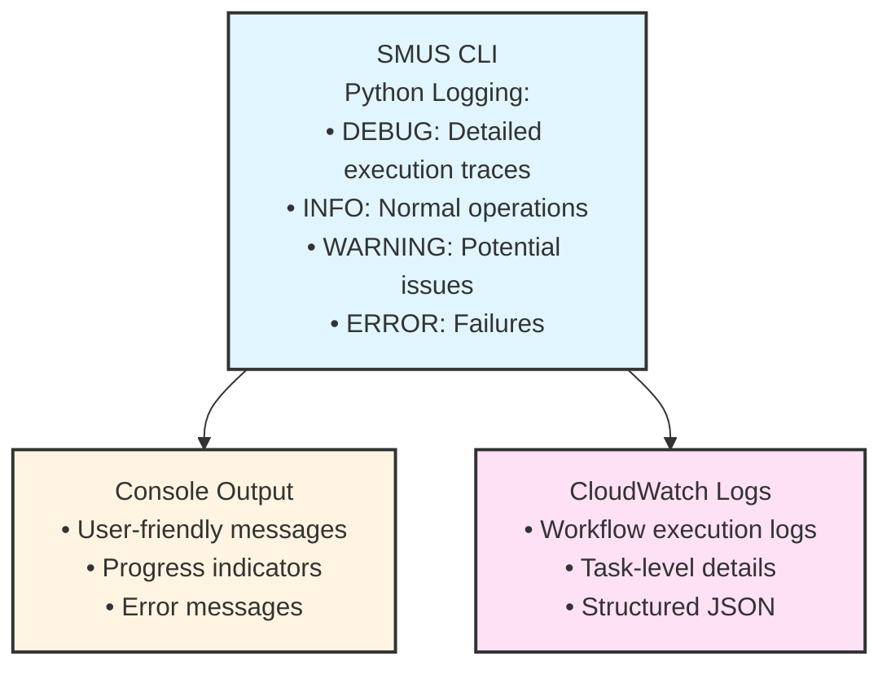

### 2. Event Emission

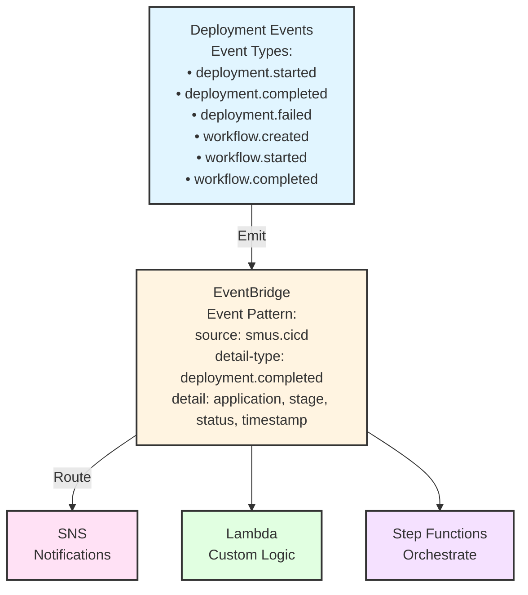

### 3. Metrics

Key metrics tracked:
- Deployment duration
- Success/failure rates
- Workflow execution time
- Resource creation counts
- API call latency

---

## Testing Architecture

### 1. Test Pyramid


### 2. Test Infrastructure

```
tests/
├── unit/                     # Unit tests
│   ├── test_manifest.py
│   ├── test_validation.py
│   ├── test_bootstrap.py
│   └── test_helpers.py
│
├── integration/              # Integration tests
│   ├── basic_pipeline/
│   ├── examples-analytics-workflows/
│   │   ├── ml/
│   │   ├── etl/
│   │   └── notebooks/
│   └── base.py
│
├── fixtures/                 # Test data
│   ├── manifests/
│   └── workflows/
│
└── scripts/                  # Test utilities
    ├── setup/
    └── validate_workflow_run.sh
```

---

## Deployment Patterns

### 1. Branch-Based Deployment

```
Git Branch → Environment Mapping

main branch        → prod environment
develop branch     → test environment
feature/* branches → dev environment

Workflow:
1. Developer pushes to feature branch
2. CI/CD deploys to dev automatically
3. PR to develop → deploys to test
4. PR to main → deploys to prod (with approval)
```

### 2. Bundle-Based Deployment

```
Artifact Promotion

1. Create bundle from dev:
   smus-cicd-cli bundle --manifest manifest.yaml

2. Store bundle in artifact repository

3. Deploy bundle to test:
   smus-cicd-cli deploy --bundle Bundle-MyApp-test-*.zip --targets test

4. Promote to prod:
   smus-cicd-cli deploy --bundle Bundle-MyApp-test-*.zip --targets prod
```

### 3. Tag-Based Deployment

```
Git Tags → Version Releases

v1.0.0 → prod deployment
v1.0.0-rc1 → test deployment
v1.0.0-beta → dev deployment

Workflow:
1. Tag commit with version
2. CI/CD creates bundle
3. Deploy based on tag pattern
```

---

## Best Practices

### 1. Manifest Organization

```yaml
# Recommended structure
applicationName: MyApplication

# Define content once
content:
  storage: [...]
  git: [...]
  workflows: [...]

# Stage-specific overrides
stages:
  dev:
    # Minimal config for rapid iteration
    bootstrap:
      actions:
        - type: workflow.create
  
  test:
    # Add testing and validation
    bootstrap:
      actions:
        - type: workflow.create
        - type: workflow.run
          trailLogs: true
  
  prod:
    # Production safeguards
    bootstrap:
      actions:
        - type: workflow.create
        # No automatic execution
```

### 2. Environment Variables

```yaml
# Use environment variables for account-specific values
environment_variables:
  AWS_ACCOUNT_ID: ${AWS_ACCOUNT_ID}
  AWS_REGION: ${AWS_DEFAULT_REGION:us-east-1}
  S3_BUCKET: ${S3_BUCKET}
  
# Reference in workflows
workflows:
  - workflowName: my_workflow
    tasks:
      my_task:
        script_args:
          '--bucket': '{env.S3_BUCKET}'
```

### 3. Connection Management

```yaml
# Create connections in bootstrap
bootstrap:
  actions:
    - type: datazone.create_connection
      name: mlflow-server
      connection_type: MLFLOW
      properties:
        trackingServerArn: ${MLFLOW_ARN}
    
    - type: datazone.create_connection
      name: custom-db
      connection_type: ATHENA
      properties:
        workgroup: ${ATHENA_WORKGROUP}
```

### 4. Multi-Domain Configuration

```yaml
# Configure independent domains per stage
stages:
  dev:
    domain_id: dzd_dev123456  # Development domain
    project_name: my-app-dev
    # Rapid iteration, shared resources
    
  test:
    domain_id: dzd_test789012  # Separate test domain
    project_name: my-app-test
    # Isolated testing environment
    
  prod:
    domain_id: dzd_prod345678  # Production domain in different account
    project_name: my-app-prod
    # Strict governance and compliance
```

**Multi-Domain Best Practices:**

- Use separate domains for compliance boundaries (e.g., PCI, HIPAA)
- Configure domain-specific IAM roles and permissions
- Test cross-domain deployments in lower environments first
- Document domain ownership and governance policies
- Use consistent naming conventions across domains
- Consider network connectivity between domains for data sharing

---

## Troubleshooting Guide

### Common Issues

**1. Manifest Validation Errors**
```
Error: Missing required field 'applicationName'
Solution: Add applicationName at top level of manifest
```

**2. Connection Not Found**
```
Error: Connection 'default.s3_shared' not found
Solution: Ensure project has default connections created
```

**3. Workflow Deployment Fails**
```
Error: Workflow 'my_workflow' not found in content.workflows
Solution: Add workflow to content.workflows list
```

**4. Bootstrap Action Fails**
```
Error: workflow.run failed - workflow not found
Solution: Ensure workflow.create runs before workflow.run
```

---

## Appendix

### A. Glossary

- **Application**: Data/analytics workload being deployed
- **Manifest**: YAML file defining application configuration
- **Stage**: Deployment environment (dev, test, prod). Each stage can target an independent project in an independent domain
- **Domain**: DataZone domain that provides governance and isolation. Multiple domains can be used across stages
- **Project**: DataZone project within a domain. Each stage typically targets a different project
- **Bootstrap**: Initialization actions during deployment
- **Connection**: DataZone connection to AWS services
- **Workflow**: Airflow DAG for orchestration

### B. References

- [SMUS CI/CD CLI README](../README.md)
- [Manifest Schema](manifest-schema.md)
- [CLI Commands](cli-commands.md)
- [Bootstrap Actions](bootstrap-actions.md)
- [Examples Guide](examples-guide.md)

### C. Version History

| Version | Date | Changes |
|---------|------|---------|
| 1.0 | 2026-01-22 | Initial architecture documentation |

---

**Document End**
